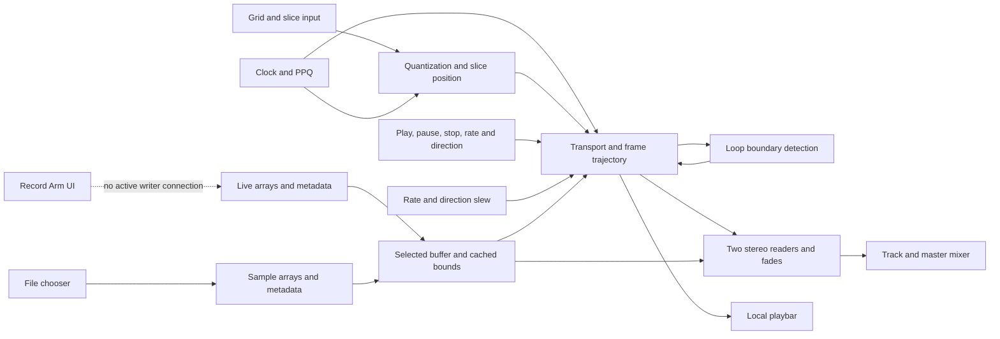

# Original application: observations and functionality map

Recorded 2026-09-09. The baseline is repository main at
`5f4b801fea36a33599b2a6bb8b2e34eaeeb527a6`, verified against the remote before
creating `codex/original-playback-observations`. That initial update changed
documentation only; the authorized load-refresh repair is recorded below.
The current job is to understand and harden the existing musical path in
small steps; the broad R1 implementation plan has been set aside.

## Preserved work and source map

The rejected rewrite is preserved on `codex/r1-shared-buffer-playback` at
`fb808b13c12bb818a7c59798c630be172ec08631` and in
[PR #1](https://github.com/kasselvania/plugmlr/pull/1). Its uncommitted changes,
untracked files, and ignored renders were saved with `git stash --all` as
`23dfe32e8cfd76a15ecc0f4c8a30248dd95704a0` (message begins
`Failed experiment: R1 rewrite before archival`). Do not apply or drop this stash
as part of the original application's investigation. Those experiments are not
acceptance evidence for this baseline.

| Source | Role in the original entry path |
| --- | --- |
| [mlr.pd](../mlr.pd) | Application controls, clock/Grid paths, `arrays-samples`, and mixer. Instantiates sample data, live buffer, and player for IDs 1–16. |
| [sample-data.pd](../sample-data.pd) | File chooser, two sample arrays, `soundfiler`, sample metadata publication. |
| [live_buffer.pd](../live_buffer.pd) | Live arrays, size/index metadata, recording-related messages. Recording not tested here. |
| [sample_player_rebuild.pd](../sample_player_rebuild.pd) | Selected buffer, transport, loop/slice logic, rate glide, playbar, two stereo readers, and gain transitions. |
| [mixer.pd](../mixer.pd) | Track output gain/envelope. Track 1 is implemented inline in `mlr.pd`; tracks 2–16 use this abstraction. |

Alternative players remain useful references, not automatically active code.
For example, `sampler_playback.pd` contains a post-load refresh receiver absent
from the active player. The installed copy at
`/Users/peterkassel/Documents/plugdata/Patches/Kasselvania/mlr-lite` also differs
from this checkout, including its player logic. It is a read-only reference;
the observed application was opened from this repository.

## What was observed

Runtime: `/Applications/plugdata.app`, **0.9.4 nightly `98ae0f78b`**, Pd **0.56.3**,
Pd-Lua **0.12.23**, on macOS **26.4.1 (25E253), arm64**. This was a native plugdata
session. Audio-device settings were not freshly recorded as part of this baseline.

- `mlr.pd` opened, along with its saved `arrays-samples` and `grid-input-output`
  views. The 1–16 buffer/player objects were visible; the console printed reader
  setup messages for them. With ordinary messages hidden and errors shown, the
  startup error view was empty. Ordinary messages were then restored.
- The existing Sample 1 load control opened the native chooser and loaded the
  repository's `DrumLoop.wav`. During this observation the control was triggered
  using plugdata's console selection and `bang` after pointer attempts were
  inconclusive; it was the existing `1-sample-load` control, not a helper loader.
- Both arrays in `sample-data 1` visibly populated. Its UI showed **631881 frames**,
  **44100 Hz**, and **39492.6** frames per slice (rounded display). Read-only
  `afinfo` agreed: stereo, 24-bit PCM, 44100 Hz, 631881 frames, 14.328367 seconds.
- Player 1 selected `sample_buffer`, `1`. Pressing its Play/Pause button moved the
  playbar. After the user raised the mixer, the user confirmed audible output.
  This establishes **Sample 1 → player/channel 1 → mixer → output**.

User listening report, recorded separately from source/console evidence:

> “it cuts out part way through the loop that plays, then, goes through a full
> loop without audio. then, starts again.”

The playbar continued moving. Representative console messages included
`dsp-message: dsp_off 0`, `voice_1_vline: 631881`, `dsp-message: dsp_on 1`, and
`voice_1_vline: 631865`. These are existing debug prints, not explicit runtime
errors or proof of a cause. The relationship to reader switching, gain fades,
loop bounds, and beat resets has not yet been established.

There is working playback infrastructure and a reproducible musical fault.
No explicit console error was observed in the inspected startup view; that does
not prove every path works or establish the cause of the audible fault. Other
channels, reverse, glide, slice triggering, quantization/beat reset, physical Grid
feedback, recording, and buffer replacement have not been individually validated.
Connected controls and code for several of these already exist.

Evidence here is the session's direct UI/console inspection, the user's listening
report, and the file metadata check. No rendered audio, numerical audio checks,
standalone console export, or new test harness was retained for this baseline.
No Pd patch was edited or saved during the observation.

## First chunk: loader to player metadata

This is a trace of the actual objects and `#X connect` edges, not a proposed new
interface. Line references below refer to the baseline commit above.

1. In `sample-data.pd` (lines 10–25), `$1-sample-load` triggers `openpanel`.
   `t a b b` fills two table symbols before sending the path through `pack s s s`
   and `prepend read -resize` to `soundfiler`. The resulting order is
   `read -resize PATH 1-sample_buffer_ID 0-sample_buffer_ID`: file channel 1 enters
   prefix `1`, file channel 2 enters prefix `0`.
2. The frame-count outlet supplies the end field and `N / 16` slice length.
   First index is set to zero; a literal `1` supplies the loaded flag. The rate
   metadata is divided by 1000, yielding samples per millisecond. The packet on
   `s_b_buffer_states` is `ID loaded_flag rate_kHz slice_frames first_index end`.
   For the observed file the graph yields `1 1 44.1 39492.5625 0 631881`; this
   exact packet was not captured as a console print. The field named “last index”
   carries frame count `N`, not `N - 1`.
3. In the player's `buffer_&_loop` (lines 175–208), `route` matches the selected
   buffer number. `t a b` sends `$0-loaded_sample` **before** unpacking the new
   metadata. `buffer_selection_setup_and_logic` uses that bang to select this
   player's own sample-buffer number through the existing GUI/message path.
4. Selection sends `$0-send_target`. The player sends the target's `_select_bang`
   and `_load_up` messages and refreshes cached indexes with `$0-update_indexes`.
   Only afterward does the pending sample packet finish unpacking. Its loaded
   flag is sent to `$0-loaded_update_indexes` after the other fields are stored,
   but the active player has **no receiver for that completion message**.
   The initial Play path separately sends `$0-update_indexes` (line 363).

This ordering is consistent with the observed console sequence: after loading,
`1188-loop_end` still printed `48000`; pressing Play printed `631881` and loop
start `0`. It identifies a metadata handoff problem to isolate. It does **not**
establish the cause of the subsequent alternating silent passes.

Three local candidates recorded by the initial trace (the first is now repaired
as described below; the other two remain unimplemented):

| Candidate | Existing evidence and narrow next check |
| --- | --- |
| Complete the post-load refresh after metadata is stored. | The active player emits an unreceived completion message. `sampler_playback.pd`, lines 1239–1242, already has `r $0-loaded_update_indexes → sel 1 → s $0-update_indexes`. Evaluate that small existing pattern against the selection order, then inspect load-time bounds before pressing Play. |
| Resolve the channel-order discrepancy. | The loader orders arrays `1, 0`; `tabread_processing` constructs reader targets `0, 1` (lines 708–730). The console printed `set 0-sample_buffer_1 1-sample_buffer_1`. Verify the complete output with distinct left-only/right-only material before changing ordering; ordinary stereo listening did not establish it. |
| Validate successful load publication. | `sample-data.pd` publishes a literal loaded flag without a positive-frame-count check; channel metadata is unused. Missing/empty/mono-file behavior has not been exercised. Check what the actual loader emits in those cases before adding a small guard. |

The next buffer trace must account for two existing details: sample and live
metadata packets have different layouts (`l_b_buffer_states` is
`ID rate_kHz first_index end slice_frames content_flag`), and `sample-data.pd`
has no `_select_bang` or `_load_up` receiver to republish metadata on reselection.
The loader also resizes its arrays directly. Selection, alignment, swapping, and
replacement behavior therefore need observation before refactoring.

## Follow-up: complete the post-load refresh

The user advanced the first candidate. On `codex/fix-sample-load-refresh`, the
active player's unreceived `s $0-loaded_update_indexes` is replaced by `sel 1`,
and its matching outlet is connected to the existing `s $0-update_indexes` in
`buffer_&_loop`. This is one object replacement and one connection. It recovers
the completion behavior found in `sampler_playback.pd` without adding a relay.
`unpack` emits the loaded flag last, after storing the end, start, slice size,
and sample rate, so the refresh reads the newly stored values. Object numbering
and every other existing connection remain unchanged.

Native plugdata checks, in the same runtime identified above:

| Check | Observed result |
| --- | --- |
| Fresh original application, load `DrumLoop.wav`, do not press Play. | Console player ID `1471` ends the load with `loop_end: 48000`, `loop_start: 0`. Reproduces stale active bounds. |
| Close that stopped instance, reopen the repaired `mlr.pd`, load the same file, do not press Play. | Player ID `1753` ends the load with `loop_end: 631881`, `loop_start: 0`. |
| Load the user's `SC_ICD_90_synth_chords_sunny_Cmaj.wav` into Sample 1 while still stopped. | The same player ends the load with `loop_end: 470400`, `loop_start: 0`. `afinfo` independently reports stereo 24-bit PCM, 44100 Hz, 470400 frames, 10.666667 seconds. The user's file is not included in the repository. |
| Open another load chooser and cancel it. | No new load-result messages; the buffer panel still shows start `0`, end `470400`, rate `44.1` samples/ms. |
| Inspect the repaired `buffer_&_loop` in the actual application. | The new `sel 1` connection and those master values are visible. Play has not been pressed during these comparisons. |

The initial selection still prints the previous bounds before completion. The
repair adds the missing final refresh; it does not make selection/loading atomic
or make replacement under an active reader safe. Loading while playing was not
tested. The loader's unchecked success flag and channel-order candidate remain
unchanged.

The before-repair chooser was opened by clicking Sample 1 Load. Pointer attempts
after reopening were inconclusive, so the repaired loads used plugdata's console
to select the same existing `bng_1` (inspector send symbol `1-sample-load`) and
send `bang`, followed by the native file chooser. No helper audio patch was opened.
This confirms the existing load-message path; it is not a general pointer/UI test.

An explicit error-only console inspection showed three errors caused by the
agent's navigation attempts: `canvas: no method for 'sample_player_rebuild_1_1'`,
`canvas: no method for 'buffer_&_loop'`, and
`No object found for: pd_buffer_&_loop_indexes_data_1`. These were not emitted by
loading. The inspection showed no additional errors. Console history was not
cleared, and both message and error visibility were restored. For future read-only
inspection, the working console sequence is `ls`, then `sel` with the exact
listed object ID, then `vis 1` and `deselect`; `cnv` sends a canvas message and
does not navigate to a child by name.

Repeat the first two rows using the original observation commit and this repair,
one application instance at a time. Inspect the final loop-bound prints before
pressing Play. This validates the control-message refresh in the actual patch.
It is not a rendered-audio test: no new listening verdict, recording, audio
numerical check, or claim that the alternating silent loops are fixed is made.
At the end of that comparison, the repaired application was left stopped with
its buffer panel open. This describes that check, not subsequent user activity.

## Whole-application functionality map

The user expanded the review to understand **all existing musical functions**
before choosing further repairs or refactoring. This section reads the actual
`.pd` declarations, canvas-local `#X connect` edges, trigger order, and matching
send/receive names. Source references here describe repair candidate
`0f8c26789ec6e70e815385d6dca88a0c0b92f0ef`; the remote main remains
`5f4b801fea36a33599b2a6bb8b2e34eaeeb527a6`.

This update changes documentation only. A read-only native UI/console snapshot
showed the existing application and subsequent user playback messages; it adds
no controlled behavior or listening result. The observations and load-refresh
comparison above remain the runtime evidence. Findings below establish wiring
and gaps, not the audible cause of each reported fault.

### How the existing parts relate

The two readers are internal transition voices within one musical player.
The active patch also has a master `vline~` used for position snapshots and loop
detection; each reader has its own `vline~`. They receive related commands but
are not one physical signal path. This distinction matters when the playbar
moves during silence.

### Function catalogue

“Connected” below means a source path exists. It is not listening acceptance.
Player references mean `sample_player_rebuild.pd` unless stated otherwise.

| Function | Actual control, state, and path | Current status |
| --- | --- | --- |
| Stereo file load | `sample-data.pd`: `ID-sample-load` → chooser → `soundfiler` → two arrays, frame count, file rate, 16 equal slice lengths, loaded flag. | Load and final bound refresh observed. Success validation, replacement safety, and channel ordering remain open. |
| Buffer choice and metadata | Main sends default selections for IDs 1–16. Player `buffer_selection_setup_and_logic` and `buffer_&_loop`: type/number select array names, request metadata, and store start/end/rate/slice/content values. Delete dispatches to the selected target. | Substantial selection logic; reselection and type/number identity gaps below. Sample deletion has no handler. |
| Live storage, clear, and growth metadata | `live_buffer.pd`: two arrays, size query, first-record notifications, first/last indexes, resize, delete/clear, content flag. | Storage/metadata code exists. It does not itself supply an active recording writer. |
| Play, pause, resume, stop | Player root: flags dispatch initial play or pause/resume; snapshot current frame; rebuild motion; control mixer envelope. Stop clears flags and resets motion/reader selection. | Play and mixer output observed. Pause has a connected mixer-close path. Other transport combinations are not individually validated. |
| Slicing and jumps | `row_$1` → immediate/quantized selection → slice number × slice size; reverse chooses the next slice boundary; request reader transition and jump after a 1 ms delay. | Existing slicing, not missing by design. A slice jumps into the buffer and continues toward the current loop boundary; it does not automatically loop just that slice. |
| Position and visual playbar | Internal frame-position messages → ordered bound/rate refresh → duration calculation → `vline~`; 20 ms snapshots update the local playbar. | Moving playbar observed. The visible slider has no outgoing seek connection; it is a display in this version. |
| Key quantization | PPQ modulo a power-of-two interval; store pending slice; pass it at the selected tick. Immediate and quantized branches share the slice output. | Connected, with toggle meaning and repeated-key ordering problems below. No physical Grid test. |
| Loop bounds and wrap | `loop_logic`: compare master frame position to end, prepare a reader transition near end, then request start. Bounds are cached from selected-buffer metadata. | Forward-only detector in this version. No complete reverse wrap or dedicated user loop-enable path found. Internal bound controls are present. |
| Speed | Five presets: 0.25, 0.5, 1, 2, 4. Snapshot position and recalculate remaining duration from rate and file sample rate. | Real speed-control path exists. Magnitude and direction are separate; this is not a signed-rate message contract. |
| Rate slew/glide | Duration and curve knobs → `curve~` → `cyclone/snapshot~` at a nominal 5 ms interval → updated rate and trajectory; completion latches the target. | Existing glide implementation to retain. Its separate engage toggle has no consumer in this player. |
| Direction and direction slew | Direction button changes a 0/1 state and chooses the trajectory endpoint. Separate curve/delay logic appears intended to slow to zero, switch direction halfway, and return to the requested speed. | Direction selection exists; loop detection and reader inversion disagree with it. The direction-slew command construction is disconnected. |
| Clock mode and beat reset | `mlr.pd` derives internal/DAW PPQ and BPM. Player duration calculation has a clock mode; beat-reset selection counts PPQ intervals and emits a reset message. | Clock source code exists. Beat reset ends at an unreceived message; clock-duration inputs include obsolete metadata names. |
| Reader handoff and crossfade | `tabread_processing` selects stereo arrays. `gain_control_logic` alternates voice 0/1 and sends gain, message-gate, and DSP commands. | Core existing design worth understanding. The two reader implementations and transition handlers are asymmetric. |
| Recording and overdub | Active player exposes Record Arm and recording flags. Alternative `sampler_playback.pd` contains timed/endless recording decisions and stereo `poke~` writers. | Record Arm has no receiver and there is no writer in the active player. Alternative recording must be traced/recovered as a feature, not inferred from the button. Overdub mixing is unvalidated. |
| Input, track gain, and master | `mlr.pd` and `mixer.pd`: stereo player output → transport envelope → track gain → master → `dac~`. Separate input/monitoring sketches exist. | Track 1 output heard. Input knobs do not establish a recording route. Track 1 inline mixer duplicates the abstraction used for 2–16. |
| Grid input and visual feedback | Native OSC/SerialOSC patch routes press coordinates to row messages; LED logic and local playbar messages are separate. Lua handler alternatives are not instantiated by `mlr.pd`. | Only rows 1–6 are connected in the native row dispatcher. LED receives do not match the active player's private playbar publisher. Physical operation unvalidated. |

### Data and state already in use

- **Positions:** buffer metadata, slice offsets, trajectory targets, and reader
  indexes use sample frames. “End” is populated with frame count `N`, while
  “first” initially holds zero. There is no consistent checked end-boundary
  convention around interpolation, wrapping, and reverse entry yet.
- **Time and rate:** ramp/fade/slew durations use milliseconds; file Hz is divided
  by 1000 into frames/ms. Free-running duration uses
  `abs(target - current) / (rate_magnitude * frames_per_ms)`.
  The active calculation has no explicit zero/invalid-rate guard. Positive
  rate magnitude plus direction is the existing model; changing that model is
  outside this catalogue.
- **Metadata:** sample packets are
  `ID loaded rate_kHz slice_frames first end`; live packets are
  `ID rate_kHz first end slice_frames content`. These layouts differ.
- **Clock subdivisions:** the DAW branch publishes `floor(PPQ * 16)`; the
  internal branch sends `BPM * 16` to `clock` and counts its events. Key
  quantization uses `2^menu_index` ticks; beat reset uses `menu_value * 64`
  ticks for menu values 1–8. `global-transport` can control the internal clock,
  but no sender for it exists in the active entry graph. Automatic musical
  alignment is therefore not established simply by selecting clock mode.
- **Identity:** `$0` isolates much player-local state; `$1` identifies a track/row
  and its default buffer. Selected buffer type/number can differ from that
  default, but automatic selection mixes these roles. Arrays, row messages,
  output buses, BPM, and PPQ remain globally named. Copying a player with the
  same arguments would not create independent resources.
- **Timing:** transport flags, selected buffer values, the master trajectory,
  each reader's trajectory, gain envelopes, and pending delayed DSP-off events
  are separate state. Refactoring must preserve their ordering while making
  their owners explicit. Moving boxes into subpatches alone will not do that.

### Concrete gaps and inconsistencies

These are grouped by function rather than reduced to a single suspected cause.
They are not a claim that fixing one will resolve every playback fault.

**Buffer selection and storage**

1. `sample-data.pd` has no `_s_b_select_bang` or `_s_b_load_up` receiver to return
   its metadata when a previously loaded buffer is selected. The live equivalent
   `_l_b_select_bang` is present but unconnected. A selection request does not
   establish a fresh, complete buffer description. The player also dispatches
   delete to either buffer type, but only the live buffer has a delete handler.
2. Both metadata buses in `buffer_&_loop` route on selected number without a
   corresponding type filter. Sample receipt also fires `$0-loaded_sample`,
   which selects this player's own `$1` sample number before unpacking the
   packet. Selecting a different buffer and then loading it needs a specific
   check for target/cache disagreement; the post-load refresh does not fix this.
3. Loading directly resizes arrays, publishes a literal loaded flag, and ignores
   channel metadata. There is no active-reader replacement guard. Live deletion
   also resizes/clears storage without coordinating readers. Its reset size is
   a fixed 48000 frames, not a sample-rate-dependent duration.
4. `live_buffer.pd:18` receives hardcoded `1_l_b_first_record_bang` to obtain the
   sample rate. Other buffer IDs do not have their own corresponding trigger.
   The sample loader's `1, 0` channel order differs from the readers' `0, 1`
   target order; this needs a distinct-channel output check.

**Transport, slices, and clock**

5. Stop uses `s 1-mixer_env_close` at player line 1363, whereas Pause uses
   `s $1-mixer_env_close` at line 1191. Stopping another track can therefore
   address channel 1's mixer. Pause itself has both a snapshot/freeze path and
   that correctly parameterized mixer-close path; it is not wholly absent.
6. The transition router declares `pause resume stop`, but those outlets have
   no connections. Stop sends `stop 1` to this unused outlet. Several older
   envelope/DSP message names likewise have no receivers in the active graph.
   These branches need classification rather than being carried into a new
   interface as if they worked.
7. Slice position uses full-buffer `N / 16` without adding a nonzero first-index
   offset or clamping the requested slice. Current slicing therefore needs
   explicit behavior for a changed loop region. The current playbar does not
   implement mouse seeking.
8. Quantizer value `1` selects the immediate branch (player lines 410–414),
   contrary to the apparent “Quantize” checkbox meaning. Its pending-slice `[f]`
   at line 405 receives new keys at the hot inlet: a second key can pass through
   an already-open pending gate before the next tick. This is an ordering defect
   to reproduce with two keys inside one quantization interval.
9. `$0-reset-sync` at line 394 has no receiver in the active player. The main
   `stop-playback` button also has no receiver in the active entry graph.
   `calc_duration` still reads `$1_file_abs_start/end`, published by an alternative
   loader rather than `sample-data.pd`, and contains load-time placeholder values.
   Neither beat-reset nor synchronized duration is established by the visible
   clock controls. Several top-level per-track controls are only wired for track 1.

**Motion, speed, direction, and slew**

10. `loop_logic` (lines 597–648) has only `>=~` end comparisons and restarts from
    loop start. It has no direction-gated `<=~` start comparison or reverse
    restart-at-end path. Changing a ramp's direction alone cannot complete this
    loop implementation.
11. The pre-transition threshold is `loop_end - samples_per_ms * 3`. Rate changes
    update the subtraction's cold inlet without recomputing its output. The
    main update trigger also refreshes bounds before the later duration/rate
    calculation. Transition lookahead can therefore retain an earlier rate.
12. Rate slew is connected, but `$0-slew_engaged` has no receiver. Direction slew
    is more incomplete: `pack f f f f` at line 1338 has no hot-inlet connection;
    trigger outlets 0 and 1 at line 1336 are unused; the engaged branch's `[f]`
    at line 1335 has no output connection. Its snapshot toggle is also wired
    to the interval inlet, unlike the rate-slew path. Reconnecting one wire
    would not resolve this entire gesture.
13. The duration calculation divides by rate with no zero case, while the
    direction-slew sketch targets zero. Stopping at zero, reversing from a
    boundary, changing bounds during motion, and interrupting a slew need
    explicit musical behavior before those paths can be made consistent.

**Readers, transitions, and output**

14. Voice 0 connects its initialization counter to `gate~ 2`; voice 1 connects
    that counter only to a display (lines 965–1151). Voice 1 also lacks voice 0's
    `main_vline_gate` handler. Thus the two alternating readers do not respond
    to the same setup/control sequence. This is a concrete structural difference;
    its contribution to the reported silent pass still needs an audio check.
15. Both readers contain `expr~ 1 - $v1`, a normalized-phase reversal operation,
    after a `vline~` carrying frame indexes. On that branch, frame 1000 becomes
    -999. The direct and transformed branches also both feed the table index
    inlet. This is an internal units mismatch, not evidence of correctly
    implemented reverse playback.
16. Loop/play fades use 6 ms, slice fades 9 ms, while reader DSP-off delays use
    6 ms. DSP-on does not cancel an already pending DSP-off. Voice 0's emitted
    fade-bang has no matching handler; voice 1's special fade branch includes
    unconnected continuation messages. Rapid commands can encounter stale
    delayed actions, and a slice fade can be cut short. The exact audible
    effect has not been rendered or measured.
17. Mixer open ramps over 5 ms; mixer close is `0 0`, immediate. Together with
    reader envelopes and the master/reader trajectory split, this needs an
    end-to-end transition check. The source alone does not establish click,
    dropout, or gain performance.

**Recording, input, and external feedback**

18. Active Record Arm sends `$0-record_button_bang` (line 14) with no receiver.
    The armed Play outlet is unconnected and there are no `poke~`/`tabwrite~`
    writers in the active player. Recording flags and live arrays do not make
    a complete recording path. The alternative writer is described below.
19. Main Audio 1 input sends `1-live-buffer-in`, which has no active consumer.
    Other input gain/meter sketches do not complete a writer route. The separate
    `audio-in-subpatch.pd` input/monitor/`pdlink` patch is not instantiated by
    `mlr.pd`; its existence is not evidence that main's input controls record.
20. Local playbar updates use `$0-playbar_data_i`; the main Grid view listens to
    `1-playbar_data_i` and `2-playhead`. These names do not match the active
    publisher. Native press dispatch connects rows 1–6, with row 7/8 sends left
    unwired and no connected row 9–16 dispatcher. Test LED messages and Lua
    alternatives do not complete that route.

### Useful behavior in the other versions

These references were read for specific behavior, not ranked by filename.
None was loaded as a replacement, edited, or accepted through runtime testing.

| Source | What is worth understanding or recovering |
| --- | --- |
| `sampler_playback.pd` | Has a Record Arm receiver and timed/endless recording decisions, PPQ-aligned record start, first-record metadata, growable storage handling, input gain/gates, and stereo `poke~` writing in `poke_write_processing`. Timed length controls use measures; an existing comment assumes 4/4. “Overdub” controls are present, but input/write gating is not proof of a correct old-audio feedback mix. Full recording behavior remains unvalidated. Also contains the post-load refresh pattern used by the small repair. |
| `sample_playback_new.pd` and `old-sample_playback_new.pd` | Byte-identical pair. Contains direction-gated forward/reverse boundary comparisons, loop-point messages, and a `play_pause_stop` subpatch. Its very long duration fallback at rate zero is an older choice to inspect, not an adopted pause policy. |
| `sample-playback.pd` and `old-sample-playback.pd` | Byte-identical pair. Earlier stereo playback, slice/random-slice, loop, beat-reset, quantization, and rate-change paths. The explicit “Slice (plays till end of sample)” comment helps explain the musical meaning of slicing. |
| `sampler_playback_third.pd` | Earlier rate/curve/snapshot and bidirectional loop work. A reference for those sections; the entire alternative is not independently qualified. |
| `voice.pd` | Self-contained stereo loading, 16-way and random slice controls, and playback/position experiments. Useful for the simpler original slice path, not the active main abstraction. |
| `sample-data-new.pd`, `old-sample-data.pd` | Different table/metadata naming schemes. The former publishes `$1_file_abs_start/end`, explaining surviving consumers in the current duration calculation. Do not mix naming schemes without tracing their clients. |
| `previous_live-buffer.pd` | Separate stereo `poke~` buffer-writer and recording/index metadata. Parent delivery of writer controls needs recovery; not a complete active recorder. |
| `live-buffer.pd`, `audio-in-subpatch.pd` | Input selection/metering and separate ADC/monitor/`pdlink` routing. `live-buffer.pd` is different from the active `live_buffer.pd` storage component. |
| `rate-change.pd` | Small snapshot/rate/length sketch with no outlet; not a ready-made reusable speed component. |
| `monome_grid_handler.pd_lua`, `monome_grid_handler_fixed.pd_lua` | Press filtering, transport/row dispatch, configurable prefix. Both register the same class name; neither is instantiated in the active main path. |
| Installed `mlr-lite` copy | Its player has bidirectional loop comparisons and simpler direct-index readers with more symmetric gate handling. Writer objects also exist there, but the Record Arm connection is still not established. These are narrow read-only references, not a reason to copy the installed application wholesale. |

### Refactoring boundaries to review

The useful existing design is a buffer-backed musical player with slice/clock
input, continuous motion, and two readers for transitions. Preserve that story.
First make the existing subpatches and their state understandable; extract a
reusable abstraction only when its inputs, outputs, and ordering are clear.

| Part | State it should own | Boundary grounded in the existing code |
| --- | --- | --- |
| Buffer storage and description | Arrays, channel order, frame count, file rate, content status; permission to resize/clear. | Build on `sample-data` and `live_buffer`. Selection requests one complete description. Playback rate, transport, and fades do not belong here. |
| Musical input and timing | Row/column mapping, pending quantized key, interval and clock selection. | Convert controls into slice/jump/transport requests. Keep Grid and beat mapping outside the reader DSP. |
| Player motion and gestures | Playing/paused state, current frame, loop region, direction, requested/current speed, active slew. | Group existing transport, duration, loop, and slew logic around one ordered trajectory update. Keep rate and direction slew visible subpatches here initially; do not create competing owners of transport flags. |
| Stereo readers and transition scheduling | Outgoing/incoming reader state, each trajectory, gains, delayed shutdown. | Keep the two-reader design. Make the two command handlers consistent, and coordinate/cancel delayed actions. The readers are not additional musical players. |
| Recording writer | Write enable/index, first-record length/content, input/overdub behavior. | Recover the existing alternative in a separate later change. Coordinate storage ownership with the buffer; do not hide resize decisions in unrelated playback controls. |
| Output and feedback | Track/master gain and published display/controller position. | Reuse `mixer.pd`; reconcile track 1's duplicate implementation when appropriate. Report which position is displayed instead of treating the master playbar as proof of an audible reader position. |

Unconnected branches should be marked as unfinished or superseded after checking
their callers, then repaired or removed in a focused change. They should not
become new public controls merely because they have names. Historical patches
remain preserved as references during that work.

The next implementation candidate should be chosen from this map with a concrete
musical case. Reader setup/command symmetry and coordinated boundary handoff are
strong candidates for the reported intermittent playback. Direction-aware wrap
must be assessed with the same reader path. This review does not select an
unobserved cause or authorize a wholesale replacement.

For each subsequent repair, reproduce the relevant control sequence in the actual
application with the console visible, inspect the corresponding values, and
listen/render where the claim concerns audio. Keep those results separate from
the source trace. There are no new audio renders, numerical audio results, or
claims of working recording, reverse, glitch-free transitions, or Grid operation
in this documentation update. No additional-player expansion is part of it.
