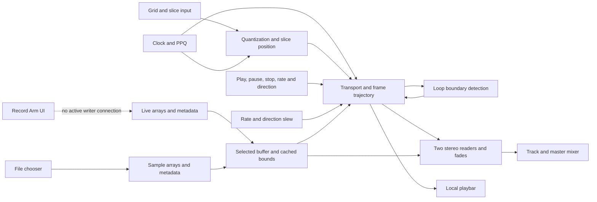

# Original application: observations and functionality map

Recorded 2026-09-09. The baseline is repository main at
`5f4b801fea36a33599b2a6bb8b2e34eaeeb527a6`, verified against the remote before
creating `codex/original-playback-observations`. That initial update changed
documentation only; the authorized load-refresh repair is recorded below.
The current job is to understand and harden the existing musical path in
small steps; the broad R1 implementation plan has been set aside.

## Player usability view (review candidate)

Scope: make one existing player understandable without changing its DSP, clock,
recording or reset semantics. `player-panel <player-id> <track>` is attached once
to the original player and opened by `<track>-open-player-view`. Main supplies an
Open player 1 button. Existing slice/loop and buffer/record panels are relocated,
not rebuilt; button/send identities remain the same. The original Beat Reset
engine remains in the player, with a message-based menu adapter in the view.
The view uses a direct menu adapter rather than embedding the reset engine.
In the final clean view, mouse-open and keyboard selection of 1 beat displayed
Waiting for Play while stopped; selecting Off restored Reset Off.

Display contract: transport comes from existing playing/paused/ready/switching
flags. Direction comes from the existing direction flag. Set speed is the
selected 0.25/0.5/1/2/4 multiplier, not a claim about instantaneous slew speed.
Clock source and internal BPM/Run reflect existing feedback; `clock-display-state`
caches that feedback so a later-opened view can show current settings. Observed
`ppq` ticks drive 4/4 bar and beat counters and a Ticking indicator, which becomes
No ticks 500 ms after the last tick. Before any observed tick, count is zero.
Reset eligibility reads the existing interval and transport flags plus observed
clock activity. Countdown is whole quarter-note beats to the next shared boundary,
not time since enabling. It is zero while inactive; the request flash is driven by
`<track>-reset-fired`, not by a second scheduler. Off does not stop playback.
Tempo-fit OFF/UNVERIFIED reflects the legacy mode and is explicitly labeled
unfinished. No new tempo-fit control or DAW qualification is introduced.

**Native observations:** fresh player 1 instance against the existing loaded
buffers, cached internal/120 BPM display, Play/Pause, moving position marker,
forward/reverse, half-speed selection, independent clock ticking while paused,
Waiting for Resume, Waiting for clock, Counting with a four-to-one countdown,
and Stopped/Off were observed in plugdata 0.9.4 nightly 98ae0f78b / Pd 0.56.3.
Hardware/runtime settings remain 48 kHz / 512 / 1x. DSP was rebuilt with physical
output muted after dynamically replacing the player instance; this is fixture
setup, not a new audio behavior. No recording was started. All three populated
live-buffer exports match before/after byte-for-byte; buffer owners remained
loaded throughout. See [observations](evidence/player-usability/observations.json).
The initial load exposed an existing unescaped semicolon in a comment, which
printed `speed: no such object`; that text delimiter is repaired. Temporary
missing-voice-sender warnings accompanied instance replacement and are not
presented as a normal startup test.

**Structural check:** `python3 tests/check_player_panel.py` verifies all existing
connection lines and nested DSP/control objects against merged base
`3d349dc8527de4598fd11f2c99c3805465528590`, allows only the listed GUI extraction,
and confirms the display adapter cannot send engine commands. No new rendered
audio acceptance or recording validation is claimed for this UI slice.

**User feedback (2026-09-11):** “Yup! this looks great” approves the visible
layout. The user subsequently reported: “I also tested the internal clock and
the beat repeat. Its great. We're good.” This accepts the internal clock and
Beat Reset in the player view, separately from the automated observations.
Broader control coverage, recording and DAW validation remain unchanged.
Native reset-menu selection and Off were verified in the final
clean view. Set speed was also verified to update to 0.5 while stopped and back
to 1 immediately, independently of the previous playback rate. This is
an unmerged review candidate with user approval of the layout, internal clock
and Beat Reset. Other player instances were
not reloaded during this trial. Historical diagnostics remain accessible; do not
save temporary diagnostic canvas state over repository files. The original
player now has 553 root objects, so attached test helpers start at index 553.

## Beat Reset contract (review candidate)

**Current acceptance:** replacement audio passes nine numerical checks and the user accepted its listening result. Native menu selection is verified below. The original rejected musical capture is retained as a known failing demonstration, not the current acceptance report.

Per-track Reset every: Off, 1 beat, 2 beats, 1 bar, 2 bars, 4 bars, 8 bars.
A beat is a quarter note; bars mean 4/4. Public `<track>-reset-beats` accepts
only 0, 1, 2, 4, 8, 16 or 32 (0 disables). Invalid values leave the setting
unchanged and report `<track>-reset-error Invalid_interval`. Default is Off.
`<track>-reset-state` reports accepted beat values; `<track>-reset-fired` reports
the shared tick when a reset request passes the transport/readiness gate.

Use the existing ppq bus (16 ticks/quarter), aligned to its origin. Do not reset
on tick zero or on enabling/changing the setting; wait for the next positive
matching tick. Ignore repeated identical ticks and invalid/noninteger/negative
ticks; clock discontinuities do not replay missed boundaries. A short zero-delay
message deferral lets Reset supersede a quantized slice on the same tick. Later
musical requests use the existing last-request-wins pending cut. Pending cuts
still wait for safe reader reuse, so tick alignment is not sample-exact audio
onset. Stop/Pause/selection changes cancel pending reset dispatch; Off or interval
changes cancel it too. No clock tick means no reset.

Only an actively playing, unpaused, ready, non-switching player may reset. Reuse
`loop-region-control full` to restore full-content bounds and request start in
forward or exclusive end in reverse, through `slice_policy` and the existing
crossfade. Keep speed/direction unchanged. Do not move paused positions or start
stopped/empty players. No writer, host-sync or tape-slew changes belong here.

Implementation is in `beat-reset <player-dollar-zero> <track>`. It replaces the
unimplemented reset menu, while the old reset sketch's ppq input is disconnected.
Reset requests use `loop-region-control full`, not a second reader or trajectory
engine. Eligibility is checked again after zero-delay dispatch. The initial
candidate incorrectly forced a duplicate playing cache to zero on Pause, so
Resume did not restore reset eligibility; that extra cache override was removed.
The initial failing audio/reader capture is retained separately.

**Validation correction (2026-09-11):** The user rejected the musical capture as a brief slice followed by silence. The earlier 27-check pass omitted audible activity in the musical case and did not establish a usable demonstration. The added musical activity check deliberately continues to fail on that rejected capture. [Historical capture results](evidence/beat-reset/results.json). Native original
player/readers/post-master captures cover every interval, matching/nonmatching and
duplicate ticks, interval rejection, Off, Stop, Pause/Resume, empty buffers,
selection, reverse, smaller-loop restoration, same-tick quantized slice/reset,
and overlapping requests 2 ms apart. The final request uses the existing safe
handoff; superseded requests are not required to become separate audible jumps.
No transition windows are removed from audio step or reader-jump measurements.
Wave steps are below .004; stereo constant steps below .001, with correct channel
order and unity reader gain. Active windows have no block-length silence or
unintended mixer gain changes; stopped/paused/empty windows are silent. Stable
resets enter within .003 frames of the start/end target and preserve signed speed.

The autonomous musical capture has seven reset requests, including slower speed,
reverse, tempo change and Pause/Resume. [Listen here](evidence/beat-reset/musical-post-master.wav).
The user reports a brief slice followed by silence. Direct inspection confirms effectively silent player and mixer output after roughly three seconds. DrumLoop has 24,897 trailing frames below 0.0001 amplitude (0.565 seconds at 44.1 kHz). Half-speed reverse requires over 1.129 seconds to traverse that tail, while the score resets every 0.5 seconds, then 0.667 seconds. Captured reverse reader positions remain in that silent tail. This is a failed demonstration, not proof of broken reverse DSP or accepted musical behavior. The replacement below uses a longer reverse interval without trimming the sample or changing reset semantics. Runtime was
native plugdata 0.9.4 nightly `98ae0f78b` / Pd 0.56.3, existing CoreAudio 48 kHz /
512 frames / 1x. The musical file is 44.1 kHz; synthetic files are 48 kHz. No DAW,
44.1 kHz host or external clock acceptance is added. Captures stop automatically
at seven seconds, with both stop markers observed in the actual console.

The first score also sent a symbol to global `ppq`, producing `mod: no method for
'symbol'` in the legacy slice consumers. Beat Reset rejects it, but the shared
application bus does not have general malformed-message validation. The final
score retains negative/fractional tick tests and invalid reset-interval tests;
the text-on-global-ppq check is recorded as a separate existing limitation.

**Replacement listening capture (2026-09-11):** [Two-bar reset example](evidence/beat-reset/musical-long-post-master.wav) uses the unchanged DrumLoop, half-speed reverse, and an eight-beat/four-second interval. Forward audio is followed by reverse entry at 1.1 seconds and a clock reset at 4.05 seconds. The roughly 1.13-second source-tail gaps remain; drums return around 2.5 and 5.5 seconds instead of being continually reset into silence. Nine [replacement checks](evidence/beat-reset/musical-long-results.json) pass, including audible forward and both reverse passes, reverse motion, end entry, mixer gain, reader continuity and automatic stop. Signed motion uses a window slope because large float frame positions quantize individual differences. Human listening accepted on 2026-09-11: the user reports “okay, seems solid to me.” This applies to the replacement capture only and is separate from the nine numerical checks; it is not a universal click-free claim. Native dropdown selection is verified below. The earlier rejected capture and its failing activity check remain intact. Repeat with `record-check symbol fixtures/beat-reset-musical-long.txt` and the same bounded taps; analyze with `tests/analyze_beat_reset_listening.py`. Native runtime/settings were unchanged. Temporary taps were removed afterward; Live 2, speed 1x, forward, Reset Off, stopped playback/clock and output .9 were restored. No buffer contents were changed. Setup/removal printed missing diagnostic send warnings, and unsuccessful cleanup commands printed no-method errors; these were outside the bounded capture and corrected through native canvas editing. The application has an unsaved-change indicator from adding/removing taps; no production patch file was saved.

**UI verification (2026-09-11):** opened the real Reset menu by mouse and selected entries with native keyboard navigation, rather than sending interval messages. The displayed `1 beat` emitted `reset-ui-state: 1`; the running internal clock produced ticks 480, 496, 512, 528, 544 (16 apart). Selecting `2 beats` emitted state 2 and produced ticks 608, 640, 672, 704, 736, 768 (32 apart). Selecting Off emitted state 0; no later reset events appeared while ordinary playback continued, through the automatic 20-second stop. The popup itself is not visible to screenshot/accessibility capture, but selected labels and console events are directly observed. This closes the native menu-selection gap; pointer selection of an individual popup row was not exercised.

A temporary message-only observer printed state/fired messages and armed Stop before Play. Initial manual console tick commands incorrectly used numeric selectors, producing legacy `mod: no method for '16'/'32'` messages. These were test-input errors; corrected typed commands and then the actual internal clock were used. The successful timing observations above are from the internal clock. No recording or new audio engine was used. Observer removed afterward, Live 1 retained (the user's current selection), Reset Off, clock/playback stopped, output .9 restored. Buffer contents and production patch files were unchanged. The existing unsaved UI indicator from temporary edits remains; do not save diagnostic canvas state over repository files.

**Repeat:** with player 1's bounded taps attached (helper objects start at root
index 552), use `tests/instant-reverse-check $0` and
`tests/bounded-player-capture 1 $0`. Load `stop-wave-48.wav` into Sample 3, keep
Sample 4 empty, and run `record-check symbol fixtures/beat-reset.txt`. Retain
`/tmp/plugmlr-record-check.wav`, `/tmp/plugmlr-reset-readers.wav` and the event log;
repeat with `stop-constant-48.wav`, physical output muted. Then run
`fixtures/beat-reset-musical.txt` with DrumLoop in Sample 1. The musical score uses
the actual internal clock; the synthetic score injects controlled ticks. The
six-channel layout is reference L/R, player L/R, mixer L/R; the ten-channel trace
retains player L/R, master position, rate, reader 0 position/gain, reader 1
position/gain, and their DSP gates. NPZ samples are lossless decoded float audio.
Run `python3 tests/analyze_beat_reset_listening.py docs/evidence/beat-reset` with NumPy for the accepted replacement (nine checks). `analyze_beat_reset.py` retains the original capture audit and intentionally exits nonzero because the rejected musical file fails its activity check; its other 27 checks pass.
The listening WAV uses mixer channels times .9 without normalization.


## Current checkpoint — 2026-09-11

PRs #18 (slice scheduler) and #19 (standalone clock) are merged. Their retained
34 and 27 numerical checks pass; the user accepted both musical captures after
listening. These are bounded native results, not universal click-free or DAW
acceptance. The work below this current section is a chronological evidence
record: older “remaining” bugs may be resolved by a later section.

| Area | Current state | Remaining work |
| --- | --- | --- |
| Stereo playback | Imported/live selection, forward/reverse, five speeds, speed glide, Stop/Pause, slices, loop Apply and dual-reader handoffs have retained native evidence. | Direction slew through zero, arbitrary speed, very short loops and broader stress qualification. |
| Slice timing | Latest pending key dispatches on the matching clock tick; transport/mode/grid changes cancel stale keys. Internal Run/BPM works. | Beat Reset is the candidate above; tempo-locked audio duration and DAW/MIDI clock remain open. |
| Recording | Fresh fixed-length stereo takes, seconds/4/4 bars, early Stop and local-bus hardware input work. | Growth/trim, recording pause/resume, quantized recording, overdub, export UI and recall. |
| Device integration | Suite repositories and lease-aware SerialOSC candidates are mapped. | Replace legacy Grid connection, verify presses/LEDs and reconnect; physical integration is not accepted. |
| Reuse and hosting | Original application and shared buffers preserved. | Multiple-instance namespace isolation, additional musical heads, DAW lifecycle and cross-process stereo transport. |

### Control clarity follow-up contract

Keep `<track>-quantizer` compatible: 1 means immediate and 0 means quantized.
The new visible Quantize checkbox uses the ordinary UI meaning: checked enables
quantization. A tiny adapter inverts the UI value and mirrors public messages
back to all views with `set`, without emitting a second command. Defaults remain
immediate, with a 1/16-note grid. Show the actual selected subdivision at startup
and after scripted changes. Label the unfinished Beat Reset/clock-rate controls
and replace the dead main Stop All and unwired track checkboxes with guidance.
Do not add reset behavior, change audio processing, or rebuild the application UI.

**Implemented and observed:** `slice-mode-control <track>` is shared by the main
Track 1 checkbox and each player's checkbox. Its GUI adapter changes neither the
legacy public mode values nor the original slice dispatcher. The subdivision
startup now sends index 2 through the existing power-of-two calculation (4 ticks)
and sends `set 2` to the menu; scripted grid changes update that display too.
Beat Reset's experimental menu remains beside its source logic, outside the
musical control area, with a visible unfinished label. The dead global Stop and
unwired track checkboxes became guidance; the unused Audio 1 input knob now points
to the real input panel. Other legacy input knobs remain identified as legacy.

Native UI/console validation used the original application in the existing
plugdata 0.9.4 / Pd 0.56.3 session. On fresh load, Quantize is off and Slice grid
shows 1/16; a key immediately emits slice 2. Clicking the player checkbox emits
exactly one legacy mode 0 message and checks the main view. Keys 3 then 6 emit
only slice 6 at tick 4, not tick 1. Changing grid to index 1 cancels pending key 9
and visibly shows 1/32. Unchecking the main checkbox emits exactly one mode 1;
key 10 then emits immediately. Track 2's mode message does not produce a track 1
mode event. Scripted track 1 mode updates mirror without feedback emissions.
No new Pd error was observed. This was a control-only check with empty Sample 4
selected: no recording was started and no new audio/listening acceptance is
claimed. The retained slice/clock analyzers were rerun before their merges (34/27
passing checks); those captures remain tied to their original source revisions.

[Native event log](evidence/control-clarity/native-control-events.txt) and
[validation record](evidence/control-clarity/results.json) retain this check.
To repeat, attach `tests/control-clarity-check $0` temporarily to player 1
(current root has 552 objects), select empty Sample 4 with clock stopped, and
follow the event/UI sequence above. Use `row_1`, `ppq`, and the helper's
`clarity-grid` input for the described messages; `clarity-write bang` writes the
log to `/tmp/plugmlr-control-clarity.txt`. Remove the observer afterward without
saving temporary patch edits. The session was restored to Live 2, stopped,
with both imported samples, original gains, and all three live arrays verified
byte-identical to fresh pre-test exports. Beat Reset semantics remain undecided.


## Standalone clock controls (review candidate)

Contract before implementation: retain the existing ELSE `clock` and `count`
path, with 16 ticks per quarter note and `ppq` integer tick positions. Internal
BPM accepts numbers from 30 through 320, truncated to integer as before; default
110. `global-transport` accepts 0 (stop ticks) or 1 (run ticks); repeated values
must not restart the clock. Stop holds the tick count; Run resumes with the next
tick immediately, not a restart of the sample or bar. Clock transport does not
start/stop audio. Pending quantized keys still wait for a matching tick, including
across clock Stop; playback Stop/Pause cancels them under the existing contract.
Switching to DAW stops the internal tick generator; switching back resumes it if
Run is still enabled. Internal tempo is retained independently of host tempo.
Host transport must not operate the internal generator. No clock Reset button,
Beat Reset destination, MIDI clock, catch-up, or DAW qualification is added here.
The public globals remain the application's existing single-instance clock bus.

The slice listening file and reproduction procedure below are retained unchanged.
PR #18's slice capture was accepted by the user on 2026-09-10 after listening:
no audible artifacts. On 2026-09-11 the user listened to PR #19's clock
capture and reported that it sounds great; its listening check is accepted.

Implementation: the main patch now has a small Run/BPM panel. The original
`clock`, counter and source switch remain in `pd clock-system`. Source selection
gates internal transport and selects the appropriate cached tempo; the host's
transport outlet no longer drives the internal clock. The old hidden tempo knob
is replaced by a stored value because its saved initialization conflicted with
110 BPM. Public `internal-bpm` and `global-transport` messages drive the same UI
path. Invalid run values and nonnumeric/out-of-range internal tempos are ignored.

The first integrated capture exposed an additional source-level defect:
`calc_duration`'s BPM inlet triggered `t b f`, which retriggered its old start
position. At 1001.3125 ms reader 1 jumped 30825.328125 frames while audible.
The localized repair routes BPM into the existing tempo store's cold inlet.
Only the normal position request recalculates duration. Free playback is therefore
unaffected by changing clock tempo; the unfinished clock-rate mode now picks up
stored tempo at its next position request, not by an unsafe immediate restart.
This does not qualify that legacy clock-rate mode or repair its obsolete metadata.

**Native results:** [27 checks pass](evidence/standalone-clock/results.json).
The actual extracted clock (renamed test buses, no audio objects) emits 16 ticks
per quarter at 60/120/240 BPM, resumes its count without duplicate Run events,
ignores invalid inputs, and retains internal tempo through source changes.
Synthetic host-tempo injection exercises the production host input destination;
it is explicitly not a Bitwig or DAW transport test. The first harness lacked a
receiver for its renamed source-label message and printed `no such object` three
times; that harness receiver was added and the completed repeat printed its stop
marker without a new error. The production source label was present throughout.

The original application then rendered matching seven-second musical scores
before/after the tempo repair, plus stereo wave and constant fixtures. Six queued
cuts dispatch on autonomous matching ticks, including a key held across clock
Stop and a key held while DAW source is selected. No audible-reader teleport
remains in the repaired captures. Clock Stop leaves audio running; final playback
Stop is silent. Stereo constant ordering, unity reader sum, expected mixer gain,
finite output and absence of block-length silence in active windows pass. All
transition samples are included: synthetic wave maxima are .003174/.002816 at
the player and .001304/.001157 after the mixer; constant steps remain below .001.
The musical file has much larger source-dependent steps, retained in the results;
these measurements do not establish universally click-free playback.

**Listening and runtime:** on 2026-09-11 the user accepted the clock capture
after listening ("sounds great"). This is separate from the 27 numerical checks
and does not establish universal artifact-free playback. The earlier
[slice listening file](evidence/slice-quantizer/musical-post-master.wav) and procedure
are unchanged; the new [clock musical capture](evidence/standalone-clock/musical-post-master.wav)
is also retained at post-master gain times .9 without normalization. Runtime was
native plugdata 0.9.4 nightly `98ae0f78b` / Pd 0.56.3, the unchanged 48 kHz / 512 /
1x CoreAudio session. The binary hash was reverified. Musical source is 44.1 kHz;
synthetic sources are 48 kHz. No 44.1 kHz host, DAW, MIDI clock or physical controller
acceptance is claimed. All captures armed their seven-second stop before starting.
Temporary taps/helpers were removed, all three restored live arrays were verified
byte-identical to fresh pre-test exports, both imported samples were restored,
Live 2 selected, and clock/playback left stopped at output .9.

**Reproduce:** `python3 tests/build_standalone_clock_check.py`, then open the
printed `/tmp/plugmlr-clock-check.pd` in plugdata; it stops automatically at 2300 ms
and writes `/tmp/plugmlr-clock-events.txt`. Close it after completion. For audio,
use the existing bounded original-player/mixer tap procedure below, from a fresh
application load (clock count starts at zero). Load DrumLoop into Sample 1 and run
`record-check symbol fixtures/standalone-clock.txt`. Retain the six-channel output,
`/tmp/plugmlr-clock-readers.wav` ten-channel trace and events before repeating.
For synthetic checks, copy that score to `/tmp/plugmlr-clock-wave.txt`, replacing
`1-buffer-select sample 1` with `1-buffer-select sample 3`; load `stop-wave-48.wav`
and then `stop-constant-48.wav` into Sample 3 and run the temporary score each time.
Keep physical output muted for the constant. NPZ files retain decoded float samples
losslessly; their columns are the existing player/mixer and reader trace layouts.
Run `python3 tests/analyze_standalone_clock.py docs/evidence/standalone-clock`
with NumPy available. Source and capture hashes are in the evidence manifest.


## Slice scheduler repair (review candidate)

Contract before implementation: retain the existing public `row_<track>` integer
slice indexes and legacy `<track>-quantizer` mode (1 immediate, 0 quantized) in
this bounded repair. Quantized presses replace one pending index without output;
only a matching `ppq` tick dispatches it. Tick units remain 16 per quarter note;
menu indexes 0..6 select 1..64 ticks. Clear pending input on Stop/Pause, buffer
selection, mode changes and subdivision changes. A press made after a Stop/Pause
is a new intentional command; in quantized mode it waits for the tick, as before.
With no clock tick, retain the latest request and keep existing playback running.
Dispatch still passes through the current slice policy and safe handoff delay;
quantization is not a promise to bypass fades or make a sample-exact jump at the
tick. Mode/clock UI redesign and Beat Reset destination remain separate choices.
Test actual selected-slice messages and player/readers/mixer, including nonmatching
ticks, multiple pending keys, cancellations and loop-boundary collisions.

Implementation is localized in the original quantizer: connection 155→151 now
uses the stored slice's cold inlet. Two `t f b` triggers clear pending before
mode/subdivision updates, and receivers for `stop-fade` and `selection-stop`
clear it on transport changes. Four control objects and one explanatory comment
are added; no alternative scheduler, reader, clock or audio envelope is introduced.
The test helper now logs `selected_slice` and `ppq` and exposes a test-only menu
adapter. These are observations of the original patch, not simulated playback.


**Native results:** [34 checks pass](evidence/slice-quantizer/results.json).
At the unchanged production baseline, the second key (slice 6) emitted at 150 ms
before the intended 250 ms tick and emitted again at 250 ms. Stale cuts also
emitted at 600/950/1250/1550/1850 ms after Stop, Pause, buffer change, mode change
and subdivision change. The candidate has none of those extra emissions. Its
nine selected-slice emissions match the score exactly, including immediate mode,
a 500 ms wait without ticks and reverse cuts. All seven subdivision indexes emit
once at their matching tick; nonmatching and duplicate ticks produce no extra cut.
Recorded master trajectories enter the requested slices within the existing
handoff window. These are measured native outputs, not just storage-state checks.

Stereo constant and wave captures are finite and stop at the seven-second deadline.
The wave's largest adjacent steps (player L/R, post-master L/R) are
.003174/.002802/.001304/.001152; constant steps are
.000278/.000139/.000228/.000114. These maxima include every transition sample.
No nonzero-gain reader teleports, block-length dropout in continuous windows or
unintended steady mixer gain changes occur. Intentional stopped/paused windows
are silent. Speed/Pause and wave/constant loop-Apply regression captures pass too.

**UI/console:** inspected the actual original player and its console before and
after testing. The existing quantizer menu/Beat Reset controls remain visible;
this repair does not yet reconcile their labels/defaults. No new Pd error was
observed during the completed scores. A transient native UI-tool pipe interruption
occurred after starting the musical score; reconnecting showed both automatic stop
messages, and the retained capture has the full expected decoded length. It did
not require manual recorder shutdown and is not treated as a Pd engine failure.

**Runtime and limits:** same native plugdata 0.9.4 nightly `98ae0f78b` / Pd 0.56.3;
installed binary hash verified. Existing CoreAudio 8A session at 48 kHz / 512 / 1x
was used without host-configuration changes. Tests use controlled `ppq` messages,
not an autonomous clock: no standalone clock UI, host sync, tempo/source changes,
DAW lifecycle, 44.1 kHz host or physical controller acceptance is claimed. Mode
1 still means immediate. Beat Reset remains unimplemented pending its destination
choice. Apply remains immediate and independent of the quantized key queue; this
slice does not silently invent clock-locking for Apply or other controls.

**Listening:** [musical capture](evidence/slice-quantizer/musical-post-master.wav)
uses 44.1 kHz stereo DrumLoop on the 48 kHz host, with queued cuts at .5/1.5/2.5/4.5 s
and an intentional Pause. On 2026-09-10 the user explicitly identified PR #18
and reported: "I listened and I do not hear any artifacts." This satisfies the
listening check for this capture, separately from the 34 numerical checks. It
does not accept PR #19's clock capture or establish universal artifact-free
playback. Actual mixer
channels are exported with output factor .9, no normalization; generated reference
channels are not used as the listening copy.

**Reproduce:** use the preceding bounded original-player tap procedure. Final
player has 550 root objects, so temporary helpers begin at index 550. The updated
`tests/live-record-check.pd` logs selected slices and received ticks; use
`record-check symbol fixtures/slice-quantizer.txt` with wave in sample slots 3/4,
then repeat with the stereo constant (output muted). Use `slice-quantizer-grids.txt`
for all subdivisions, followed by the existing speed, Pause and visible-loop scores.
Use `slice-quantizer-musical.txt` with DrumLoop in Sample 1 for listening. Automatic
stops are armed before every capture. Preserve/reload the original user arrays
before attaching/removing temporary taps. Retain original six-channel WAV,
ten-channel reader WAV and event log, or lossless decoded float NPZ as here.
Run `python3 tests/analyze_slice_quantizer.py docs/evidence/slice-quantizer`
with NumPy/ffmpeg. The [manifest](evidence/slice-quantizer/manifest.json) records
source hashes and capture identities; musical full arrays stay ignored locally.

All three user live arrays were restored and re-exported byte-identically.
Content/capacity stays 96000/96000, 96000/96000 and 60032/192000 frames; next lengths
2/2/4 seconds. Sample 1 DrumLoop and user Sample 2 Sunny are restored. Original
player is stopped on Live 2, gains .548/.75/.9, without diagnostic taps/recorders.
Adjacent repositories, installed services and failed R1 stash are untouched.

## Merged playback checkpoint and timing review

PRs #14, #15, #16 and #17 were merged in order with merge commits, retaining
all branches and the failed R1 stash. Main is
`eccf293ad495bde92b990ac269bfd978ce26a884`. Its file tree is identical to tested
head `443f7a4e7685dff248297a44f814e92bf7974f28`; no merge resolution changed code.
GitHub reported no configured CI checks. Acceptance is the retained native
capture/numerical evidence and user listening, not a hosted CI claim.

Next review branch: `codex/slice-timing-review`, from that main. No playback code
has changed in this review. Native original player remains visible, stopped on
Live 2, with the user's takes intact and no recording started. The UI shows the
Key/Input Quantizer and Beat Reset menus; presence is not implementation evidence.

Actual source trace at this base (root object indexes in `sample_player_rebuild`):

| Path | Connected logic | Gap / next repair |
|---|---|---|
| Immediate slice | `row_$1` (148) → `switch` inlet 1 (156) → `selected_slice` (171) | Keep the existing musical slice policy and pending-cut fade protection. |
| Quantized slice | row → `t b f` (155) → stored slice (151), then pending flag (143). `ppq` → modulo (149) → zero → trigger (146), output stored slice then clear pending. | The new slice enters storage's **hot inlet**. A second row event can pass its value through the already-open pending gate before a tick. Store without output; dispatch only from the tick. |
| Pending lifecycle | Pending flag reset at load and after a matching tick. | No explicit Stop, buffer-switch or quantizer-mode cancellation reaches this storage. A stale key can survive transport changes. Add cancellation deliberately and test it. |
| Mode | `$1-quantizer` → `sel 1` → switch 1 immediate / 2 quantized. A separate loadbang chooses immediate. | Value 1 means bypass although the main label says Quantize. Main toggle starts at 0 while player defaults to immediate. Resolve displayed state and public compatibility together; existing test scores use 1 for immediate. |
| Subdivision | Key menu index → `2^index` → modulo divisor. Loadbang writes raw 4 ticks. | At 16 ticks/quarter the menu maps 1/64..1 note to 1..64 ticks; default raw 4 means 1/16 note. Visible menu initially shows its placeholder, not the effective subdivision. |
| Reset interval | Reset menu index + 1 → integer × 64 → `ppq` modulo → zero → hidden enable toggle → `$0-reset-sync`. | No receiver for this symbol exists in the active player. Enable toggle defaults off and is buried outside the musical panel. At 16 ticks/quarter, 64 ticks is one 4/4 bar; the label does not state bars. User choice of reset destination is pending. |
| Internal clock | `mlr.pd` → `pd clock-system`: tempo → ×16 → `clock` → counter → source switch → `ppq`. `global-transport` feeds the clock's run toggle. | No sender for `global-transport` appears in the current application. A standalone UI start/stop/reset path needs a separate explicit contract. Do not mistake the internal label for a running clock. |
| DAW clock | `playhead` outlet 8 → change → unpack → floor(PPQ×16) → source switch. | Wired, not newly tested. Clock source switching, seeks, loops and transport lifecycle remain open; do not claim host sync. |

The alternative `sample-playback.pd` has a local `reset-sync` receiver alongside
its loop trigger. It shows prior reset intent, but does not supply the missing
receiver to `sample_player_rebuild` because their dollar-zero namespaces differ.
No alternative player was imported and no new clock engine is proposed.

Recommended next bounded implementation: isolate the existing slice scheduler,
fix latest-key storage and cancellation, reconcile the checkbox/default display,
and test two keys before a tick, multiple tick subdivisions, missing clock,
Stop/Pause/buffer changes and commands coincident with loop fades. Capture actual
player/readers/post-master output with automatic deadlines as before. Beat Reset
should then reuse that same cut interface, once its musical destination is agreed.
Question sent to the user: restart the selected loop every N bars only while
playing, entering its start forward/end reverse, or use full-sample boundaries?
No reset behavior has been invented or implemented while that choice is pending.

## Overlapping cut handoffs (repaired candidate)

Repair contract, before implementation: retain the same two readers and existing
6/9 ms envelopes. A slice/Apply request keeps the current 1 ms minimum latency,
but waits until 12 ms after the most recent crossover or initial Play before
reusing a reader. That interval covers the 9 ms cut fade plus two 64-frame Pd
blocks at 44.1/48 kHz rates (this repair is tested at 48 kHz). The existing pending destination remains
latest-wins; replacement does not append a queue. Stop/Pause/buffer cancellation
still discards the pending jump. Bounds commit only with the actual cut. This
adds bounded command latency near a fade, not catch-up timing or another reader.
The cut owns loop detection during that wait, as before. Additional source finding: paused Apply called `pause-finish`, which also closes
the mixer. At 2 ms into Pause this prematurely cuts its 6 ms fade. Route paused
Apply only to the saved-position hold; leave mixer closure with normal cleanup.
Natural loops shorter
than the fade interval and other host/block sizes are not thereby qualified.

Implementation: `pending-cut-delay.pd` replaces exactly one fixed-delay object.
Its timer measures time since the last `crossfade_playhead` or initial `play`
message. The existing pending target/bounds storage and cancellation are reused.
A new private `pause-reposition` receiver updates only the saved-position hold;
paused Apply no longer sends `pause-finish` and prematurely closes the mixer.
No reader, envelope, recording, direction, quantizer or buffer-storage rewrite.

Matched native baseline at `c822ef0` reproduced all three nonzero-gain reader jumps
(1552.3125, 3054.3125, 3056.3125 ms). A guard-only intermediate removed them but
exposed the pre-existing paused-Apply mixer cut; its exact patch and constant
capture are retained. Final wave and constant captures remove both failures.
The rapid burst commits at 3052.3125 and 3064.3125 ms, 12 ms apart, with the last
requested range winning. Loop ranges, stopped/paused behavior, invalid/empty
inputs, stereo order and unity reader sum remain correct in the existing score.

All 25 checks in [results](evidence/cut-handoff/results.json) pass. Whole-capture
maximum adjacent steps (player L/R, mixer L/R) are:

| Capture | Player L | Player R | Mixer L | Mixer R |
|---|---:|---:|---:|---:|
| Baseline wave | .022923 | .017340 | .009421 | .007127 |
| Final wave | .003174 | .002791 | .001304 | .001147 |
| Guard-only constant | .000278 | .000139 | .021917 | .010962 |
| Final constant | .000278 | .000139 | .000209 | .000105 |

These maxima include every transition sample; no fade windows are excluded.
Continuous windows have no block-length dropout or unintended mixer gain change;
Pause/Stop/empty windows are silent and all recorded samples finite. The previous
speed and Pause/Resume regression scores pass on the final source too. No remaining
failure was observed in these scores. This does not qualify natural loops shorter
than the fade, every command combination, other host rates/block configurations,
or arbitrary waveform transitions as universally click-free.

Runtime is the same native plugdata 0.9.4 nightly `98ae0f78b` / Pd 0.56.3,
CoreAudio 8A at 48 kHz / 512 / 1x. Installed binary hash rechecked; host settings
were not changed. Wave/constant files are stereo 48 kHz; the musical stress score
uses the stereo 44.1 kHz DrumLoop on the 48 kHz host. Listening is separate:
the user reported “I don't hear any artifacts at this time” for the
[repaired musical capture](evidence/cut-handoff/musical-post-master.wav).
This accepts the listening check for this capture, not universal artifact-free playback.
The rapid bursts, 100 ms loops and brief Pause are intentional.

Reproduction uses the preceding visible-loop tap setup and scores, plus
`tests/fixtures/handoff-musical.txt`. Temporary helper indexes on final source
start at 545 (player has 545 objects before taps). Every run was automatically
bounded to seven seconds; both stop messages were checked in the actual console.
Run `python3 tests/analyze_cut_handoff.py docs/evidence/cut-handoff` with NumPy and
ffmpeg. Retained baseline/intermediate/final float arrays, source hashes and the
intermediate patch are linked by the [manifest](evidence/cut-handoff/manifest.json).
Musical WAV is actual post-master L/R at output factor .9 without normalization;
its full arrays and redundant guard-only wave/speed arrays remain ignored locally.

All three live takes were freshly preserved and restored byte-identically.
Original player is visible on Live 2, stopped, recorders/taps removed. Sample 1
DrumLoop, user Sample 2 Sunny, next recording lengths 2/2/4 seconds and gains
.548/.75/.9 are restored. No edits to adjacent repositories, services or failed stash.
This follow-up updates PR #17 and leaves it unmerged.

## Visible slice and loop controls (review candidate)

Base: PR #16 head `0bf4e53cb2034368d36c699106eec08df68a7e25`.
Branch: `codex/visible-slice-loop-controls`. The existing PR stack remains unmerged.

Pre-implementation UI contract: add a compact `slice-panel` to the original player.
Buttons display 1..16 and send existing `row_<track>` indexes 0..15. They retain
current quantizer scheduling and the named whole-content slice policy. Show actual
playback position and selected loop on the same whole-content scale, so resizing
a loop does not reinterpret the display. Position and editable Start/End use
seconds; internal conversions use file frames and the existing file sample rate.
Loop edits are staged until Apply, with a separate Full sample action. Invalid or
empty ranges must leave playback/bounds unchanged and give visible feedback.
The user approved restarting at the new loop's beginning in forward playback and
its end in reverse. While paused, Apply sets the saved resume point without
starting audio; while stopped, it sets the next playback bounds. Full sample uses
the same action with content bounds. Seconds round to the nearest file frame;
ranges must contain at least one frame, fit the content and have finite endpoints.
Apply and slices replace one shared pending jump; Stop cancels it. Buffer selection
resets bounds, while Play preserves the chosen region. Public adapter:
`<track>-loop-region START_SECONDS END_SECONDS` or `full`.
This checkpoint does not add clock/quantizer behavior or replace reader DSP.

Implementation map: `slice-panel.pd` contains only GUI/message conversion;
`loop-region-control.pd` validates seconds and routes by playing/paused state.
`pd slice_policy` chooses full bounds for slices or requested bounds for Apply,
then commits through the original shared 1 ms pending-cut delay and crossover.
The original 20 ms position snapshot feeds both visualizations; no additional
position timer or reader DSP was introduced. Initial Play no longer resets bounds;
buffer selection still does. Existing slew, quantizer, recording and mixer paths
are otherwise unchanged. The malformed-symbol trial exposed a `trigger` conversion
error; a `route list` now rejects it before reaching the list trigger.

**Native UI observations:** loaded the original `mlr.pd`, opened the original
player, edited Start/End to 1/3 seconds directly, and observed that the region
remained full until Apply. Apply showed the smaller region. A malformed command
showed `Invalid_range`, preserving 1/3 and the region without another console error.
During bounded playback, Position read 1.43933 s in the smaller loop; clicking
slice 9 restored full bounds and moved the marker into the second half (7.62318 s).
Full sample restarted at the beginning (0.432333 s at the next screenshot).
The panel and older playbar now use the same whole-content scale.

**Numerical evidence:** [results](evidence/visible-loop/results.json),
[regressions](evidence/visible-loop/regressions.json), and
[source/capture manifest](evidence/visible-loop/manifest.json).
The actual original player, its two readers and post-master mixer were captured,
not a separate playback model. Six automatically bounded seven-second captures
retain 335918 decoded frames each in lossless NPZ files. Wave, constant, speed and
pause arrays are committed; manual-UI/musical arrays remain in ignored local-raw,
with the musical listening WAV committed. The WAV container's
slightly short decoded tail follows the earlier native capture convention.
The wave and distinct-channel constant fixtures pass 12 region-range checks,
including forward/reverse Apply, Full sample, latest-command slice/region ordering,
rapid Apply, paused Apply/Resume, stopped Apply/Play, invalid input preservation,
and empty-buffer silence. Continuous playback has no block-length dropout and
mixer gain error below 2e-6. The constant confirms stereo order and unity reader sum.
Pause/Resume and speed regression scores also pass; 251161 eligible speed-reader
steps include the previous boundary collisions without an oversized step.

**Historical transition failure at c822ef0 (repaired above):** functional passes
at that revision did not close crossover acceptance.
The wave capture contains reader teleports at approximately 1552.312, 3054.312 and
3056.312 ms, while their gains are still nonzero. The first follows Apply near a
loop wrap; the latter follow 2 ms repeated Apply commands. Maximum adjacent player
steps are 0.022923 L / 0.017340 R. A shared pending jump prevents simultaneous new
owners, but does not ensure a reader from an earlier handoff has finished fading.
The previously documented rapid-reader-reuse limitation is therefore observable
through this UI too. This candidate leaves that gate explicitly false and must
not be presented as fully transition-qualified. A focused handoff-ownership repair
is the next technical job; no such redesign is included here.

**Runtime:** plugdata 0.9.4 nightly `98ae0f78b`, Pd 0.56.3; installed binary hash
rechecked against the earlier identity. Native settings directly showed CoreAudio,
8A input/output, 48000 Hz, 512 frames, 1x, limiter Off. Test signals are stereo
48 kHz. The musical capture uses the repository's stereo 44.1 kHz DrumLoop.wav
with that 48 kHz host. No new 44.1 kHz host, Bitwig, DAW lifecycle, controller or
project-recall acceptance is claimed.

**Listening, separate from measurements:** the user reported “Sounds clean” for
[musical post-master audio](evidence/visible-loop/musical-post-master.wav).
It contains Apply at 1.35 s, Reverse at 2.35 s, Apply at 3.35 s, slice at 4.35 s,
and Full sample at 5.35 s. Export uses actual mixer channels 5/6 with the session's
0.9 output factor, no normalization. This does not override the stress failure.
The generated-reference channels in the six-channel capture are not listening audio.

**Run it:** open `mlr.pd`, load a stereo file with Sample 1 Load, open
`pd arrays-samples` then `sample_player_rebuild 1`, and select sample_buffer / 1.
Set audible track/master levels. Edit Start_s/End_s and press Apply; Play preserves
those bounds. Direction Change reverses; Apply then enters at the new loop end.
Use buttons 1–16 to exit the smaller region or Full sample to reset it explicitly.
Pause/Apply stays silent until Resume. Quantized scheduling remains its existing,
unqualified behavior; native checks used immediate `1-quantizer 1`.

**Repeat validation:** use the existing temporary tap arrangement from the prior
slice checkpoint: `tests/instant-reverse-check $0`,
`tests/bounded-player-capture 1 $0`, and `tests/speed-slew-controls $0` in the
original player, plus mixer object 20/21 outputs to
`s~ plugmlr-record-check-left/right`. Initialize only the helper, mute output,
then rebuild DSP after attaching taps. Load `stop-wave-48.wav` into samples 3/4;
submit `record-check symbol fixtures/visible-loop.txt` through the native console.
Wait for both automatic stop messages before retaining `/tmp/plugmlr-record-check.wav`,
`/tmp/plugmlr-visible-readers.wav` and events. Repeat sample 3 with
`stop-constant-48.wav` while muted. Run `speed-slew-position.txt` and
`pause-resume.txt` with wave samples, retaining their respective reverse/pause reader
files. `visible-loop-musical.txt` uses DrumLoop in Sample 1; `visible-loop-ui.txt`
provides bounded playback for manual button checks. Reproduce numerical results:
`python3 tests/analyze_visible_loop.py docs/evidence/visible-loop` and
`python3 tests/analyze_visible_regressions.py docs/evidence/visible-loop` (NumPy/ffmpeg).
The first reports functional checks separately from the false transition gate.

**Session restoration:** all three live arrays were freshly copied before reload,
then restored and re-exported byte-identically. Content/capacity remains
96000/96000, 96000/96000, 60032/192000 frames; next lengths 2/2/4 seconds.
Sample 1 DrumLoop and the user's Sample 2 Sunny loop were restored. Original player
is visible on Live 2, stopped, with no diagnostic taps or capture running; track
gain .548, master .75 and output .9. Companion input configuration was untouched.
The failed R1 stash, historical patches, adjacent repositories and services remain
untouched. This is an unmerged review candidate, not the next engine slice.

## Slice policy checkpoint

Branch `codex/fix-slice-region-handoff` starts at PR #15 head
`5227f7e991462eeddfa5fb2b49009875221e45a4`. Remote main was verified as
`81b4e5c57505bd518d9fb5161689a9199a33bd00`; the preceding PRs remain unmerged.

Contract agreed before implementation: the 16 slice buttons retain fixed positions
across the selected sample's content. An accepted slice leaves any smaller loop,
including when its destination was inside that loop, and restores full-content
loop bounds before its existing crossfade/jump. Forward enters the slice at its
start; reverse at its end. Playback continues across the content, not just that
slice. `row_<track>` retains zero-based indexes 0..15. Internal bounds/positions
are file frames with an exclusive end, converted by the existing file-rate duration
calculation. Speed, Pause/Resume, Stop, quantizer scheduling and 6/9 ms fades retain
their existing paths. Stop cancels a pending slice before it can reset the bounds.
Empty/switching buffers cannot start a trajectory. No new mode switch or engine.

**Policy location:** `pd slice_policy` in `sample_player_rebuild.pd`, called at the
slice commit trigger. This is a musical mapping choice, separate from loop DSP and
reader crossfading. A future within-loop slicing mode must change both its position
mapping and bounds policy explicitly; it must not quietly reinterpret the buttons.
Reference: [norns MLR event_exec](https://github.com/tehn/mlr/blob/main/mlr.lua)
and [mlre cut_track / clear_loop](https://github.com/sonocircuit/mlre/blob/main/mlre.lua).
The user approved this default on 2026-09-10. During the existing 1 ms pending
slice delay, that slice owns the next jump: loop detection cannot start a competing
fade. Commit restores bounds, performs the existing reader/trajectory handoff, then
releases loop detection; Stop cancels the pending slice and releases ownership.
This ordering addresses the native-reproduced boundary/cut collision.

### Implementation and results

The original slice frame calculation, reverse offset, delayed commit, two readers,
6/9 ms envelopes and transport paths are reused. `slice_policy` restores the cached
content endpoints at commit. Its prepare inlet suppresses competing loop events
during the existing 1 ms pending slice; commit or Stop re-enables loop detection.
The matching guard is the spigot in `pd loop_logic`. No additional reader or delay.
Only `sample_player_rebuild.pd` changes in the application: 48 added / 4 removed
lines. Source inspection and native captures showed the competing wrap happened
BEFORE the slice commit; a stale-event-after-commit hypothesis was not used as the
basis for an untested repair. The policy-only failure and source are retained.

**27 numerical checks pass** on retained audio from the actual player, post-master
mixer and both internal readers. Exact source/runtime hashes are in
[`manifest.json`](evidence/slice-region/manifest.json). Native Mac plugdata is
**0.9.4 nightly 98ae0f78b / Pd 0.56.3**, binary SHA256
`86179a37e58e7a0f0436fc555f56ce41892e3f32ed19b4a3ba8f1cfe3c17476e`.
Audio settings were inspected in its UI: CoreAudio, 8A output, **48000 Hz / 512
frames / 1x**. Speakers were muted for diagnostics. Each capture self-stops at
seven seconds; both completion messages were inspected in the native console.

- Six ordinary cuts cover positions inside, before and after the old subloop,
  forward and reverse. Candidate destinations agree within 0.002 file frames
  with the first moving sample, and all six subsequently traverse full content.
- The speed stress includes the formerly excluded simultaneous region/cut windows.
  Baseline has two oversized audible-reader jumps; the final candidate has none
  across 251161 checked reader steps. Largest qualifying step is 4.00049 frames
  at a maximum requested speed of 4x.
- At the two collision windows, maximum L-channel adjacent steps change from
  0.105635 / 0.074460 to 0.012146 / 0.012573. These are fixture measurements,
  not perceptual click thresholds.
- Constant stereo levels match their expected distinct L/R values within 7.46e-9,
  including the 2 ms cut burst. Active windows have no full-block dropout or
  unintended mixer gain change. Intentional Pause/Stop/empty-buffer windows are
  exactly silent at player and mixer. No non-finite samples or nonzero final tails.
- The existing Pause/Resume score passes active/silent audio and mixer checks on
  this source. Stops cancel pending cuts, and playback subsequently wraps again.

**Known state-reporting gap:** at 5319.98 ms, after returning from an empty buffer,
reader 0 reports gain 1 immediately before its DSP flag turns off. It is identical
in the baseline and candidate; player and mixer are exactly silent for the checked
10 ms neighborhood. This is retained as an unchanged gap, not described as a
successful zero-gain shutdown. Other audible shutdown checks pass.

**Listening:** pending for this source. The retained
[`candidate-wave-listen-48.wav`](evidence/slice-region/candidate-wave-listen-48.wav)
contains ONLY actual post-master stereo at output gain 0.90, without normalization.
The first two channels of the six-channel diagnostic recording are generated
reference tones and must not be presented as application playback.

### Reproduce and restore

Use the original `mlr.pd`, with the temporary bounded taps described in the preceding
checkpoints: `tests/instant-reverse-check $0`, `tests/bounded-player-capture 1 $0`
and `tests/speed-slew-controls $0` inside player 1, plus the two post-master mixer
taps. Initialize only the helper. Complete the additions, rebuild DSP while muted,
and verify BOTH recordings contain samples: the initial live-added reader tap
produced an empty WAV until DSP was rebuilt; those setup runs are excluded.

1. Load `tests/fixtures/stop-wave-48.wav` into sample slots 3 and 4. Run
   `record-check symbol fixtures/slice-region.txt`, then the existing
   `fixtures/speed-slew-position.txt`, on the exact baseline and candidate.
2. On the candidate also run `fixtures/pause-resume.txt`. Load
   `stop-constant-48.wav` into slot 3 and repeat `fixtures/slice-region.txt` muted.
3. Wait for `capture-stopped` and `record-check-stopped` after each run. Retain
   `/tmp/plugmlr-record-check.wav`, its events file and the reader capture named
   in the score (`region`, `reverse` or `pause`). The committed NPZ files preserve
   every decoded float sample; native WAV hashes and exact conversion checks are
   in `capture-compression.json`.
4. Run `python3 tests/analyze_slice_region.py docs/evidence/slice-region`
   with NumPy and ffmpeg. The compressed artifacts reproduce the same 27 checks.

All three original live takes were restored/re-exported byte-identically, retaining
content/capacity 96000/96000, 96000/96000 and 60032/192000 frames. Next recording
lengths remain 2/2/4 seconds. Original samples 1/2 are restored, Live 2 is selected,
playback stopped, recording disarmed, output 0.90. Diagnostic taps and the temporary
preservation helper are removed. Original application/player remains open.

This slice qualifies the matching 48 kHz file/host setup only. Other host rates,
file/host mismatches, arbitrary burst audibility, exact loop period, quantizer
behavior, physical controllers and DAW lifecycle remain outside these results.
The old sample-only frame mapping assumes the current zero-based content origin;
a future splice/within-loop mode must implement its origin offset explicitly.
Region-entry UI and a new visual layout are not implemented. Keep that future work
separate from the named musical policy and this repaired handoff.


## Pause/Resume follow-up

Branch `codex/fix-pause-resume` starts at PR #14 head
`268fad47e75ea07b159ebbdb22589499dc467df2`; remote main remains
`81b4e5c57505bd518d9fb5161689a9199a33bd00`. PR #14 is still unmerged.

Contract before implementation: Play/Pause remains the existing toggle. Pause
remembers the current logical ramp position in file frames, marks playback paused
immediately, cancels pending reader handoffs, and fades both readers over 6 ms.
At 9 ms it freezes the master at the remembered frame and disables silent readers.
Resume restarts from that frame with the existing play fade and current direction,
rate and bounds. A Resume during the pause fade waits for cleanup; further toggle
presses change that queued intent. Stop or buffer selection cancels pending Resume.
The fade can briefly continue the old trajectory; it does not advance the saved
resume point. Speed/direction edits while paused must stay silent. Empty buffers
must not start. Stereo, original controls, 48 kHz host and file-rate conversion
remain unchanged. Recording Pause/Resume and region/slice handoff repair are outside
this checkpoint. Verify actual player, mixer, reader gains and position, including
short pauses, interrupted fades and Stop cancellation; preserve takes before reload
and arm automatic capture stops before starting.

### Repair and native results

Only `sample_player_rebuild.pd` changes in the application (116 lines added,
17 removed). Its existing Pause trigger becomes a local `pause_transition`:
save position, mark paused, cancel handoffs, fade both readers, then hold/disable
at 9 ms. Resume uses the existing crossfade reset, play message and reader switch
before publishing the saved-position trajectory. The shared `current_position`
calculation now also answers Pause; the old block snapshot is disconnected.
No mixer DSP, buffer storage, recorder, external or replacement player is added.

Two races were found in actual candidate audio and repaired before qualification:
a buffer switch must cancel queued Resume immediately when switching begins;
a slice that leaves paused state must cancel old pause cleanup. Accepted slices
also reopen the mixer while transport is running, so a slice can resume an already
settled Pause. These retain the existing slice gesture's intent. The failed
selection/slice captures and their exact source text are retained alongside the
passing candidate; they are not counted as acceptance.

Runtime: **plugdata 0.9.4 nightly `98ae0f78b`, Pd 0.56.3**, installed binary SHA256
`86179a37e58e7a0f0436fc555f56ce41892e3f32ed19b4a3ba8f1cfe3c17476e`.
Native settings verified: CoreAudio 8A input/output, **48000 Hz, 512 frames, 1x**.
Track gain 0.548, master 0.75. Global output muted for all diagnostics; the constant
fixture was never sent to speakers. Each retained run is seven seconds with both
capture stops armed before start and both stopped messages inspected in the UI.

| Actual stereo capture | PR #14 baseline | Candidate |
| --- | ---: | ---: |
| Constant fixture, largest player L/R adjacent step | 0.079987 / 0.040009 | 0.0004154 / 0.0002078 |
| Same, post-master L/R | 0.032874 / 0.016444 | 0.0002596 / 0.0001299 |
| Wave fixture, largest player L/R adjacent step | 0.137878 / 0.076111 | 0.0063173 / 0.0055543 |
| Settled Pause | Reader output held nonzero behind muted mixer | Player and mixer exactly zero; both readers off |
| Resume from saved position | Not accepted in this checkpoint | First moving sample within one rate step; current signed rate retained |

**27 checks pass: 25 public and two optional local musical checks.** Paired scores
cover normal Pause/Resume, paused speed/reverse edits, 1/4/8 ms interrupted pauses,
repeated-toggle parity, pause during a slice fade, Stop cancellation, loaded/empty
buffer selection and interrupted speed slew. The additional score covers pauses at
loop boundaries at 1x/4x, 0.25x/0.5x playback and slices during and after Pause.
The three measured boundary holds are approximately 0, 12000 and 12000 file frames;
subsequent playback is live in every checked window. This is not acceptance of
sample-exact loop period or tempo synchronization.

All active analysis windows have no full-block silent gap and unchanged mixer gain.
Constant-signal stereo output differs from the expected L/R levels by at most
7.46e-9. In each paired candidate score, all 28 observed reader shutdowns follow
zero gain. Paused master positions hold exactly, and Stop/selection cancellation
windows stay silent. The existing Stop/restart score retains its expected start
times and fades (run with the preceding 400 ms slew setting); the existing
instant-reverse score passes reader continuity and all 17 turn checks on this exact
candidate. No non-finite samples or nonzero stopped tails in the qualified captures.

The separate musical capture uses preserved Live 2 audio and the bundled 44.1 kHz
drum file at the 48 kHz host. Its post-Resume +2x slope is 1.83749974 file frames per
host sample, versus 1.8375 expected. Listening WAV contains post-master stereo at
output gain 0.90, with no normalization. **User listening report: pending.**

### Reproduction, restoration and limits

Use the existing bounded fixture procedure below with `tests/instant-reverse-check
$0` and `tests/bounded-player-capture 1 $0` temporarily attached to the original
player, plus the existing two post-master mixer taps. Initialize only the new test
helper, not the whole player's loadbang. Select/verify the main tab after startup
opens saved subpatch windows; deselect objects before console receiver commands.
Console numeric receiver messages require `float`, e.g. `audio-1-out float 0.548`.

1. Load `tests/fixtures/stop-constant-48.wav` into sample 3 and 4. Keep output muted.
   Run `record-check symbol fixtures/pause-resume.txt` on PR #14 and the candidate.
2. Repeat with `stop-wave-48.wav` in both slots. On the candidate also run
   `fixtures/pause-boundaries.txt` with the constant fixture,
   `fixtures/stop-restart.txt` with the constant fixture and
   `fixtures/instant-reverse.txt` with the wave fixture.
3. After every run, verify `capture-stopped` and `record-check-stopped`. Retain
   `/tmp/plugmlr-record-check.wav`, its events file, and the reader WAV:
   `plugmlr-pause-readers.wav`, `plugmlr-stop-readers.wav` or
   `plugmlr-reverse-readers.wav`, respectively.
4. Run `python3 tests/analyze_pause_resume.py docs/evidence/pause-resume` with NumPy
   and ffmpeg. NPZ is lossless decoded native float audio; original WAV hashes and
   exact conversion checks are retained. Paired wave WAVs remain directly playable.
   Private takes and the musical listening WAV remain local/ignored.

All three original live takes were restored and re-exported byte-identically.
Their content/capacity frames remain 96000/96000, 96000/96000, 60032/192000;
next-recording lengths remain 2/2/4 seconds. Samples 1/2 are restored. Final original
application has no test taps, Live 2 loaded/selected, playback stopped, recording
disarmed and output 0.90. The companion, historical patches, failed R1 stash,
adjacent repositories and installed services are untouched.

Setup issues remain separate from DSP results: initial candidate navigation targeted
a saved-open canvas and produced `vis`/`pd` errors on a selected Lua object. That
setup was discarded before candidate captures. Restoration initially omitted
`float` in numeric console messages; its actual console errors were inspected,
metadata corrected and all three usable content states verified before handoff.
No new object/connection errors were observed during qualified runs. Source indexing
passes for 12 canvases / 1084 objects / 1048 connections.

Open: listening acceptance, the previously demonstrated simultaneous region-bound
edit/slice handoff fault, tape-direction slew, recording Pause/Resume, 44.1 kHz host
operation, multi-track/instance isolation, DAW lifecycle and recall. The next
separate checkpoint is slices/regions and their visible feedback. No universal
click-free claim; numerical amplitude limits apply only to these retained fixtures.

## Speed-slew position follow-up

Branch `codex/fix-speed-slew-position`, based on merged PR #13 at
`81b4e5c57505bd518d9fb5161689a9199a33bd00`, verified against remote main.

Contract before implementation: retain the original five rate presets
(0.25/0.5/1/2/4), separate direction, 0..2000 ms slew duration, -1..0 curve,
and existing 5 ms rate reports. Each accepted report changes the trajectory's
slope from its current position without jumping back to an older DSP block.
Zero-duration changes use the same position rule. Rate publication precedes
position calculation; an interrupted curve retains the existing cancellation
and final-target ordering. Loop wraps and slice handoffs keep ownership of their
jumps; a rate update at an exhausted endpoint waits for the loop handler.
Stopped/paused updates must not start playback. Positions remain file frames,
and duration uses file frames per millisecond times rate magnitude. No zero-rate,
tape-direction slew, Pause/Resume, writer, mixer or controller implementation is
included. Native qualification uses actual player, mixer and both reader captures,
paired with the merged baseline at 48 kHz. Preserve original takes before reload;
arm each capture's automatic stop before recording. Keep the shared device clock
unchanged and report any remaining transition defect separately.

### Source repair

Only `sample_player_rebuild.pd` changes in the application: 26 added and 12 removed
lines. The prior local `reverse_position` becomes `current_position`, sharing its
existing start/target/duration packet and logical timer between direction and speed
queries. A small selector returns each result to its original path. Speed still
passes through the existing endpoint guard and 3 ms retry; direction retains its
own existing state guards. The obsolete speed `snapshot~` and its signal connection
are removed, leaving an explanatory text object in its index slot so the surrounding
patch does not need renumbering. No other player logic or audio path is replaced.

This retains `curve~` and the original 5 ms rate reports. Audio-rate positions are
still generated by `vline~`; motion during a glide remains a sequence of ramps
using those reported rates. The repair removes position resets at updates. It does
not claim continuously integrated, sample-exact speed modulation or implement tape
slew through zero.

### Native comparison and listening

Runtime: plugdata **0.9.4 nightly `98ae0f78b`, Pd 0.56.3**, CoreAudio **8A input/output,
48000 Hz, 512 frames, 1x**. Device/rate/buffer and oversampling were inspected in the
native UI; build/Pd identity was also verified in the installed binary. Track gain
0.548, master 0.75; global output muted for diagnostics and restored to 0.90. No
Bitwig or shared device-clock change. Both automatic seven-second capture stops
were observed in the console after every retained run.

| Actual capture result | Merged baseline | Candidate |
| --- | ---: | ---: |
| Oversized audible-reader steps in qualified spans of the original score | 2 | 0 |
| Same, additional interrupted-slew stress score | 21 | 0 |
| Largest L/R audio step during the original slew interval | 0.036193 / 0.016101 | 0.006325 / 0.005558 |
| Largest qualified reader step in either score | Up to 57.896 file frames | 4.000004 file frames |
| Constant-signal stereo gain error | Additional candidate check | Below 9.4e-8 |
| Stop/restart regression | Prior accepted sequence | Same start times and fades; zero gain before all 23 reader shutdowns |

The original `instant-reverse.txt` score supplies the paired reproduction and
reverse regression. The additional score includes a first nonzero glide, every
rate preset, 1/400/2000 ms durations, curves -0.5/-1/0, repeated target changes 2 ms
apart, reversal during glides, narrow regions, Stop/Play overlap, empty Live 5,
loaded-buffer switches and a stopped speed command. Qualified active windows have
no full-block silent gap and mixer gain error below 2e-6; output is finite and the
stopped tail is exactly zero. The 4.05-frame continuity limit uses the maximum
supported 4x rate at equal file/host rates, plus numerical tolerance. It is not a
click-audibility threshold. Explicit excluded transition windows are in the JSON.

The separate musical capture uses the preserved Live 2 take and bundled 44.1 kHz
drum file at the 48 kHz host. Settled signed reader rates match the file/host
conversion within 1e-4 frame/sample. A full-file wrap in the -2x section includes
56 held master frames; the signed-rate window follows that wrap. Exact full-loop
timing is not accepted by this measurement. The listening copy uses post-master
L/R at output gain 0.90, with no normalization.

**User listening report: “sounds good to me”.** This is separate from the numerical
results and refers to that musical glide/reversal capture.

**28 checks pass:** 26 public-evidence checks and two optional local musical checks.
Connection-index validation passes for 11 player canvases / 1037 objects / 997
connections; the control-only test adapter also passes. These source checks do
not substitute for native audio evidence.

### Remaining defects and evidence limits

- Two loop-region changes made together with slice commands still collide with
  reader handoffs. The first produces the same 0.105635 left-channel step in both
  baseline and candidate at about 1252.31 ms. The second produces 0.064911 on baseline
  and 0.074460 on candidate at about 3003.31 ms; the earlier motion differs after
  repair, so waveform phase and amplitude differ. Both expose the pre-existing
  region/slice handoff defect. These windows are retained and explicitly excluded
  from speed-position acceptance, not hidden or claimed fixed.
- Pause still closes the mixer abruptly and holds reader DC. Pause/Resume is the
  next separately scoped repair, followed by slices/regions and visible feedback.
- Tape-direction slew, zero-rate behavior, 44.1 kHz host operation, multi-instance
  isolation, recording-writer changes, DAW lifecycle and recall are not qualified.
  No universal click-free claim.
- One initial setup capture is excluded: it followed a replay of player loadbang
  and showed both readers at gain 1. Setup also exposed incomplete temporary tap
  wiring and a malformed console float command. A fresh application reload and
  corrected, individually finalized taps preceded all retained comparisons. No
  new object/connection errors were observed during the qualified runs. Discarded
  setup data remains ignored under `local-raw/discarded-setup`.

### Reproduction and restoration

Use the same bounded fixture setup as the instant-reverse procedure below, adding
`tests/speed-slew-controls $0` in player 1 only for the extra curve controls. This
adapter has no audio processing. Initialize only the newly attached test helper;
do not replay the whole player's loadbang. Complete both mixer sends before
starting DSP/capture. Use a fresh original application for each baseline/candidate
comparison, preserving takes before reload.

1. Load `tests/fixtures/stop-wave-48.wav` into sample 3; run
   `record-check symbol fixtures/instant-reverse.txt` on each source revision.
2. Load that same wave into sample slots 3 and 4, leaving Live 5 empty. Run
   `record-check symbol fixtures/speed-slew-position.txt` on each revision.
3. On the candidate, repeat the new score with `stop-constant-48.wav` in both slots,
   keeping global output muted. Run `fixtures/stop-restart.txt` for regression.
4. For musical listening, load a preserved take into sample 3 and `DrumLoop.wav`
   into sample 4, then run `fixtures/speed-slew-music.txt`.
5. After each score, wait for both `capture-stopped` and `record-check-stopped` in
   the native console. Retain `/tmp/plugmlr-record-check.wav`, its `-events.txt`,
   and `/tmp/plugmlr-reverse-readers.wav` (`plugmlr-stop-readers.wav` for Stop).
6. Run `python3 tests/analyze_speed_slew_position.py docs/evidence/speed-slew-position`
   with NumPy and ffmpeg. WAVs and NPZ contain actual native samples; compression
   is lossless and its original-WAV hashes are retained. Public paired WAVs, all
   state logs, reader data and checks are committed. Private take/music WAVs stay
   local and ignored.

After testing, the application was reloaded from the repaired source with no test
taps. All three live buffers were restored and re-exported byte-identically;
Live 3 retains 60032 content frames in 192000-frame capacity. Original imported
samples 1/2 and next-recording lengths 2/2/4 seconds were restored. Final native UI:
Live 2 Loaded/selected, playback stopped, recording disarmed, output 0.90. Temporary
export and empty diagnostic tabs were closed. The original companion remains
open; the failed R1 branch/stash and adjacent projects are untouched.

## Instant-reverse continuity follow-up

Recording PR #11 merged as `b0884baf8e7e63daad22c094c1efa25866347547`;
Stop/restart PR #12 merged as `c4abb9c1440951989147729d86cb1731ab032820`.
The new `codex/fix-instant-reverse` branch starts at the latter commit.

Contract before implementation: with direction slew disabled, Direction Change
reverses the running trajectory at its current position, keeps the selected rate
magnitude and loop region, and adds no deceleration or catch-up. The audio-rate
readers should remain position-continuous through the turn; loop wraps and slices
retain their existing handoffs. Internal positions remain zero-based file frames;
rate magnitude uses the existing five presets and speed slew. This is a repair of
the existing instant mode, not implementation of the disconnected tape-slew mode.
Stopped or paused direction changes must not start audio. Stop and buffer replacement
retain their current authority over pending playback. No storage, writer, mixer,
controller or host-clock change is included. Qualification will use paired native
48 kHz player/mixer/reader captures, including reversals at loop and fade boundaries,
rapid toggles, all speed presets and an interrupted speed slew. The shared 8A stays
at 48 kHz; 44.1 kHz host qualification and tape slew remain separate.

### Source trace and repair

Direction Change already toggles `$0-playback_direction`, checks playing/paused
state and rebuilds the existing trajectory. The fault was its `snapshot~` start
position: the current ramp continues during the remainder of the control block,
then jumps back to that older position before running in reverse. The native
baseline shows a 49-frame jump on the first 1x turn and about 196 frames on a 4x
turn. The [upstream Pd signal-control source](https://github.com/pure-data/pure-data/blob/master/src/d_ctl.c)
also shows ordinary `snapshot~` retaining the last sample of the processed block;
`vsnapshot~` selects within that existing block. Source inspection informed the
repair; the installed runtime's captures, not that upstream revision, qualify it.

The only application edit is 23 lines in `sample_player_rebuild.pd`: redirect the
guarded direction query to local `pd reverse_position`. The existing
`$0-loop_target_index` already publishes `[start_frame target_frame duration_ms]`
for each calculated playback trajectory, in the same synchronous chain that drives `vline~`.
The new subpatch stores those three numbers and resets a Pd logical `timer` on
each ramp. A direction query computes:

`start + clamp(elapsed_ms / duration_ms, 0, 1) * (target - start)`

Stop/Pause have separate direct holds; the existing state guards prevent a direction
query from starting either of them. Zero duration returns the target. This is one on-demand control calculation,
not a periodic timer or replacement audio engine. The existing `vline~` objects
still generate every audio-rate frame position. Their direction changes now
start at the current trajectory position, preserving magnitude without an added
fade, deceleration, resynchronization or catch-up. The normal loop/slice crossovers,
reader gates, speed-slew calculation, Stop queue, Pause path, buffer storage,
recording and mixer remain unchanged. The unsupported tape-slew branch is not
reconnected or presented as working functionality.

### Native evidence and listening

Actual original application and console: **plugdata 0.9.4 nightly `98ae0f78b`,
Pd 0.56.3**, CoreAudio **8A at 48000 Hz, 512 frames, 1x**. Track gain 0.548,
master 0.75. Global output was muted during synthetic/DC diagnostics and restored
to 0.90 afterwards. The companion stayed on input 3/4, gain 1.10, local bus 1,
monitor 0; neither Bitwig nor the shared hardware clock changed.

| Measured check | Baseline | Candidate |
| --- | ---: | ---: |
| First 1x turn, largest frame step | 49 frames | 1 frame |
| 4x turn, largest frame step | 195.995 frames | 4 frames |
| Largest L/R audio step at the 17 paired active turns | 0.095053 / 0.075712 | 0.004059 / 0.005432 |
| Additional narrow-loop/rapid-turn test | Not run on baseline | 18 turns preserve position continuity and flip signed speed |
| Constant stereo signal through loops/turns | Additional candidate check | Maximum gain error below 9.4e-8 |
| Merged Stop/restart score | Prior accepted evidence | Same expected start times; zero gain before reader shutdown; finite/stopped output |

The paired seven-second score includes every speed preset, a six-turn 2 ms burst,
an interrupted 400 ms speed slew, turns at loop edges and during a slice fade, plus
paused/stopped turns. The additional score uses `[3000,9000]` and `[4500,7500]`
file-frame regions, turns 0.2 ms apart, 4x loop motion, empty Live 5, Stop/Play
overlap and imported-buffer switches. All checked active spans contain audio with
no whole-block silent gap, expected mixer gain within 2e-6 and finite samples.
The actual reader and master frame steps at each checked turn remain within the
selected per-sample magnitude plus 0.02 frame; before/after signed slopes flip
without changing magnitude within 0.01 frame/sample. These fixture tolerances do
not establish a general click-audibility threshold.

Play/Pause at 3450 ms in the additional score pauses the automatic start after
selecting sample 4. Its held pre-mixer reader value is the existing Pause behavior;
the actual mixer is exactly silent. Empty-buffer and stopped-turn windows are
also silent. This observation must not be mislabeled a stuck-playing regression.

The separate musical score uses the preserved two-second live take and the included
44.1 kHz drum file at the 48 kHz host. Measured drum reader speeds after reversal
match +0.5x, -2x and +1x with the file/host conversion within 1e-4 frame/host sample.
Its listening copy extracts post-master L/R and applies output gain 0.90, without
normalization. **User listening report: “Clean direction changes.”** This report
is independent of the numerical results and applies to that musical capture.

**Remaining failures/limits:** the wider candidate score still contains a
0.036193 left-channel step around 3085.67 ms during ongoing speed slew, away from
a Reverse command. That path still uses its older block snapshot and has not
been repaired here. Pause still closes the mixer abruptly and holds reader DC
upstream. This repair does not accept those transitions, tape slew, 44.1 kHz host
operation, multiple application instances, DAW lifecycle or project recall.
There is no universal click-free claim.

### Retained evidence and reproduction

`docs/evidence/instant-reverse` contains paired native player/mixer WAVs, exact
decoded float reader/additional capture data in NPZ, state events, numerical JSON
and source/evidence hashes. `capture-compression.json` records raw WAV hashes and
verified lossless conversion. NPZ keys and channel layout match the Stop/restart
evidence below. Private hardware/music WAVs remain local and ignored.

1. Preserve existing takes before reloading. Use one original `mlr.pd`, the native
   configuration above, and muted global output for the DC check. Reuse
   `tests/fixtures/stop-wave-48.wav` and `stop-constant-48.wav`; the latter must
   not be played through speakers.
2. Add temporary post-master sends to mixer objects 20/21 as in the Stop test.
   In player 1, instantiate `tests/instant-reverse-check $0` and
   `tests/bounded-player-capture 1 $0`. The new helper reuses the existing bounded
   `live-record-check` and adds only control adapters for speed-slew duration and
   internal loop bounds. Activate DSP after all taps are connected, while stopped.
3. Load the wave fixture into sample 3. Send
   `record-check symbol fixtures/instant-reverse.txt`. Each recorder arms its
   seven-second stop before starting. Wait for both `capture-stopped` and
   `record-check-stopped` in the actual console. Retain
   `/tmp/plugmlr-record-check.wav`, `/tmp/plugmlr-reverse-readers.wav` and
   `/tmp/plugmlr-record-check-events.txt` before another run.
4. Load the wave into slots 3/4, leave Live 5 empty, and run
   `instant-reverse-edges.txt`; repeat with the constant fixture in both slots.
   Run the existing `stop-restart.txt` for regression; its reader output is named
   `/tmp/plugmlr-stop-readers.wav`. For listening, put a musical take in sample 3
   and `DrumLoop.wav` in sample 4, then run `instant-reverse-music.txt`.
5. Run `python3 tests/analyze_instant_reverse.py docs/evidence/instant-reverse`
   with NumPy and ffmpeg. **27 checks pass**: 25 use public evidence; two use the
   optional local musical captures. Connection-index and whitespace checks also
   pass separately; they do not substitute for native DSP testing.

All completed runs were observed to stop in the native console. Initial temporary
missing-mixer-send warnings were resolved by attaching both taps before the baseline
run; candidate setup attached those sends first. No new runtime object/connection
errors were observed during the completed candidate runs. No recording was left
running between operations.

After testing, the original application was reloaded to remove temporary taps and
test slots. All three live takes were restored and re-exported byte-identically;
Live 3 keeps 60032 content frames inside 192000-frame capacity. Original imported
samples 1/2 were restored. Final UI: Live 2 Loaded and selected, playback stopped,
recording disarmed, global output 0.90. The failed R1 experiment remains untouched.

## Stop/restart follow-up

Separate branch `codex/fix-stop-restart`, based on the recording checkpoint
`2b5ff88dfa6fce61f96f8b253acc5f4269fe19fc`. Remote main was verified as
`9358537d48c549c26778f8d533ec870a7c5538ff` before edits; PR #11 remains separate.

Contract for this repair: Stop ends recording through its existing direct,
block-resolved route. Playback enters stopped state immediately, cancels pending
slice/gain dispatch, and uses the existing 6 ms reader gain fades before its
legacy reset/DSP/mixer shutdown. A short settling interval defers a new Play
until the old fade and cleanup finish at 9 ms after the latest Stop.
Repeated Stop cancels a pending Play; multiple Play requests during that interval
coalesce into one start, rechecking the current buffer before starting. A cleanup
from an earlier Stop must never execute after that new start. Buffer selection's
existing 6 ms fade, 20 ms commit and metadata ordering remain intact. Empty/equal
or inverted playbar bounds report zero; valid spans retain the original unclipped
linear normalization. No recording-length,
buffer-storage, reverse or tape-slew behavior is being redesigned. Actual baseline
and repaired player/mixer audio, including both reader states, determine acceptance.

### Source repair

Only `sample_player_rebuild.pd` changes in the application. Its new local
`pd stop_transition` orders the existing Stop and initial-start bodies; it has
one pending-start flag and one cancellable timer. Stop marks playback stopped
immediately, resets the UI, closes gain-dispatch gates and sends `0 6` to both
existing reader gain envelopes. It also cancels the slice/speed retry dispatch
and each reader's pending 12 ms DSP-off timer so they cannot cut the fade short.
At 9 ms it runs the old cleanup first, then rechecks buffer readiness before any
queued start. Another Stop clears that request and restarts the timer.

The original Stop instead jumped the playhead, zeroed reader gain/DSP and closed
the mixer immediately. Moving only the mixer close would still leave those
reader cutoffs. This repair reuses the original readers, fades, cleanup and
selection logic; `record-controls.pd`, buffer storage and `mixer.pd` are unchanged.
The playbar's divide-by-zero `scale` is replaced with one guarded expression.
There is no new engine, external, global control scheme or GUI redesign.

### Actual native results

Same standalone runtime: **plugdata 0.9.4 nightly `98ae0f78b`, Pd 0.56.3**,
CoreAudio **8A input/output, 48000 Hz, 512 hardware frames, 1x**. Baseline and
candidate captures used track 1 gain **0.548**, master **0.75**. The global output
was muted for synthetic/DC diagnostics; actual pre-output player and post-master
mixer signals were captured. Neither hardware clock nor Bitwig was changed.

| Check | Baseline | Repaired candidate |
| --- | ---: | ---: |
| Constant signal, largest player L/R step | 0.079987 / 0.040009 | 0.000539 / 0.000270 |
| Changing signal, largest player L/R step | 0.074188 / 0.040741 | 0.003174 / 0.002777 |
| Constant signal, largest mixer L/R step | 0.032874 / 0.016444 | 0.000228 / 0.000114 |
| Reader shutdowns preceded by nonzero gain, constant score | 12 | 0 |
| Main Stop during recording at 375 ms | 15616 frames; Loaded at 378 ms | Same |
| Empty-buffer playbar | NaNs at 50, 375, 1900, 2020 ms | Finite zero |

Both channels' peaks remain unchanged within 2e-6. Measured steady windows after
each restart contain audio, no whole-block silent gap, and the expected mixer gain
`0.548 * 0.75 = 0.411` within 2e-6. Every retained synthetic sample is finite;
final player/mixer tails are exactly zero. The constant score's isolated Stops
retain approximately 6 ms more audio than the abrupt baseline, matching the fade.
An adjacent-sample step bound is evidence about these signals, not an audibility
threshold or proof of universally click-free playback.

The seven-second scores exercise Stop at a loop wrap, Stop during a slice fade,
Play 0/1/4/8/15 ms after Stop, overlapping Stops, and Stop during a buffer switch.
Candidate starts occur only after the old cleanup. A separate score verifies that
another Stop cancels a queued Play; two Play requests coalesce; selecting empty
Live 5 cancels the pending start; and reloading the active imported slot stops
playback until a fresh Play. All five expected stopped windows are exactly silent.
The recording comparison uses fresh diagnostic Live 4, leaving its 96000-frame
capacity intact and unwritten tail zero; the writer's direct Stop is unchanged.

**Listening:** a separate musical capture uses the preserved two-second live take
and the included 44.1 kHz drum file at the 48 kHz host rate. The listening copy
extracts post-master L/R and applies the user's 0.90 output setting without
normalization. The user reported **“Clean stops and restarts.”** This listening
result applies to that capture and is separate from the numerical checks.

Actual UI/console inspection accompanied setup and every bounded run; both
`capture-stopped` and `record-check-stopped` were observed before continuing.
Temporary missing-send messages occurred before mixer taps were connected; two
`No object found` messages came from navigating before loadbang-opened tabs
settled. Those setup mistakes were corrected before the candidate captures.
No new runtime object/connection errors were observed in completed candidate runs.
The baseline's NaN values remain in its retained event log.

### Evidence and repeat procedure

`docs/evidence/stop-restart` contains paired changing-signal WAVs, exact decoded
float samples of the remaining synthetic captures in compressed NPZ files, event
logs, `checks-48.json`, compression hashes and a source/evidence manifest.
NPZ keys are `samples` and `sample_rate`; conversion was checked for exact equality.
Six-channel captures are generated input L/R (source bus off), player L/R,
post-master mixer L/R. Ten-channel captures are player L/R, master frame, rate,
reader 0 frame/gain, reader 1 frame/gain, and reader 0/1 DSP flags. Reader taps can
hold old values after DSP shutdown; analysis checks gain immediately before off.
Hardware music and raw archival WAV copies remain local and ignored.

1. Preserve loaded takes before reloading the original `mlr.pd`. Use the native
   runtime/configuration above, with one application. Mute global output for the
   DC test; **do not play `stop-constant-48.wav` through speakers**.
2. Temporarily attach `tests/live-record-check $0` and
   `tests/bounded-player-capture 1 $0` in player 1. Attach the two named mixer
   sends to post-master objects 20/21 as in the recording procedure below. Activate
   DSP after all taps are connected, with playback stopped. These diagnostic
   additions are not saved to the application.
3. Load `tests/fixtures/stop-constant-48.wav` into imported slots 3 and 4, set
   track/master gains above, and send `record-check symbol fixtures/stop-restart.txt`.
   Both captures arm their seven-second stop before recording. Wait for both
   stopped messages; retain `/tmp/plugmlr-record-check.wav`,
   `/tmp/plugmlr-stop-readers.wav` and `/tmp/plugmlr-record-check-events.txt` before
   another run. Repeat with `stop-wave-48.wav` in both slots, then
   `stop-cancelled-start.txt` with that changing signal and empty Live 5.
4. For `stop-recording-and-empty.txt`, use an unused Live 4 and empty Live 5.
   That score deliberately clears Live 4. Connect companion bus 1 and arm input;
   its writer also has an independent two-second duration stop. Add a temporary
   `r record-check-export` into `soundfiler` in the fixture; the score exports
   `/tmp/plugmlr-stop-live4.wav`. Retain the export with its event log. For a public
   reproduction a generated local input can replace the private hardware source.
5. Run `python3 tests/analyze_stop_restart.py docs/evidence/stop-restart` with
   NumPy and ffmpeg. The analyzer accepts raw WAV or compressed NPZ. Baseline
   hard cuts/NaNs are expected failing controls, explicitly identified in the
   checks. `tests/make_stop_fixtures.py` regenerates both PCM16 fixtures byte for
   byte. `tests/check_patch_connections.py sample_player_rebuild.pd` checks indices
   separately; it does not test DSP. Current result: **35 numerical checks pass**:
   33 use public evidence and two additionally check the local hardware arrays.

After the captures, temporary taps/test slots were removed by reloading. All
three original live takes were restored and re-exported byte-identically; Live 3
retains 60032 usable frames inside 192000-frame capacity. Both original imported
samples were restored. Final UI: Live 2 selected, Loaded, stopped; input disarmed;
global output 0.90. The existing companion remains on channels 3/4, gain 1.10,
bus 1, monitor 0. Preservation hashes are retained without private source paths.

Open limits: 44.1 kHz host qualification of this repair; Pause transitions;
instant-reverse continuity and tape slew;
broader DAW/device/recall behavior. The drum capture exercises a file/host mismatch,
not a 44.1 kHz host. No next slice is included here.

## Current input/recording recovery contract

Candidate on `codex/fixed-live-recording`, based on main
`9358537d48c549c26778f8d533ec870a7c5538ff`. This is fresh, fixed-length recording
inside the original application. It does not revive the rejected R1 rewrite.
The user moved the fixture from Bitwig to standalone hardware input 3/4, then
explicitly chose a local Pd stereo connection after the pdlink tests failed.
Bitwig and installed services were not changed after that scope change.

### Contract

- Companion channels are one-based Pd/host channels, selected by Host_L/Host_R.
  Input gain and monitoring remain separate; monitor defaults to zero. Bus 0
  disconnects, 1–16 selects a local stereo bus. Use one companion and one receiver
  per bus; multiple senders would sum. This connection is within one Pd environment,
  not between separate processes. Main receives bus 1 and distributes stereo through
  its `$0` input namespace. Bus, buffer number and track number remain distinct.
  Existing global buffer/track names are preserved: multiple copies of the original
  `mlr.pd` in one environment are still unsupported.
- Main input meters report dBFS. Arm defaults off and requires running DSP.
  Arming is a Start precondition, not a source-presence detector or an active-take
  mute switch. Silence/disconnection records silence; reconnecting resumes input.
- Public length is seconds or whole 4/4 bars. Freeze `floor(seconds * host_rate)`
  at Start: minimum 64 frames, maximum 60 seconds. The controller accepts host rates
  44100/48000 Hz; native recording qualification in this slice covers **48000 only**.
  Bars use current project tempo at Start. Later tempo/length/rate/direction changes
  cannot retime the active writer. Growing mode, overdub, recording pause/resume and
  quantized recording are deferred.
- `N_l_b_record start|stop|get` addresses live buffer N. Start requires empty,
  non-busy storage and armed input. Invalid length, unsupported host rate, busy
  storage or existing content produces visible and console feedback. Unknown
  commands are ignored. Record/Clear are mutually exclusive, including Clear's
  existing 20 ms fade interval. Allocate both arrays before starting the writer.
  Supported controls never resize under an active writer.
- Bounds are zero-based host frames, exclusive end. Array prefix 0 is left and
  prefix 1 is right. Early Stop reports completed Pd blocks; immediate Start/Stop
  can produce zero frames. Done follows 3 ms settling. Capacity stays separate
  from content; Stop does not shrink it. No fades are baked into recorded input.
  Reader lookup is clamped to content's interpolation bounds (`first+1` through
  `max(1,end-3)`), matching existing tabread4 boundary behavior for full arrays.
  The original two readers, gain fades and musical controls remain.
- Record/Stop address the selected live buffer. Switching selection does not redirect
  a running writer; it finishes at its frozen limit. Reselect that buffer to stop
  early. Record on an imported buffer is ignored, with the panel asking for a live
  buffer. There is no automatic playback after a take, product export UI or recall.
- Diagnostic captures always arm an automatic stop before starting. Human listening,
  recorded samples, state events and source inference are separate evidence.

### Reused path and localized repairs

`audio-in-subpatch.pd` retains the original ADC, input gain, meters, menu, monitor,
DAW parameters and bundled `daw_storage` dependency. `input-send~` / `input-receive~`
replace its network route with one multichannel `throw~` / `catch~` bus. The new
`record-input` panel owns the receiver and input arming. Each existing `live_buffer`
now receives the instrument namespace and owns `live-record`; the original array
names, length settings and metadata publication stay in place. `record-controls`
connects the existing player Record/Stop controls to its selected live buffer.

`fixed-record~` recovers the old stereo `poke~` writer pattern, with one audio-rate
`cyclone/count~`, a guarded index and bounded Stop. Internal commands are
`start FRAMES` / `stop`, replies `started` / `done WRITTEN_FRAMES`; the caller owns
and sizes the arrays. Frame range is integer 64–16777216, busy starts ignored.
The index becomes -1 when stopped or at the limit; a pre-armed duration timer is a
second stop path. There is no message-rate audio generation, new external or service.

The early-stop test exposed a real integration bug in reader lookup: content ended
at 15616 while allocated storage continued to 96000. The active reader held index
15616 at gain 1 for a whole Pd block, reading the unwritten tail before the next
loop fade. A small clamp before each existing tabread4 fixes that boundary without
resizing storage or altering recorded input. Existing mixer DSP is unchanged.
Historical/alternative patches remain in place; no MLR UI or head-count rewrite.

### Native observations and numerical results

Actual UI/console: **plugdata 0.9.4 nightly `98ae0f78b`, Pd 0.56.3**, bundled
ELSE rc14/Cyclone; CoreAudio **8A input/output, 48000 Hz, 512 hardware frames, 1x**.
Inputs 1–4 were enabled so `[adc~ 3 4]` explicitly reads the external stereo pair.
Before enabling 3/4, the probe meters read zero; afterward 3/4 showed input and 1/2
remained zero. Companion gain was 1, Host_L/R 3/4; monitor remained zero. Live settings
were read in the UI, not inferred from the stale saved preferences file.

Two six-second ADC-versus-pdlink captures retained every aligned sample with unity
gain, but failed stereo alignment. A local-bus capture passed the same four measured
half-second windows (starting at seconds 1–4): exact stereo samples, unity gain,
finite values and zero measured relative delay. These are fixture measurements,
not universal latency or dropout guarantees.

| Input path | Left delay | Right delay | Result at 48 kHz |
| --- | ---: | ---: | --- |
| Original two mono pdlink streams | 1152 frames | 1216 frames | Right 64 frames late |
| One multichannel pdlink stream | 1344 frames | 1408 frames | Right 64 frames late |
| Local multichannel Pd bus | 0 | 0 | Exact samples in measured windows |

The [upstream ELSE rc14 source](https://github.com/porres/pd-else/blob/v.1.0-rc14/Source/Audio/pdlink~.c)
discovers channel count during processing and defers DSP rebuilding; this can explain
one stream beginning a block late. That is an inference from upstream source, not
proof of the installed binary's implementation. No runtime or library was patched,
and no fixed channel-delay compensation was added. Failed fixtures are retained in
`tests/input-link-check.pd`, `pdlink-input-receive~.pd` and `pdlink-stereo-check.pd`.
The earlier `link-probe-*` Bitwig fixtures were not qualified; their presence is not
DAW evidence.

Actual writer/array and application tests:

| Check | Observed result |
| --- | --- |
| Core 4800-frame take | Exact L=0.125/R=0.25; 64 sentinel guard frames untouched |
| Core Stop at 30 ms | 1408 frames; remaining capacity untouched |
| Core repeated Start / immediate Stop | Original 4800-frame take retained / zero-frame take |
| Main unarmed Record | Refused in actual console and selected-buffer panel |
| Main two-second hardware take | 96000 frames; both channels nonzero; Loaded and 2 seconds shown |
| One-second generated take | 48000 exact stereo input frames; later length 3 seconds did not resize it |
| Record and Clear while busy | Both rejected; original take completed |
| Start during pending Clear | Rejected through the storage-busy interval |
| Record over existing content | Refused with Clear_live_buffer_first |
| Main Stop at 325 ms | 15616 usable frames, capacity 96000; unwritten tail zero |
| Bars, tempo and selection | One bar at 120 BPM remained 96000 frames after tempo/next-length changes and selection of live buffer 2 |
| Growth / tiny / 61-second targets | Refused; no content published |
| Immediate Record/Stop | Empty, zero frames; capacity untouched |
| Local source bus off/on during take | Defined silent interval; reconnected samples resumed exactly |
| Recorded/imported switching | Audio in both channels and expected mixer gain in live1 → sample1 → live1 → sample2 steady windows |

The generated application signal is 375 Hz left at 0.08 and 600 Hz right at 0.04.
Captured channels are input L/R, original player L/R, original post-master mixer L/R.
Fixed, early and bars array exports match the captured input at one shared offset,
with **zero sample error** (all usable frames checked). Writer timing and content
bounds come from actual metadata events. Mixer steady windows match track gain 0.2
× master 0.75, with errors below 2e-6; actual observed errors are in each JSON.
All retained application samples are finite; playback stops and does not remain
stuck. Bus-off silence is intentional recorded content.

The paired early-loop window (0.55–2.3 seconds) changed from **64 silent frames to
zero**. Largest adjacent player step changed L/R from **0.07986 / 0.03987** to
**0.00420 / 0.00314**. `early-loop-comparison.json` and the failed/repaired reader
captures retain the evidence. Reader instrumentation is before the new lookup clamp.
These measured loop results do **not** establish universally click-free playback.

**Failures observed in the recording checkpoint:** its generated captures show abrupt
steps at instant reverse and hard Stop (up to about 0.084 at player level in this
fixture). The existing Stop path explicitly zeros reader gains/DSP and closes the
mixer immediately; the separate Stop/restart repair above addresses that path.
Instant-reverse continuity also needs its own bounded trace/repair. Earlier clean
listening reports do not close these newly measured gaps. JSON `passed` flags mean
only their named recording/steady-window checks, not overall transport acceptance.

During development the actual console exposed two status-label message errors and
one test-fixture relative-path failure; these were corrected and reloaded before
the final checks. A first playback diagnostic wrote an empty file because newly
attached DSP taps were inactive; it was excluded and repeated after DSP activation.
Seven-second writesf captures advertise about 6.998 seconds in their WAV headers;
the checks use the declared frames. Exact take lengths are established separately
from soundfiler array exports, not inferred from diagnostic file duration.

### Evidence, repeat procedure and open gates

Evidence lives in `docs/evidence/fixed-recording`: generated float WAVs, array
exports, state logs, source/evidence hashes and numerical JSON. Hardware-source WAVs
are retained locally in ignored `local-input/`; committed JSON names/hashes them.
No private sample path or hardware music is published. Core DC/sentinel exports
are measurements, not listening material; do not play them through speakers.

To repeat the core checks, open `tests/fixed-record-check.pd` in native plugdata
with DSP on. Send `fixed-record-check start`, `fixed-record-early bang`,
`fixed-record-repeat bang` or `fixed-record-immediate bang`. Each stops and exports
`/tmp/plugmlr-fixed-record-check.wav`; copy it before running the next case.

For original-application evidence, disconnect companion bus 0, arm the main input,
and open `tests/live-record-export.pd`. In player 1, temporarily instantiate
`tests/live-record-check $0`. Attach `s~ plugmlr-record-check-left` and
`...-right` to the existing post-master mixer objects 20/21; these temporary taps
were not saved into the application. Activate DSP after adding the taps.
Send `record-check symbol fixtures/record-fixed.txt` (or `record-early.txt`,
`record-bars.txt`, `record-guards.txt`, `record-gap.txt`). Each run stops source,
writers, player and capture after seven seconds. Wait for `record-check-stopped`
in the actual console before the next run. Copy `/tmp/plugmlr-record-check.wav`,
`/tmp/plugmlr-record-check-events.txt` and the array export named in that score.
The fixture produces a quiet generated signal and deliberately plays it through
track 1. The main recorder itself also arms its own duration stop before writing.

For switching, first load `tests/fixtures/buffer-a.wav` and `buffer-b.wav` into
sample slots 1/2, keep a recorded live1, then run `record-switch.txt`.
`record-hardware-play.txt` plays an existing two-second hardware take;
`record-hardware-take.txt` records/plays a new one with companion bus 1 connected.
These hardware captures stay local. For reader evidence, instantiate the existing
`tests/bounded-player-capture 1 $0` in player1 and send `1-test-capture start PATH
6000` before the early score; its own Stop is armed independently.

Numerical checks require Python with NumPy and ffmpeg:

```sh
python3 tests/analyze_fixed_record.py WAV --frames EXPECTED
python3 tests/analyze_input_link.py FOUR_CHANNEL_WAV --rate 48000
python3 tests/analyze_live_record.py fixed CAPTURE ARRAY_EXPORT EVENT_LOG
# Also: early, bars, guards, gap; only CAPTURE needed for switch/hardware/hardware-take.
python3 tests/check_patch_connections.py sample_player_rebuild.pd
```

**Listening:** the user reported that `local-input/hardware-playback-mixer-48.wav`
"sounds fine, but its quiet" and proposed a more audibly coherent source. That
capture used track gain 0.2 and master 0.75. The report is separate from the
measured instant-reverse/Stop steps and does not close those transition gates.
The previous track gain 0.548 was restored afterward. No recording was started
while the user changed source. After the user supplied a new source and requested
a slight boost, companion input gain was set to 1.10 (+0.83 dB), and plugdata's
global output was raised from 0.80 to 0.90 (+1.02 dB). The original input knob's
range is now 0–2, with a numeric readout and a unity label; its initial value stays
0. The saved companion was reloaded, channels 3/4 and local bus 1 restored, and
the actual UI read back 1.10 and 0.90. Both input meters were active and below full
scale in that view. No new take or clipping qualification was performed for the
changed source. A redundant console `sel` while the knob was already selected
printed `knob: no method for 'sel'`; this was a console-control error, and the
subsequent reload/settings commands succeeded. Earlier listening acceptance
belongs to earlier playback candidates.

**Open:** instant-reverse/hard-Stop transition quality; 44.1 kHz recording and a
host-rate change after recording; cross-process/Bitwig transport and lifecycle;
multiple original instrument instances; unexpected hardware-device loss; full
recording-length range; recall/export UX. This run kept the shared 8A at 48 kHz
while the user used Bitwig for controller work. It did not change the interface
clock to qualify 44.1 kHz. No separate runtime substitutes for those open gates.
Growing/trim, overdub, pause/resume and quantized recording remain future slices.
Final native state: this slice's diagnostics and temporary taps closed, original application
reloaded, Sample 1 DrumLoop and the user's Sample 2 restored. The retained hardware
take is in live1 (2 seconds), selected in player1. Companion 3/4, gain1.10, local bus1,
monitor0; main input disarmed, playback/recording stopped. The final UI still
showed both input meters. Takes are volatile until export/recall is implemented.
The PR is a recording candidate, left unmerged; no next slice starts automatically.

### Recording checkpoint with the new hardware source

Completed on the product source at `c6d13d519ee2f794f1cb0b36b187bd667c17b395`,
in the same native runtime and 48 kHz / 512-frame 8A configuration above. This
follow-up changes test fixtures and documentation only. The original application
and companion were inspected in the actual UI/console. Input channels 3/4 and
gain 1.10 were retained, along with track 0.548, master 0.75 and global output 0.90.
Live 1 was preserved; Live 2 and Live 3 were confirmed Empty before recording.

| Operation | Actual result |
| --- | --- |
| Fixed two-second take, Live 2 | Recording → Loaded; 96000 frames and 2 seconds displayed |
| Early Stop, Live 3, four-second target | Stop through the player's existing control path; 60032 usable frames (1.250667 s), capacity 192000, unwritten tail exactly zero |
| Both recorded arrays versus raw ADC capture | Every usable stereo frame matches raw input × 1.10 exactly, with one common 2368-frame capture offset for both channels |
| Recorded/imported switching | Live 2 → Sample 1 → Live 3 → Sample 2 → Live 2; stereo audio in all five steady windows, exact configured track × master gain |
| Bounded shutdown | Each seven-second fixture printed `record-check-stopped`; final player/mixer samples are zero, all captured audio finite |
| Cleanup and preservation | Reloaded original application without temporary test objects; all three restored live-array exports are byte-identical to their retained originals |

Live 2 recorded peaks are L/R **0.849287 / 0.692288**; Live 3 peaks are
**0.758298 / 0.766992**. The array comparison tests the real input-gain path and
channel ordering; channels were not independently realigned. `checkpoint-48.json`
contains the numerical checks, steady-window levels and file hashes.

**Listening:** the user reported **"Useful level; no audible problems"** for the
fixed-take, early-stop and switching captures. Listening files extract the original
post-master channels and apply the actual 0.90 global output gain; they are not
normalized. The fixed/early listening files omit the recording interval. This
report applies to these captures, not to all transitions or the open reverse/Stop
defects described above. All hardware/listening WAVs remain in ignored `local-input/`.

Two additional findings are retained explicitly:

- **Empty-buffer position-report defect:** reset before usable bounds exist can
  publish `NaN` to `playbar_data_i`. In `sample_player_rebuild.pd` →
  `pd playhead_logic`, a reset enters `scale` with equal start/end bounds. The
  retained logs contain three such stopped-state reports in the fixed case and
  two in the early case; none occurred while playing. This is an existing UI/control
  normalization defect, separate from audio finiteness, and needs a small bounds
  guard in the next playback/UI repair. It was traced but not changed in this check.
- **Source headroom:** raw ADC channel 3 hit -1.0 for six samples at 6.768583 s in
  the fixed capture, after both the take and its playback had stopped. An initial
  assertion covering all six capture channels therefore failed. The retained
  result reports this source event separately; its passing headroom checks cover
  the recorded arrays and player/mixer output. No claim is made that the ongoing
  hardware source is always unclipped. A software gain reduction cannot undo an
  input that already reaches full scale at the ADC tap.

The ordinary/native workflow above is the 48 kHz recording checkpoint. It does
not qualify 44.1 kHz recording, interface-rate changes or separate-process/Bitwig
transport. Those remain open, along with the previously listed limits. The PR is
ready for review, left unmerged. No playback-transition or UI-refactor slice has
started automatically.

To reproduce this follow-up without clearing existing audio:

1. Use empty Live 2 and Live 3, the same hardware channels/gains, and the bounded
   `tests/live-record-check $0` fixture in player 1 with the post-master taps
   described above. Keep its generated source bus at 0. Before recording, modify
   only that temporary fixture: disconnect `4 0 → 12 0` and `5 0 → 12 1`, add
   object 64 `[adc~ 3 4]` and connect its outlets to writesf object 12 inlets 0/1.
   Add object 65 `[r record-check-export]` → 66 `[soundfiler]`, and object 67
   `[r record-check-record]` → 68 `[s $1-record_button_bang]`. These are ordinary
   console `cnv obj/connect/disconnect` operations; do not save them into the
   application or the shared fixture. Activate DSP after completing the taps.
2. Arm the main input. Send `record-check symbol fixtures/record-checkpoint-fixed.txt`,
   then the early and switch scores of the same prefix. Each stops capture and
   playback at seven seconds. The early score stops Live 3 explicitly, and its
   writer also retains its independent four-second maximum. Observe Recording,
   Loaded and `record-check-stopped` in the actual UI/console before proceeding.
3. After each run, preserve `/tmp/plugmlr-record-check.wav` and its `-events.txt`
   sibling as `checkpoint-CASE-48.wav` and `checkpoint-CASE-48-events.txt`. Preserve
   `/tmp/plugmlr-checkpoint-live2.wav` and `...-live3.wav` as `checkpoint-live2-48.wav`
   and `checkpoint-live3-48.wav`. Place hardware WAVs under ignored `local-input/`,
   with the event logs in the evidence directory. Run
   `python3 tests/analyze_record_checkpoint.py docs/evidence/fixed-recording`.
4. Disarm recording, export all populated live arrays before reloading to remove
   temporary taps, and restore content bounds separately from capacity. Do not
   treat reloading as product recall. `checkpoint-restoration.json` records the
   actual preservation check performed here.

Setup console messages are distinguished from product errors: one empty `cnv`
command printed `canvas: no method for 'float'`, and the temporary capture receiver
printed missing-send messages until its mixer taps were attached. The completed
capture runs reported no recording errors. Final state: Live 2 selected and
Loaded, Live 1 and Live 3 retained, original sample slots restored, input disarmed,
recording/playback stopped, companion bus 1 still receiving channels 3/4. Diagnostic
objects/tabs are closed; the two older control-only tabs remain untouched.

## Accepted checkpoint, 2026-09-10

The user confirmed the current switching behavior after the mixer-isolation
repair at `60ee22c13b081183753228939e4fc118df519c03` and explicitly authorized
merging the original-application stack, PRs #6 through #10, into main. This is
acceptance of the working playback/buffer checkpoint. It does not implement
recording or close the documented transition, DAW, device-integration and
multi-instance limits. The failed R1 experiment and its stash remain separate.

The sections below preserve observations at their original source revisions.
Their draft/unmerged descriptions are historical review states, not instructions
to reopen completed slices. Human confirmation of normal application behavior
is separate from listening to every retained diagnostic capture.

## Buffer selection and recording-length settings

Work starts from `33418a6dc7cafe00399b37f4f6a32ff4155f5d49` on
`codex/buffer-selection-and-length`, above the unmerged crossover candidate.
Remote main is `fc17d598a60d4531b3beac78d1a49eccc5ad660d`.

### Contract and candidate behavior

- A buffer is identified by its kind (sample/imported or live/recordable) and
  number, independently of the track selecting it. Preserve the existing stereo
  arrays and reader DSP. Selection must obtain that buffer's stored metadata;
  updates for another kind or number must not change the selected player.
- Recording-length settings belong to the live buffer. Modes are growing,
  fixed seconds, and fixed bars. Seconds are positive finite values; bars are
  positive whole numbers. The existing application uses four quarter-note beats
  per bar. A bars preview is `bars * 4 * 60 / project_bpm` seconds. Invalid or
  unavailable tempo cannot resolve a bar duration. MIDI clock is not implemented.
- The user explicitly confirmed: changing tempo does not resize, stretch or
  otherwise change recorded audio. The next recording will use the new tempo.
  Configuration and duration preview do not alter arrays, stored content bounds,
  playback rate or loop points. Actual audio length and allocated capacity are
  distinct; empty reserved arrays are not recorded content.
- Growing mode specifies an unknown final duration. The later recording slice
  must establish the usable end on stop/pause and define resume and allocation
  behavior. This slice does not implement a writer, physical growth/trim,
  overdubbing or quantized recording start/stop. Do not advertise those controls
  as operational. Recording start/stop timing remains separate from length mode.
- The contract above was written before implementation. With no preference reply
  on switching behavior, this candidate uses: fade the existing readers to zero
  over 6 ms, commit the latest selection after 20 ms, then restart from the new
  region's beginning (exclusive end in reverse) if the player was running.
  Stopped/paused selection stays stopped. Stop cancels any pending restart;
  empty selection rejects Play. The brief silence is intentional. This policy
  is a candidate default, not a separately confirmed user choice.
- Existing playback units remain zero-based source frames internally, exclusive
  end, file rate in frames/ms, and five speed magnitudes plus separate direction.
  Content seconds are `(end - first) / (rate_kHz * 1000)`. No new seek, rate-zero,
  slew, or loop-boundary behavior is introduced. The original two internal stereo
  readers remain one musical player; prefix 0 is left, prefix 1 right.
- Loading/replacing or clearing announces the affected kind/number, stops selected
  players, marks its content unavailable during the 20 ms wait, then changes
  storage. Selection during the wait therefore cannot restore readiness from
  stale metadata. Loading stays stopped; failed imports become empty/unplayable.
  This is not seamless live replacement. Direct historical writer messages
  remain internal, unvalidated paths, not a supported concurrent recording API.

Source recovery: `sampler_playback.pd` contains the 1–8-measure menu, 4/4 tempo
conversion, PPQ start logic and stereo capacity-doubling at 90 percent. Those
recording paths are not connected through the active player. `sample-data.pd`
does not answer selection requests; `live_buffer.pd` has an unconnected selection
receiver and treats allocation size as its last index on load-up. The active
player filters metadata by number without kind isolation and its load side effect
can override a chosen buffer with the track's own sample number. These are source
findings, not new recording-runtime evidence.


### Implemented boundaries and messages

| Patch | Change in this candidate |
| --- | --- |
| `buffer-selection.pd` | Extracts the existing selection responsibility: kind + number, metadata request, menu feedback, latest request, stop/fade/restart. |
| `sample-data.pd` | Reuses soundfiler and stereo arrays; answers selection requests, fixes L/R load order, separates explicit load from passive publication. |
| `live_buffer.pd` | Reuses live arrays and existing content messages; fixes buffer-1 hardcoding, keeps allocated capacity separate from recorded bounds, clears content safely. |
| `record-length.pd` | Pure message configuration and preview, owned by each live buffer. Does not write or resize audio. |
| `buffer-panel.pd` | Selected identity, Empty/Loaded, content seconds, next recording mode/amount/target. Imported controls cannot change a live buffer accidentally. |
| `sample_player_rebuild.pd` | Uses these controls around existing DSP; gates unready playback and switches table names before new playback starts. |

Ordinary Pd messages (N and TRACK are integers 1–16):

- `TRACK-buffer-select sample N` or `TRACK-buffer-select live N`.
  Invalid kind, fractional/out-of-range number or nonnumeric ID is ignored.
- `N-sample-path symbol PATH` uses the same importer as the existing chooser.
  A successful explicit load selects Sample N in Track N; other tracks keep
  their own selection. Metadata packets are still the original global buses.
- `N_l_b_length dynamic`, `seconds VALUE`, `bars VALUE`, or `get`.
  Seconds must be positive finite; bars positive finite whole numbers. Invalid
  amounts retain and republish the previous configuration. Unknown commands are
  ignored. Settings last for the session only.
- `l_b_length_states` publishes `N mode amount target_seconds ready`.
  Modes 0/1/2 are growing/seconds/bars. Growing has target 0 and ready 0 (open
  duration). Nonpositive/unavailable tempo gives a bars target of 0, ready 0.
  Extremely large or tiny values have not been qualified for a future allocator.

The original `mlr.pd`, mixer, historical player/recording patches, five-speed
controls, reader DSP, device repositories and installed services are preserved.
The legacy global names remain: this candidate does not establish isolation
between multiple copies of `mlr.pd`.

### Native results, 2026-09-10

Actual `/Applications/plugdata.app`: **0.9.4 nightly `98ae0f78b`, Pd 0.56.3**.
The UI Audio Settings showed CoreAudio, MacBook Pro Speakers/Microphone,
512 frames, 1x oversampling; both 48000 and 44100 Hz were exercised, then 48000
restored. Checks ran through the original player loaded by `mlr.pd`; the passive
capture has no DAC or independent playback engine. The selected-buffer panel
visibly showed identity, content status and duration. The console was read
throughout, including the expected missing-file error.

Reproducible quiet stereo sine files distinguish both buffers and channel order.
Sample A is 48 kHz (L220/R440 Hz); Sample B is 44.1 kHz (L330/R660 Hz).
Live 1 is seeded with 0.8 seconds of L550/R770 at the current host rate. **Seeding
is fixture preparation using soundfiler and existing metadata messages, not a
recording implementation.** Maximum source amplitude is approximately 0.107.

- At each host rate, all 14 stable audio windows and 11 expected selection events
  passed: kind/number selection, imported/live transitions, reverse preservation,
  a 2 ms command burst with latest selection winning, empty refusal, Stop during
  a pending selection, invalid IDs, and ignored updates from an unselected kind.
- Both channels retain their distinctive frequencies and expected gain. File/host
  mismatch is covered in both directions. No non-finite samples or stuck playback
  were found in these windows. Intentional stopped intervals were silent.
- Selection-only maximum sample steps were below 0.0084 at either host rate.
  Ordinary changes include about 14 ms of silence after the 6 ms fade; the rapid
  burst extends it to about 18 ms. These are fade-through-silence transitions.
- The bars preview changed from 16 to 12 seconds at 120→160 BPM for 8 bars.
  Fixed seconds stayed fixed; invalid amounts restored the preceding setting;
  tempo zero made bars unresolved. Stored live duration remained 0.8 seconds.
- Separate bounded checks cover paused selection, a deliberately missing file,
  and Play/reselection commands 5–10 ms into load/clear. The latter verifies
  silence while unavailable and that the intervening normal live start still
  produces audio. These checks do not qualify simultaneous multi-track writers.

Listening evidence for **this** candidate: none yet. Earlier user reports of clean
crossover captures remain attached to those earlier captures, not these signals.

Known audio limitations remain visible in the measurements: direct Stop/Clear
and instant reverse can still make larger steps. The 44.1 kHz take includes about
0.057 on reverse, 0.099 on Clear, and 0.024 on final Stop. These operations are
reported separately from the selection checks; the analyzer's `passed` value
is **not** an all-transitions-clean verdict. No universal click-free claim.

Evidence: [manifest and source hashes](evidence/buffer-selection/manifest.json),
[48 kHz checks](evidence/buffer-selection/checks-48.json),
[44.1 kHz checks](evidence/buffer-selection/checks-44.json),
[48 kHz listening export](evidence/buffer-selection/verified-48.flac), and
[44.1 kHz listening export](evidence/buffer-selection/verified-44.flac).
Float NPZ files retain all decoded audio/state channels; FLAC is stereo listening
material. Native WAV headers decode about 2.6 ms less trailing silence than the
nominal 10.5 seconds. Analysis uses decoded frames, not the intended duration.

Three failed native controls remain in the same directory, with current checks
that reject them: `23aa474` blocked the shared shutdown message and leaked gain;
`39d3461` shut down correctly but cut sharply on selection; `3e4c943` faded the
actual reader gains but delayed table binding by 2 ms, leaking the old buffer
into a new start. The final binding change removes that delay on selection only.
The historical Pause gain route is unwired, so it was not used as a fade.

### Repeat the buffer checks

1. Run `python3 tests/make_buffer_fixtures.py` from the repository. Open this
   checkout's `mlr.pd` in the native plugdata runtime; show the console and
   `arrays-samples` → `sample_player_rebuild 1`. Keep playback stopped.
2. Temporarily add `[tests/buffer-checks $0]` and
   `[tests/buffer-replacement-check $0]` inside that player. Do not save these
   attachments into the application. The first patch prints the actual player
   ID. If created dynamically through the console, select it and send `loadbang`;
   cycle DSP after adding the capture signal taps.
3. At 48 kHz send `buffer-test prepare48`. At 44.1 kHz use `prepare44`.
   Preparation replaces only test Sample 1/2 and Live 1; use a disposable session.
4. Send `buffer-test config /ABS/config.txt`. Wait at least one second for its
   automatically written log before the next sequence. Do not overlap config
   and playback schedules.
5. Send `buffer-test run /ABS/capture.wav /ABS/events.txt`. The existing capture
   stops itself after 10.5 seconds, playback after 9.5 seconds, and the log writes
   at 10.6 seconds. `1-test-capture stop` is also an explicit emergency stop.
6. Analyze with `python3 tests/analyze_buffer_capture.py /ABS/capture.wav
   /ABS/events.txt /ABS/config.txt` (NumPy, ffmpeg and ffprobe required).
   The same command accepts a retained `.npz` instead of WAV. Add
   `--replacement /ABS/replacement.wav` to check the one-second race capture.
7. Re-prepare before `buffer-replacement-test symbol /ABS/replacement.wav`.
   This independent one-second capture tests load/clear/Play races and includes
   an expected missing-file console error. Do not overlap it with step 4 or 5.
8. Repeat at the other host rate, then restore audio settings. Close/reopen
   `mlr.pd` without saving test attachments; load DrumLoop and leave it stopped.

Final session cleanup: all temporary test attachments and agent-created empty
tabs were removed without saving. DrumLoop is loaded in Sample 1, player 1 is
visible and stopped, and the host is restored to 48 kHz / 512 frames.

The native console route used here avoids an unattended file chooser. To navigate,
`pd open mlr.pd /ABS/plugmlr` focuses the main patch; `sel pd_arrays-samples_1`,
`vis 1`, `deselect`, then `sel sample_player_rebuild_1_1`, `vis 1`, `deselect`
opens player 1. Object names should be verified with the console `ls` command.

### User follow-up: loading another slot muted track 1

The user exercised the ordinary menus and loaded a second sample. Their report:
empty selection stopped playback; returning to Sample 1 worked; loading Sample 2
while Sample 1 played left its playhead moving but silenced its audio. Stop/Play
restored audio. With both slots loaded, switching restarted the new sample at
its beginning (end in reverse), retaining player settings. The wording about the
playhead stopping on each swap was queried separately; a lasting visual freeze
has not been established. This report is stronger evidence than the earlier
pre-mixer captures for the lost-output fault.

Source trace at `61ad442d990e9bff83536f09c3e75d68f11841c4`:
`2-sample-loaded` → player 2 selection → existing internal Stop → hardcoded
`1-mixer_env_close` → track 1's actual mixer `line~` receives `0 0`.
Player 1's transport/DSP keeps running. Its next Play reopens that mixer.
This was the only fixed numeric track send/receive found in the active player.
The repair changes that send to `$1-mixer_env_close`. No reader DSP, timing,
selection policy or playbar implementation changes.

A five-second, automatically stopped native comparison captured the original
player **and the actual mixer output** at 48 kHz / 512 frames / 1x in the same
plugdata runtime identified above. At the final settings readback, output was
**8A** and input MacBook Pro Microphone, with 48 kHz / 512 frames / 1x. No device
selection was changed in this follow-up; the device was not read before the
baseline capture. The earlier capture session used MacBook Pro Speakers. This
comparison concerns mixer signals, not equivalence between those physical
outputs. Quiet A/B fixtures were used, with a Sample 2
load at 1 second, Stop/Play recovery at 2/2.05 seconds, and buffer switches at
2.8 and 3.8 seconds (the latter in reverse).

| Observed window | Before repair | After repair |
| --- | --- | --- |
| Track 1 player RMS after loading slot 2 | L 0.075527 / R 0.053948 | Same |
| Actual mixer RMS before loading slot 2 | L 0.031042 / R 0.022173 | Same |
| Actual mixer RMS after loading slot 2 | Both exactly zero | L 0.031042 / R 0.022173 |
| Mixer-close event at 1040 ms | Track 1 | Track 2 |
| Playbar values after loaded-buffer switches | Updated | Updated |

Both captures were finite. The repaired mixer/player gain stays approximately
0.411 in all five measured active windows. Output gain was matched for the
comparison (track 1 at 0.548, master at 0.75 after reload). The retained numerical
check rejects the baseline and passes the repaired capture. The moving playbar
was also visible in the native UI. This does not establish a separate report
of a lasting GUI freeze, physical speaker output, or all-transition acceptance.
No user listening report on the repaired capture has yet been received.

Evidence: [manifest](evidence/buffer-load-isolation/manifest.json),
[baseline checks](evidence/buffer-load-isolation/baseline-checks.json),
[repaired checks](evidence/buffer-load-isolation/repaired-checks.json),
[baseline mixer audio](evidence/buffer-load-isolation/baseline-mixer.flac), and
[repaired mixer audio](evidence/buffer-load-isolation/repaired-mixer.flac).
The earlier buffer-selection captures remain tied to their earlier source;
this paired comparison covers the subsequent one-line mixer repair.

To repeat, use a disposable original-application session with generated Sample A
loaded in slot 1 and nonzero track/master gain. Temporarily add
`[tests/load-isolation-check $0]` inside player 1. Its loadbang prints the player
ID; send loadbang manually when creating it through the console. Add passive
`[s~ plugmlr-load-check-left]` / `[s~ plugmlr-load-check-right]` taps to the actual
`pd mixer` master outputs: objects 20/21 outlet 0, the same signals connected to
`dac~`. On the unmodified mixer, appended tap objects are 47/48; verify those
indexes before connecting. Cycle DSP after attaching the taps. Send
`load-isolation-check /ABS/capture.wav /ABS/events.txt`, then allow 5.1 seconds
for the automatic stop/log. The script `tests/analyze_load_isolation.py` accepts
those paths (or retained NPZ plus events) and reports the fault and gain checks.
Close/reopen the application without saving the temporary attachments afterward.

Cleanup restored DrumLoop in slot 1 and the user's
`SC_ICD_90_synth_chords_sunny_Cmaj.wav` in slot 2 (44100 Hz, 470400 frames,
10.666667 seconds), both stopped. The console did not accept the escaped space
in the direct path command; restoration used a temporary filesystem alias to
the unchanged original file. This was a console-entry workaround, not a loader
repair. No user audio was copied into retained repository evidence.

### Review and next boundary

The user accepted the current normal switching behavior and authorized the
checkpoint merge. Remaining work includes broader menu/knob usability and
listening coverage; direct Stop/Clear/
reverse transition repairs; multiple simultaneously selected tracks during
replacement; huge-length limits for an actual allocator. Recording audio,
allocation/growth/trim, recording pause/resume, quantization, MIDI/host clock,
project recall, DAW lifecycle, multi-instance isolation and device integration
are not accepted by this work. The next recording implementation should consume
the buffer's length configuration and write content bounds only when there is
actual captured audio. No next implementation slice has begun.

## Preserved work and source map

The rejected rewrite is preserved on `codex/r1-shared-buffer-playback` at
`fb808b13c12bb818a7c59798c630be172ec08631` and in
[PR #1](https://github.com/kasselvania/plugmlr/pull/1). Its uncommitted changes,
untracked files, and ignored renders were saved with `git stash --all` as
`23dfe32e8cfd76a15ecc0f4c8a30248dd95704a0` (message begins
`Failed experiment: R1 rewrite before archival`). Do not apply or drop this stash
as part of the original application's investigation. Those experiments are not
acceptance evidence for this baseline.

| Source | Role in the original entry path |
| --- | --- |
| [mlr.pd](../mlr.pd) | Application controls, clock/Grid paths, `arrays-samples`, and mixer. Instantiates sample data, live buffer, and player for IDs 1–16. |
| [sample-data.pd](../sample-data.pd) | File chooser, two sample arrays, `soundfiler`, sample metadata publication. |
| [live_buffer.pd](../live_buffer.pd) | Live arrays, size/index metadata, recording-related messages. Recording not tested here. |
| [sample_player_rebuild.pd](../sample_player_rebuild.pd) | Selected buffer, transport, loop/slice logic, rate glide, playbar, two stereo readers, and gain transitions. |
| [mixer.pd](../mixer.pd) | Track output gain/envelope. Track 1 is implemented inline in `mlr.pd`; tracks 2–16 use this abstraction. |

Alternative players remain useful references, not automatically active code.
For example, `sampler_playback.pd` contains a post-load refresh receiver absent
from the active player. The installed copy at
`/Users/peterkassel/Documents/plugdata/Patches/Kasselvania/mlr-lite` also differs
from this checkout, including its player logic. It is a read-only reference;
the observed application was opened from this repository.

## What was observed

Runtime: `/Applications/plugdata.app`, **0.9.4 nightly `98ae0f78b`**, Pd **0.56.3**,
Pd-Lua **0.12.23**, on macOS **26.4.1 (25E253), arm64**. This was a native plugdata
session. Audio-device settings were not freshly recorded as part of this baseline.

- `mlr.pd` opened, along with its saved `arrays-samples` and `grid-input-output`
  views. The 1–16 buffer/player objects were visible; the console printed reader
  setup messages for them. With ordinary messages hidden and errors shown, the
  startup error view was empty. Ordinary messages were then restored.
- The existing Sample 1 load control opened the native chooser and loaded the
  repository's `DrumLoop.wav`. During this observation the control was triggered
  using plugdata's console selection and `bang` after pointer attempts were
  inconclusive; it was the existing `1-sample-load` control, not a helper loader.
- Both arrays in `sample-data 1` visibly populated. Its UI showed **631881 frames**,
  **44100 Hz**, and **39492.6** frames per slice (rounded display). Read-only
  `afinfo` agreed: stereo, 24-bit PCM, 44100 Hz, 631881 frames, 14.328367 seconds.
- Player 1 selected `sample_buffer`, `1`. Pressing its Play/Pause button moved the
  playbar. After the user raised the mixer, the user confirmed audible output.
  This establishes **Sample 1 → player/channel 1 → mixer → output**.

User listening report, recorded separately from source/console evidence:

> “it cuts out part way through the loop that plays, then, goes through a full
> loop without audio. then, starts again.”

The playbar continued moving. Representative console messages included
`dsp-message: dsp_off 0`, `voice_1_vline: 631881`, `dsp-message: dsp_on 1`, and
`voice_1_vline: 631865`. These are existing debug prints, not explicit runtime
errors or proof of a cause. The relationship to reader switching, gain fades,
loop bounds, and beat resets has not yet been established.

There is working playback infrastructure and a reproducible musical fault.
No explicit console error was observed in the inspected startup view; that does
not prove every path works or establish the cause of the audible fault. Other
channels, reverse, glide, slice triggering, quantization/beat reset, physical Grid
feedback, recording, and buffer replacement have not been individually validated.
Connected controls and code for several of these already exist.

Evidence here is the session's direct UI/console inspection, the user's listening
report, and the file metadata check. No rendered audio, numerical audio checks,
standalone console export, or new test harness was retained for this baseline.
No Pd patch was edited or saved during the observation.

## First chunk: loader to player metadata

This is a trace of the actual objects and `#X connect` edges, not a proposed new
interface. Line references below refer to the baseline commit above.

1. In `sample-data.pd` (lines 10–25), `$1-sample-load` triggers `openpanel`.
   `t a b b` fills two table symbols before sending the path through `pack s s s`
   and `prepend read -resize` to `soundfiler`. The resulting order is
   `read -resize PATH 1-sample_buffer_ID 0-sample_buffer_ID`: file channel 1 enters
   prefix `1`, file channel 2 enters prefix `0`.
2. The frame-count outlet supplies the end field and `N / 16` slice length.
   First index is set to zero; a literal `1` supplies the loaded flag. The rate
   metadata is divided by 1000, yielding samples per millisecond. The packet on
   `s_b_buffer_states` is `ID loaded_flag rate_kHz slice_frames first_index end`.
   For the observed file the graph yields `1 1 44.1 39492.5625 0 631881`; this
   exact packet was not captured as a console print. The field named “last index”
   carries frame count `N`, not `N - 1`.
3. In the player's `buffer_&_loop` (lines 175–208), `route` matches the selected
   buffer number. `t a b` sends `$0-loaded_sample` **before** unpacking the new
   metadata. `buffer_selection_setup_and_logic` uses that bang to select this
   player's own sample-buffer number through the existing GUI/message path.
4. Selection sends `$0-send_target`. The player sends the target's `_select_bang`
   and `_load_up` messages and refreshes cached indexes with `$0-update_indexes`.
   Only afterward does the pending sample packet finish unpacking. Its loaded
   flag is sent to `$0-loaded_update_indexes` after the other fields are stored,
   but the active player has **no receiver for that completion message**.
   The initial Play path separately sends `$0-update_indexes` (line 363).

This ordering is consistent with the observed console sequence: after loading,
`1188-loop_end` still printed `48000`; pressing Play printed `631881` and loop
start `0`. It identifies a metadata handoff problem to isolate. It does **not**
establish the cause of the subsequent alternating silent passes.

Three local candidates recorded by the initial trace (the first is now repaired
as described below; the other two remain unimplemented):

| Candidate | Existing evidence and narrow next check |
| --- | --- |
| Complete the post-load refresh after metadata is stored. | The active player emits an unreceived completion message. `sampler_playback.pd`, lines 1239–1242, already has `r $0-loaded_update_indexes → sel 1 → s $0-update_indexes`. Evaluate that small existing pattern against the selection order, then inspect load-time bounds before pressing Play. |
| Resolve the channel-order discrepancy. | The loader orders arrays `1, 0`; `tabread_processing` constructs reader targets `0, 1` (lines 708–730). The console printed `set 0-sample_buffer_1 1-sample_buffer_1`. Verify the complete output with distinct left-only/right-only material before changing ordering; ordinary stereo listening did not establish it. |
| Validate successful load publication. | `sample-data.pd` publishes a literal loaded flag without a positive-frame-count check; channel metadata is unused. Missing/empty/mono-file behavior has not been exercised. Check what the actual loader emits in those cases before adding a small guard. |

The next buffer trace must account for two existing details: sample and live
metadata packets have different layouts (`l_b_buffer_states` is
`ID rate_kHz first_index end slice_frames content_flag`), and `sample-data.pd`
has no `_select_bang` or `_load_up` receiver to republish metadata on reselection.
The loader also resizes its arrays directly. Selection, alignment, swapping, and
replacement behavior therefore need observation before refactoring.

## Follow-up: complete the post-load refresh

The user advanced the first candidate. On `codex/fix-sample-load-refresh`, the
active player's unreceived `s $0-loaded_update_indexes` is replaced by `sel 1`,
and its matching outlet is connected to the existing `s $0-update_indexes` in
`buffer_&_loop`. This is one object replacement and one connection. It recovers
the completion behavior found in `sampler_playback.pd` without adding a relay.
`unpack` emits the loaded flag last, after storing the end, start, slice size,
and sample rate, so the refresh reads the newly stored values. Object numbering
and every other existing connection remain unchanged.

Native plugdata checks, in the same runtime identified above:

| Check | Observed result |
| --- | --- |
| Fresh original application, load `DrumLoop.wav`, do not press Play. | Console player ID `1471` ends the load with `loop_end: 48000`, `loop_start: 0`. Reproduces stale active bounds. |
| Close that stopped instance, reopen the repaired `mlr.pd`, load the same file, do not press Play. | Player ID `1753` ends the load with `loop_end: 631881`, `loop_start: 0`. |
| Load the user's `SC_ICD_90_synth_chords_sunny_Cmaj.wav` into Sample 1 while still stopped. | The same player ends the load with `loop_end: 470400`, `loop_start: 0`. `afinfo` independently reports stereo 24-bit PCM, 44100 Hz, 470400 frames, 10.666667 seconds. The user's file is not included in the repository. |
| Open another load chooser and cancel it. | No new load-result messages; the buffer panel still shows start `0`, end `470400`, rate `44.1` samples/ms. |
| Inspect the repaired `buffer_&_loop` in the actual application. | The new `sel 1` connection and those master values are visible. Play has not been pressed during these comparisons. |

The initial selection still prints the previous bounds before completion. The
repair adds the missing final refresh; it does not make selection/loading atomic
or make replacement under an active reader safe. Loading while playing was not
tested. The loader's unchecked success flag and channel-order candidate remain
unchanged.

The before-repair chooser was opened by clicking Sample 1 Load. Pointer attempts
after reopening were inconclusive, so the repaired loads used plugdata's console
to select the same existing `bng_1` (inspector send symbol `1-sample-load`) and
send `bang`, followed by the native file chooser. No helper audio patch was opened.
This confirms the existing load-message path; it is not a general pointer/UI test.

An explicit error-only console inspection showed three errors caused by the
agent's navigation attempts: `canvas: no method for 'sample_player_rebuild_1_1'`,
`canvas: no method for 'buffer_&_loop'`, and
`No object found for: pd_buffer_&_loop_indexes_data_1`. These were not emitted by
loading. The inspection showed no additional errors. Console history was not
cleared, and both message and error visibility were restored. For future read-only
inspection, the working console sequence is `ls`, then `sel` with the exact
listed object ID, then `vis 1` and `deselect`; `cnv` sends a canvas message and
does not navigate to a child by name.

Repeat the first two rows using the original observation commit and this repair,
one application instance at a time. Inspect the final loop-bound prints before
pressing Play. This validates the control-message refresh in the actual patch.
It is not a rendered-audio test: no new listening verdict, recording, audio
numerical check, or claim that the alternating silent loops are fixed is made.
At the end of that comparison, the repaired application was left stopped with
its buffer panel open. This describes that check, not subsequent user activity.

## Whole-application functionality map

The user expanded the review to understand **all existing musical functions**
before choosing further repairs or refactoring. This section reads the actual
`.pd` declarations, canvas-local `#X connect` edges, trigger order, and matching
send/receive names. Source references here describe repair candidate
`0f8c26789ec6e70e815385d6dca88a0c0b92f0ef`; the remote main remains
`5f4b801fea36a33599b2a6bb8b2e34eaeeb527a6`.

This update changes documentation only. A read-only native UI/console snapshot
showed the existing application and subsequent user playback messages; it adds
no controlled behavior or listening result. The observations and load-refresh
comparison above remain the runtime evidence. Findings below establish wiring
and gaps, not the audible cause of each reported fault.

### How the existing parts relate



The two readers are internal transition voices within one musical player.
The active patch also has a master `vline~` used for position snapshots and loop
detection; each reader has its own `vline~`. They receive related commands but
are not one physical signal path. This distinction matters when the playbar
moves during silence.

### Function catalogue

“Connected” below means a source path exists. It is not listening acceptance.
Player references mean `sample_player_rebuild.pd` unless stated otherwise.

| Function | Actual control, state, and path | Current status |
| --- | --- | --- |
| Stereo file load | `sample-data.pd`: `ID-sample-load` → chooser → `soundfiler` → two arrays, frame count, file rate, 16 equal slice lengths, loaded flag. | Load and final bound refresh observed. Success validation, replacement safety, and channel ordering remain open. |
| Buffer choice and metadata | Main sends default selections for IDs 1–16. Player `buffer_selection_setup_and_logic` and `buffer_&_loop`: type/number select array names, request metadata, and store start/end/rate/slice/content values. Delete dispatches to the selected target. | Substantial selection logic; reselection and type/number identity gaps below. Sample deletion has no handler. |
| Live storage, clear, and growth metadata | `live_buffer.pd`: two arrays, size query, first-record notifications, first/last indexes, resize, delete/clear, content flag. | Storage/metadata code exists. It does not itself supply an active recording writer. |
| Play, pause, resume, stop | Player root: flags dispatch initial play or pause/resume; snapshot current frame; rebuild motion; control mixer envelope. Stop clears flags and resets motion/reader selection. | Play and mixer output observed. Pause has a connected mixer-close path. Other transport combinations are not individually validated. |
| Slicing and jumps | `row_$1` → immediate/quantized selection → slice number × slice size; reverse chooses the next slice boundary; request reader transition and jump after a 1 ms delay. | Existing slicing, not missing by design. A slice jumps into the buffer and continues toward the current loop boundary; it does not automatically loop just that slice. |
| Position and visual playbar | Internal frame-position messages → ordered bound/rate refresh → duration calculation → `vline~`; 20 ms snapshots update the local playbar. | Moving playbar observed. The visible slider has no outgoing seek connection; it is a display in this version. |
| Key quantization | PPQ modulo a power-of-two interval; store pending slice; pass it at the selected tick. Immediate and quantized branches share the slice output. | Connected, with toggle meaning and repeated-key ordering problems below. No physical Grid test. |
| Loop bounds and wrap | `loop_logic`: compare master frame position to end, prepare a reader transition near end, then request start. Bounds are cached from selected-buffer metadata. | Forward-only detector in this version. No complete reverse wrap or dedicated user loop-enable path found. Internal bound controls are present. |
| Speed | Five presets: 0.25, 0.5, 1, 2, 4. Snapshot position and recalculate remaining duration from rate and file sample rate. | Real speed-control path exists. Magnitude and direction are separate; this is not a signed-rate message contract. |
| Rate slew/glide | Duration and curve knobs → `curve~` → `cyclone/snapshot~` at a nominal 5 ms interval → updated rate and trajectory; completion latches the target. | Existing glide implementation to retain. Its separate engage toggle has no consumer in this player. |
| Direction and direction slew | Direction button changes a 0/1 state and chooses the trajectory endpoint. Separate curve/delay logic appears intended to slow to zero, switch direction halfway, and return to the requested speed. | Direction selection exists; loop detection and reader inversion disagree with it. The direction-slew command construction is disconnected. |
| Clock mode and beat reset | `mlr.pd` derives internal/DAW PPQ and BPM. Player duration calculation has a clock mode; beat-reset selection counts PPQ intervals and emits a reset message. | Clock source code exists. Beat reset ends at an unreceived message; clock-duration inputs include obsolete metadata names. |
| Reader handoff and crossfade | `tabread_processing` selects stereo arrays. `gain_control_logic` alternates voice 0/1 and sends gain, message-gate, and DSP commands. | Core existing design worth understanding. The two reader implementations and transition handlers are asymmetric. |
| Recording and overdub | Active player exposes Record Arm and recording flags. Alternative `sampler_playback.pd` contains timed/endless recording decisions and stereo `poke~` writers. | Record Arm has no receiver and there is no writer in the active player. Alternative recording must be traced/recovered as a feature, not inferred from the button. Overdub mixing is unvalidated. |
| Input, track gain, and master | `mlr.pd` and `mixer.pd`: stereo player output → transport envelope → track gain → master → `dac~`. Separate input/monitoring sketches exist. | Track 1 output heard. Input knobs do not establish a recording route. Track 1 inline mixer duplicates the abstraction used for 2–16. |
| Grid input and visual feedback | Native OSC/SerialOSC patch routes press coordinates to row messages; LED logic and local playbar messages are separate. Lua handler alternatives are not instantiated by `mlr.pd`. | Only rows 1–6 are connected in the native row dispatcher. LED receives do not match the active player's private playbar publisher. Physical operation unvalidated. |

### Data and state already in use

- **Positions:** buffer metadata, slice offsets, trajectory targets, and reader
  indexes use sample frames. “End” is populated with frame count `N`, while
  “first” initially holds zero. There is no consistent checked end-boundary
  convention around interpolation, wrapping, and reverse entry yet.
- **Time and rate:** ramp/fade/slew durations use milliseconds; file Hz is divided
  by 1000 into frames/ms. Free-running duration uses
  `abs(target - current) / (rate_magnitude * frames_per_ms)`.
  The active calculation has no explicit zero/invalid-rate guard. Positive
  rate magnitude plus direction is the existing model; changing that model is
  outside this catalogue.
- **Metadata:** sample packets are
  `ID loaded rate_kHz slice_frames first end`; live packets are
  `ID rate_kHz first end slice_frames content`. These layouts differ.
- **Clock subdivisions:** the DAW branch publishes `floor(PPQ * 16)`; the
  internal branch sends `BPM * 16` to `clock` and counts its events. Key
  quantization uses `2^menu_index` ticks; beat reset uses `menu_value * 64`
  ticks for menu values 1–8. `global-transport` can control the internal clock,
  but no sender for it exists in the active entry graph. Automatic musical
  alignment is therefore not established simply by selecting clock mode.
- **Identity:** `$0` isolates much player-local state; `$1` identifies a track/row
  and its default buffer. Selected buffer type/number can differ from that
  default, but automatic selection mixes these roles. Arrays, row messages,
  output buses, BPM, and PPQ remain globally named. Copying a player with the
  same arguments would not create independent resources.
- **Timing:** transport flags, selected buffer values, the master trajectory,
  each reader's trajectory, gain envelopes, and pending delayed DSP-off events
  are separate state. Refactoring must preserve their ordering while making
  their owners explicit. Moving boxes into subpatches alone will not do that.

### Concrete gaps and inconsistencies

These are grouped by function rather than reduced to a single suspected cause.
They are not a claim that fixing one will resolve every playback fault.

**Buffer selection and storage**

1. `sample-data.pd` has no `_s_b_select_bang` or `_s_b_load_up` receiver to return
   its metadata when a previously loaded buffer is selected. The live equivalent
   `_l_b_select_bang` is present but unconnected. A selection request does not
   establish a fresh, complete buffer description. The player also dispatches
   delete to either buffer type, but only the live buffer has a delete handler.
2. Both metadata buses in `buffer_&_loop` route on selected number without a
   corresponding type filter. Sample receipt also fires `$0-loaded_sample`,
   which selects this player's own `$1` sample number before unpacking the
   packet. Selecting a different buffer and then loading it needs a specific
   check for target/cache disagreement; the post-load refresh does not fix this.
3. Loading directly resizes arrays, publishes a literal loaded flag, and ignores
   channel metadata. There is no active-reader replacement guard. Live deletion
   also resizes/clears storage without coordinating readers. Its reset size is
   a fixed 48000 frames, not a sample-rate-dependent duration.
4. `live_buffer.pd:18` receives hardcoded `1_l_b_first_record_bang` to obtain the
   sample rate. Other buffer IDs do not have their own corresponding trigger.
   The sample loader's `1, 0` channel order differs from the readers' `0, 1`
   target order; this needs a distinct-channel output check.

**Transport, slices, and clock**

5. Stop uses `s 1-mixer_env_close` at player line 1363, whereas Pause uses
   `s $1-mixer_env_close` at line 1191. Stopping another track can therefore
   address channel 1's mixer. Pause itself has both a snapshot/freeze path and
   that correctly parameterized mixer-close path; it is not wholly absent.
6. The transition router declares `pause resume stop`, but those outlets have
   no connections. Stop sends `stop 1` to this unused outlet. Several older
   envelope/DSP message names likewise have no receivers in the active graph.
   These branches need classification rather than being carried into a new
   interface as if they worked.
7. Slice position uses full-buffer `N / 16` without adding a nonzero first-index
   offset or clamping the requested slice. Current slicing therefore needs
   explicit behavior for a changed loop region. The current playbar does not
   implement mouse seeking.
8. Quantizer value `1` selects the immediate branch (player lines 410–414),
   contrary to the apparent “Quantize” checkbox meaning. Its pending-slice `[f]`
   at line 405 receives new keys at the hot inlet: a second key can pass through
   an already-open pending gate before the next tick. This is an ordering defect
   to reproduce with two keys inside one quantization interval.
9. `$0-reset-sync` at line 394 has no receiver in the active player. The main
   `stop-playback` button also has no receiver in the active entry graph.
   `calc_duration` still reads `$1_file_abs_start/end`, published by an alternative
   loader rather than `sample-data.pd`, and contains load-time placeholder values.
   Neither beat-reset nor synchronized duration is established by the visible
   clock controls. Several top-level per-track controls are only wired for track 1.

**Motion, speed, direction, and slew**

10. `loop_logic` (lines 597–648) has only `>=~` end comparisons and restarts from
    loop start. It has no direction-gated `<=~` start comparison or reverse
    restart-at-end path. Changing a ramp's direction alone cannot complete this
    loop implementation.
11. The pre-transition threshold is `loop_end - samples_per_ms * 3`. Rate changes
    update the subtraction's cold inlet without recomputing its output. The
    main update trigger also refreshes bounds before the later duration/rate
    calculation. Transition lookahead can therefore retain an earlier rate.
12. Rate slew is connected, but `$0-slew_engaged` has no receiver. Direction slew
    is more incomplete: `pack f f f f` at line 1338 has no hot-inlet connection;
    trigger outlets 0 and 1 at line 1336 are unused; the engaged branch's `[f]`
    at line 1335 has no output connection. Its snapshot toggle is also wired
    to the interval inlet, unlike the rate-slew path. Reconnecting one wire
    would not resolve this entire gesture.
13. The duration calculation divides by rate with no zero case, while the
    direction-slew sketch targets zero. Stopping at zero, reversing from a
    boundary, changing bounds during motion, and interrupting a slew need
    explicit musical behavior before those paths can be made consistent.

**Readers, transitions, and output**

14. Voice 0 connects its initialization counter to `gate~ 2`; voice 1 connects
    that counter only to a display (lines 965–1151). Voice 1 also lacks voice 0's
    `main_vline_gate` handler. Thus the two alternating readers do not respond
    to the same setup/control sequence. This is a concrete structural difference;
    its contribution to the reported silent pass still needs an audio check.
    **Follow-up:** the repair below reproduces that cause, initializes voice 1's
    direct outlet, and verifies continuous loop turns. The missing trajectory
    handler remains open.
15. Both readers contain `expr~ 1 - $v1`, a normalized-phase reversal operation,
    after a `vline~` carrying frame indexes. On that branch, frame 1000 becomes
    -999. The direct and transformed branches also both feed the table index
    inlet. This is an internal units mismatch, not evidence of correctly
    implemented reverse playback.
16. Loop/play fades use 6 ms and slice fades 9 ms. The original reader DSP-off
    objects display `delay 6`, but the routed `dsp_off 0` payload overrides that
    duration and schedules immediate shutdown. DSP-on does not cancel pending
    DSP-off. Voice 0's emitted
    fade-bang has no matching handler; voice 1's special fade branch includes
    unconnected continuation messages. Rapid commands can encounter stale
    delayed actions, and a fade can be cut short. **Follow-up:** the repair below
    converts that payload to a bang, waits 9 ms, and cancels pending local
    shutdowns on reactivation. The other unfinished fade branches remain open.
17. Mixer open ramps over 5 ms; mixer close is `0 0`, immediate. Together with
    reader envelopes and the master/reader trajectory split, this needs an
    end-to-end transition check. The source alone does not establish click,
    dropout, or gain performance.

**Recording, input, and external feedback**

18. Active Record Arm sends `$0-record_button_bang` (line 14) with no receiver.
    The armed Play outlet is unconnected and there are no `poke~`/`tabwrite~`
    writers in the active player. Recording flags and live arrays do not make
    a complete recording path. The alternative writer is described below.
19. Main Audio 1 input sends `1-live-buffer-in`, which has no active consumer.
    Other input gain/meter sketches do not complete a writer route. The separate
    `audio-in-subpatch.pd` input/monitor/`pdlink` patch is not instantiated by
    `mlr.pd`; its existence is not evidence that main's input controls record.
20. Local playbar updates use `$0-playbar_data_i`; the main Grid view listens to
    `1-playbar_data_i` and `2-playhead`. These names do not match the active
    publisher. Native press dispatch connects rows 1–6, with row 7/8 sends left
    unwired and no connected row 9–16 dispatcher. Test LED messages and Lua
    alternatives do not complete that route.

### Useful behavior in the other versions

These references were read for specific behavior, not ranked by filename.
None was loaded as a replacement, edited, or accepted through runtime testing.

| Source | What is worth understanding or recovering |
| --- | --- |
| `sampler_playback.pd` | Has a Record Arm receiver and timed/endless recording decisions, PPQ-aligned record start, first-record metadata, growable storage handling, input gain/gates, and stereo `poke~` writing in `poke_write_processing`. Timed length controls use measures; an existing comment assumes 4/4. “Overdub” controls are present, but input/write gating is not proof of a correct old-audio feedback mix. Full recording behavior remains unvalidated. Also contains the post-load refresh pattern used by the small repair. |
| `sample_playback_new.pd` and `old-sample_playback_new.pd` | Byte-identical pair. Contains direction-gated forward/reverse boundary comparisons, loop-point messages, and a `play_pause_stop` subpatch. Its very long duration fallback at rate zero is an older choice to inspect, not an adopted pause policy. |
| `sample-playback.pd` and `old-sample-playback.pd` | Byte-identical pair. Earlier stereo playback, slice/random-slice, loop, beat-reset, quantization, and rate-change paths. The explicit “Slice (plays till end of sample)” comment helps explain the musical meaning of slicing. |
| `sampler_playback_third.pd` | Earlier rate/curve/snapshot and bidirectional loop work. A reference for those sections; the entire alternative is not independently qualified. |
| `voice.pd` | Self-contained stereo loading, 16-way and random slice controls, and playback/position experiments. Useful for the simpler original slice path, not the active main abstraction. |
| `sample-data-new.pd`, `old-sample-data.pd` | Different table/metadata naming schemes. The former publishes `$1_file_abs_start/end`, explaining surviving consumers in the current duration calculation. Do not mix naming schemes without tracing their clients. |
| `previous_live-buffer.pd` | Separate stereo `poke~` buffer-writer and recording/index metadata. Parent delivery of writer controls needs recovery; not a complete active recorder. |
| `live-buffer.pd`, `audio-in-subpatch.pd` | Input selection/metering and separate ADC/monitor/`pdlink` routing. `live-buffer.pd` is different from the active `live_buffer.pd` storage component. |
| `rate-change.pd` | Small snapshot/rate/length sketch with no outlet; not a ready-made reusable speed component. |
| `monome_grid_handler.pd_lua`, `monome_grid_handler_fixed.pd_lua` | Press filtering, transport/row dispatch, configurable prefix. Both register the same class name; neither is instantiated in the active main path. |
| Installed `mlr-lite` copy | Its player has bidirectional loop comparisons and simpler direct-index readers with more symmetric gate handling. Writer objects also exist there, but the Record Arm connection is still not established. These are narrow read-only references, not a reason to copy the installed application wholesale. |

### Refactoring boundaries to review

The useful existing design is a buffer-backed musical player with slice/clock
input, continuous motion, and two readers for transitions. Preserve that story.
First make the existing subpatches and their state understandable; extract a
reusable abstraction only when its inputs, outputs, and ordering are clear.

| Part | State it should own | Boundary grounded in the existing code |
| --- | --- | --- |
| Buffer storage and description | Arrays, channel order, frame count, file rate, content status; permission to resize/clear. | Build on `sample-data` and `live_buffer`. Selection requests one complete description. Playback rate, transport, and fades do not belong here. |
| Musical input and timing | Row/column mapping, pending quantized key, interval and clock selection. | Convert controls into slice/jump/transport requests. Keep Grid and beat mapping outside the reader DSP. |
| Player motion and gestures | Playing/paused state, current frame, loop region, direction, requested/current speed, active slew. | Group existing transport, duration, loop, and slew logic around one ordered trajectory update. Keep rate and direction slew visible subpatches here initially; do not create competing owners of transport flags. |
| Stereo readers and transition scheduling | Outgoing/incoming reader state, each trajectory, gains, delayed shutdown. | Keep the two-reader design. Make the two command handlers consistent, and coordinate/cancel delayed actions. The readers are not additional musical players. |
| Recording writer | Write enable/index, first-record length/content, input/overdub behavior. | Recover the existing alternative in a separate later change. Coordinate storage ownership with the buffer; do not hide resize decisions in unrelated playback controls. |
| Output and feedback | Track/master gain and published display/controller position. | Reuse `mixer.pd`; reconcile track 1's duplicate implementation when appropriate. Report which position is displayed instead of treating the master playbar as proof of an audible reader position. |

Unconnected branches should be marked as unfinished or superseded after checking
their callers, then repaired or removed in a focused change. They should not
become new public controls merely because they have names. Historical patches
remain preserved as references during that work.

The next implementation candidate should be chosen from this map with a concrete
musical case. Reader setup/command symmetry and coordinated boundary handoff are
strong candidates for the reported intermittent playback. Direction-aware wrap
must be assessed with the same reader path. This review does not select an
unobserved cause or authorize a wholesale replacement.

For each subsequent repair, reproduce the relevant control sequence in the actual
application with the console visible, inspect the corresponding values, and
listen/render where the claim concerns audio. Keep those results separate from
the source trace. There are no new audio renders, numerical audio results, or
claims of working recording, reverse, glitch-free transitions, or Grid operation
in this documentation update. No additional-player expansion is part of it.

## Reader initialization and shutdown repair

Base: `763552816a269d008afcb39b913d970e31980415`; branch
`codex/fix-reader-handoff`. The user authorized the small reader-handoff repair
after reviewing the whole-functionality map.

The already-open session did not reproduce full silent passes: its 63.339 s
native output capture had audio across the loop turns. A fresh opening of the
same application, with `DrumLoop.wav` loaded before Play, did reproduce them.
In the fresh capture, 0.1 s RMS bins below 1e-6 cover approximately 15.2–30.0 s,
43.9–58.7 s, and 72.5–86.0 s. Player 1's console continued reporting loop bounds
and alternating reader DSP commands. Only one application instance was open.

During that same fresh recording, sending `1` to voice 1's existing `gate~ 2`
through the native console restored audio on its turns. No patch connection
was changed for this intervention. The missing initialization connection leaves
that gate closed on first use; prior control history can mask the failure.
This intervention establishes the full silent-pass cause, not every short gap
or transition fault. `DrumLoop.wav` itself contains silence near its end.

Repair contract: retain frame-index playback, the two existing stereo readers,
and the existing 6 ms loop/play and 9 ms slice gain ramps. Initialize both signal
gates to their direct-reader outlet. A reader's `dsp_on 1` cancels pending local
DSP-off delays. Convert the `dsp_off 0` payload to a bang before `delay`: a float
at that inlet overrides the delay time, so the existing message scheduled an
immediate shutdown despite the displayed 6 ms argument. Normal delayed shutdown
now waits 9 ms, covering the longest existing fade. No rate, loop-region,
direction, or recording interface changes are included. This does not complete
the unfinished independent reader trajectory gating or promise click-free jumps.

Native settings were freshly inspected: plugdata, CoreAudio, 48000 Hz, 512 frames,
8A outputs USB 1/2, Opal C1 input; DSP on, app gain 0.8, limiter off, oversampling
1x. Output recording uses plugdata's built-in recorder, exported at 48000 Hz,
24-bit stereo WAV, Normalize No. The source file is stereo 44100 Hz; this run
therefore exercises a file/host rate mismatch. No separate audio patch was loaded.
The native About view reports 0.9.4; the installed executable contains build
`98ae0f78b` and `Pd-0.56.3`, matching the earlier session identity. The native
error-only console view was empty after the repaired test. Message display was
restored afterward. No console history was deliberately cleared. Earlier console
navigation mistakes in the pre-repair investigation were operator errors, not
evidence of a DSP cause.

### Native audio results

These are recordings of this application's output through plugdata's built-in
recorder, not a separate playback model. Fresh before/after runs used track 1
gain 0.4 and the saved master gain 0.75. The initial already-open run used its
prior mixer state and is not a matched level comparison.

| Check | Observed result |
| --- | --- |
| Fresh original reader state | Alternating roughly 14.8 s silent intervals, including the file's own tail. Sending `1` to voice 1's signal gate during the same recording restores its turns. |
| Fresh repaired reader state | 256.299 s capture. After the 1.4 s recording lead-in, no quiet interval of 0.4 s or longer exceeds 0.5 s. Remaining quiet intervals match the source tail. No full silent pass or stuck playback after the burst. |
| Overlapping slice requests | Control-only panel sends `0, 8, 4, 12, 1, 9, 2, 10, 0`, 2 ms apart. All nine appear in the actual console. Sent about 53.1 s after Play (about 55 s into the recording); subsequent loop turns remain audible in the captured output. |
| Level through the readers | The first three repaired passes have the same settled 10 s RMS: output channels 1/2 = 0.06389196 / 0.06878518. The working first pre-repair pass has the same values. The fourth comparison window overlaps the burst and is excluded. |
| Peak and sample steps | Matched fresh before/after captures have identical channel peaks, 0.29312229 / 0.29277468, and identical largest adjacent-sample steps, 0.27922642 / 0.27937114. Neither reaches full scale. These bounds do not establish that every transition is inaudible. |
| Stop | Existing player Stop returned the visible playbar to the beginning. It was pressed after recording; this is a UI observation, not an audio stop-envelope measurement. |
| Channel order | Both output channels contain signal, but their relative RMS/DC signs match the source in the opposite order. This agrees with the previously catalogued loader `1,0` versus reader `0,1` mapping; the inline mixer preserves that order. Correct left/right ordering is not accepted or repaired here. |

The before-burst capture was made after manually opening the old reader's gate.
It also continued playing afterward. Thus this burst is a regression check of
the repaired scheduling, not evidence that the old delay produced a stuck reader
in that sequence. The float-to-delay bug is established by the actual message
trace and Pd's local `delay-help.pd` semantics: a float sets the duration and
starts the timer; a bang uses the current duration.

**Listening:** the user's report during repaired ordinary looping, before the
burst, was **“it is solid playback.”** No separate listening verdict was obtained
for the burst, and no assistant listening claim is made. Quiet-bin and sample-step
measurements are kept separate from this report.

**Limits:** this repair does not complete independent outgoing/incoming reader
trajectories, direction-aware wrapping, direction slew, or the stop handler.
Clicks or short gain disturbances during arbitrary jumps remain an acceptance
gap. The drum signal has natural transients and end silence; its maximum sample
step is not a click detector. PCM export cannot prove internal DSP never became
non-finite. Only the existing forward, unit-rate Sample 1 path and the stated
burst were exercised. No 44.1 kHz host run, reverse/rate campaign, other-track or
multi-instance acceptance, recording/overdub, physical Grid, or DAW lifecycle
test is claimed. The broad rejected R1 acceptance remains superseded by the
user's original-application recovery scope.

### Retained evidence

Files are in [evidence/reader-handoff](evidence/reader-handoff). Representative
audio is lossless FLAC, cropped from the native 48 kHz / 24-bit WAV exports with
ffmpeg 9.0.1. Each decoded clip was compared byte-for-byte with its source PCM
slice. No normalization or resampling was applied to those clips.

| Retained clip | Native capture interval | Purpose |
| --- | --- | --- |
| [fresh-before.flac](evidence/reader-handoff/fresh-before.flac) | Fresh before, 0–45 s | Audible reader, full silent reader pass, audible return. |
| [manual-gate-recovery.flac](evidence/reader-handoff/manual-gate-recovery.flac) | Same before recording, 80–116 s | Console gate intervention at about 86 s restores audio. |
| [before-burst.flac](evidence/reader-handoff/before-burst.flac) | Old reader, gate already open, 0–10 s | Pre-repair burst comparison. |
| [repaired-first-loops.flac](evidence/reader-handoff/repaired-first-loops.flac) | Repaired, 0–45 s | Three successive audible reader turns after fresh initialization. |
| [repaired-burst-and-loops.flac](evidence/reader-handoff/repaired-burst-and-loops.flac) | Repaired, 52–88 s | Burst followed by two loop boundaries. |

[results.json](evidence/reader-handoff/results.json) retains numerical summaries
and full-capture hashes; [clips.json](evidence/reader-handoff/clips.json) records
clip hashes and crop provenance. Large original WAV exports remain locally in
this folder, ignored by Git. Screenshots retain native settings, original/repaired
reader views, control prints, export settings, the final error view, and About.
Static validation found valid object indexes for all 912 player connections and
36 control-panel connections. The analysis script ran on the source and all four
native captures; Python syntax, JSON parsing, and `git diff --check` also passed.

### Repeat the handoff check

1. Use only one `mlr.pd` instance. Close and reopen it from this checkout so reader
   initialization is tested; opening an already-used reader can hide the bug.
2. Keep the native console's messages and errors visible. Load the included
   `DrumLoop.wav` with Sample 1 Load, then open `arrays-samples` →
   `sample_player_rebuild 1`. Confirm `sample_buffer`, `1` is selected.
3. Set the existing Audio 1 Out control to 0.4 and mixer Master to 0.75. Check
   your output level first. Record actual audio settings; this run used 48 kHz /
   512 frames. Start plugdata's output recorder, then the player's Play/Pause.
4. Observe at least three 14.329 s loop turns. The source's final ~0.5 s is quiet;
   an entire silent pass is a failure. Watch reader DSP/position console messages.
5. Open `tests/handoff-commands.pd`, which contains no audio objects or buffers.
   Select immediate input (main Quantize Track 1 value **1** in this version).
   Press Slice_burst once; verify all nine prints. Continue for two more loops.
6. Stop the native recorder and export WAV, 48000 Hz, 24-bit, Normalize No. Stop
   the player; inspect the console error view and restore message display.
7. Run `python3 tests/analyze_handoff.py DrumLoop.wav /path/to/capture.wav` with
   Python and NumPy. For retained clips, decode first with
   `ffmpeg -i clip.flac -c:a pcm_s24le /tmp/clip.wav`, then use the same script.
   A quiet interval is a measurement to compare with source/control timing,
   not automatically a dropout. Obtain a separate listening observation.

Next work should remain a single agreed musical behavior from the catalogue.
Completing reader trajectory ownership and direction-aware boundaries is still
necessary; it was not started as part of this repair.

## Reverse playback and loop boundaries

Authorized after merging PRs #2–#5. Base:
`fc17d598a60d4531b3beac78d1a49eccc5ad660d`; branch `codex/fix-reverse-loop`.

Before editing DSP, the existing native player was recorded with `DrumLoop.wav`.
Direction Change was pressed about 5.47 s after Play. The playbar travelled back
to the start and remained there; the console issued no reverse wrap. The 24.181 s
native capture is quiet from about 12.4 s through its end. This was the previously
used instance, not a fresh initialization: its peak is about twice the earlier
fresh-run level, consistent with the separately open stop/restart reader-gain
gap. It establishes the missing wrap, not a matched fresh-run gain baseline.

Repair contract, before implementation:

- Keep the current magnitude presets (0.25, 0.5, 1, 2, 4) and separate direction
  button. Direction state is 0 forward / 1 reverse; the existing endpoint
  selector uses 1 forward / 2 reverse. No new signed-rate interface is introduced.
- Keep frame positions and the loader's existing start/end bounds. Valid test
  regions satisfy `0 <= start < end <= frame_count`. The end remains the existing
  trajectory boundary; changing interpolation guards or channel ordering is
  separate work. File Hz / 1000 × magnitude gives frames per millisecond.
- With direction slew off, a direction change takes the current position and
  heads toward the opposite boundary. Reverse wrap goes from start to end;
  forward wrap goes from end to start. Play from stopped uses the selected
  direction's entry boundary. Stop keeps its existing reset-to-forward behavior.
  The direction button toggles the published state, replacing the separate
  counter; startup explicitly initializes that state to forward.
- Recover direction-gated comparisons from the earlier player versions inside
  the existing `loop_logic`. Keep its gain handoff and 3 ms preparation window,
  mirrored in reverse and refreshed with speed; cap that window to half a region.
  Disable boundary triggers while stopped/paused or with a non-positive region
  or speed. Sub-block loops and invalid direct internal messages are unqualified;
  rate-zero transport and missing-buffer validation remain separate gaps.
- Direction is implemented by the existing ascending/descending frame ramp.
  Disconnect the direction button's arming of the unfinished normalized-phase
  reader branch. Preserve the working ordinary two-reader loop/slice gain path.
  Do not claim this completes independent reader trajectories, arbitrary
  click-free transitions, or the disconnected direction-slew gesture.

The repair reuses the frame ramp, endpoint switches, `edge~` event path, both
readers, and the existing gain fades. The earlier `sample_playback_new.pd` and
`sampler_playback_third.pd` contain direction-gated comparisons useful to this
repair. Only `sample_player_rebuild.pd` changes application behavior; `mlr.pd`,
loader/buffer/mixer patches, historical alternatives, and dependencies are unchanged.

The first changed captures were not accepted as the final direction/rate test:
offline source matching found reversed startup and a rate command that retained
the previous rate. Additional repairs therefore make direction initialization
explicit and store the rate target before starting `curve~` (its zero-duration
completion can otherwise read the old target). Stop now sends DSP-off to both
existing readers, preventing a still-enabled reader from doubling the next
start's gain. A subsequent native capture exposed a brief first-wrap gain spike
because a disabled reader retained its old envelope. Stop now also resets both
reader envelopes to zero. The exact restart case was repeated after reloading.
These are local state-ordering repairs; the broader stop envelope,
direction-slew gesture, and independent reader trajectories remain separate.


### Native results and limits

Actual application: `/Applications/plugdata.app`, About **0.9.4**, executable
build **`98ae0f78b`**, embedded Pd **0.56.3**. Audio Settings were read directly:
CoreAudio, **48000 Hz / 512 frames**, 8A USB outputs 1/2. Source: included stereo
24-bit `DrumLoop.wav`, **44100 Hz**, 631881 frames. Audio 1 Out was 0.4, mixer
Master 0.75, app output gain 0.8, limiter off. Native recordings were exported
as stereo 24-bit WAV at 48000 Hz with Normalize No. The final error-only console
was empty; messages were restored and playback left stopped. No settings or
installed services were changed. No other audio-producing test patch was opened.

Observed UI/console behavior:

- Fresh Play travels forward. Direction Change commits direction 1 / selector 2
  and sends a descending frame ramp. At the start boundary it returns to the end
  and continues; the old recording instead remained silent after reaching start.
- A region of frames 44100–132300 (source seconds 1–3) wraps in both directions.
  Endpoint readback agrees with the selected direction. Near-start and near-end
  seeks continue rather than leaving playback stuck.
- Stop → Direction Change → Play starts reverse from the file end. Pause →
  Direction Change → Resume continues in the new direction. Stop/Play currently
  refreshes bounds from the selected buffer, so an ad hoc region is not preserved
  by that restart path; this repair does not add region recall.
- Three direction messages in the same Pd event leave playback running in the
  expected final direction. This is one bounded overlapping-command check, not
  acceptance of every pending event or arbitrary rapid transport sequence.

Numerical checks of actual application output:

- The final 100.789 s recording has peaks **0.294218 / 0.292787**, zero full-scale
  samples, and no ≥0.4 s quiet region except initial lead-in, the source tail,
  and the deliberate Stop/restart. Quiet bins use RMS <1e-6 in 0.1 s windows;
  they cannot exclude shorter dropouts.
- Source matching verifies +1 fresh playback, +2 faster playback, -2 after reverse
  restart, and +0.5 / -0.5 in the short region. The preceding direction check
  also verifies -1. Representative aligned windows correlate above 0.998 in both
  channels with fitted gain near 0.3. All sampled results, including lower scores
  at wraps/transients, are retained. The drum repeats phrases; global match
  positions alone are not region-confinement evidence. Region-constrained matches
  and native endpoint messages provide the additional checks.
- The pre-envelope-reset restart capture peaked at **0.504924 / 0.503979** on its
  first reverse wrap. The repeated final restart stayed within the final peaks
  above. This supports the specific envelope reset, not a universal gain guarantee.
- Comparing one recorded cycle with the next gives **1.000000 s forward / 1.001333 s
  reverse at 2x**, and **4.000000 s forward / 4.001333 s reverse at 0.5x**, for the
  1–3 s region. Correlations are effectively 1. The extra reverse block is a real
  timing limitation of the current boundary/ramp path, not sample-accurate looping.
- Largest adjacent-sample steps are **0.390704 / 0.390945**. For scale, a linearly
  interpolated source reference at 2x and gain 0.3 reaches about **0.386355 /
  0.386144**. The drum itself has sharp transients. These measurements neither
  establish audible clicks nor prove their absence. The shared ramp and existing
  fades still need a focused transition/listening review.

The console exposed **two successive trajectory durations around some speed
changes**, including a stale duration after the new one. Storing the target before
starting `curve~` fixes the observed final-target ordering defect, but does not
resolve the entire speed/slew sequence. Steady rates above are verified; immediate
rate transitions and nonzero glide are **not accepted**. Trace the remaining
`curve~`/snapshot/trajectory call order before changing that mechanism. Direction
slew, beat resets, recording/overdub, invalid/missing-buffer handling, channel-order
repair, and independent reader trajectories remain outside this change.

**Listening:** no new final-version human listening report is available. The prior
“solid playback” report belongs to reader-handoff PR #5. An earlier listening
question during this investigation preceded direction-state corrections and is
not final-version acceptance. No assistant listening claim is made.

This slice tests **48 kHz host with a 44.1 kHz file**. A 44.1 kHz host, Bitwig,
multiple instrument instances, and the rejected R1 shared-head interface were not
tested here. Integer PCM export also cannot establish internal DSP finiteness.

### Retained evidence

[Results](evidence/reverse-loop/results.json) contain full-capture hashes, final
player-file hash, numerical checks and limitations. [Clip provenance](evidence/reverse-loop/clips.json)
records exact sample crops; every FLAC was decoded and byte-compared against its
native PCM crop, with no normalization. Full WAVs and rejected intermediate
screens/events remain local and ignored. Early intent-only event labels are not
used as observed state. The transport check's exact event log was not retained;
its Stop/Pause intervals are identified from native screenshots and recorded silence.
The [final event log](evidence/reverse-loop/final-events.json) is relative to the
record-start helper returning, about one second after the native recorder begins.

| Clip | Native capture interval | Evidence |
| --- | --- | --- |
| [Before missing wrap](evidence/reverse-loop/before-missing-wrap.flac) | Original direction test, 8–24 s | Reverse reaches start, then sustained silence; previously used instance has higher gain. |
| [Before restart gain spike](evidence/reverse-loop/before-restart-gain-spike.flac) | Pre-envelope-reset transport, 22.5–25 s | First reverse wrap after restart. |
| [Repaired forward](evidence/reverse-loop/repaired-forward.flac) | Final, 1–20 s | Fresh forward playback and first full wrap. |
| [Repaired reverse restart](evidence/reverse-loop/repaired-reverse-restart.flac) | Final, 32–50 s | Reverse startup and two full reverse wraps at 2x. |
| [Repeated directions](evidence/reverse-loop/repaired-direction-burst.flac) | Final, 54–69 s | Short reverse region, three same-event direction changes, forward continuation. |
| [Slower directions](evidence/reverse-loop/repaired-slow-directions.flac) | Final, 77–100 s | 0.5x forward, direction change, 0.5x reverse. |

Screenshots retain native About, audio settings, loop-logic objects/connections,
direction/entry console messages, repeated-command output and the final error view.

### Repeat the direction check

1. Open a fresh single `mlr.pd` from this checkout. Show console messages and
   errors. Load `DrumLoop.wav` with Sample 1 Load; open arrays-samples →
   `sample_player_rebuild 1`. Use the existing mixer controls as in the README.
2. Leave rate slew duration at zero. Start plugdata's native output recorder,
   then Play. Observe a full forward loop, press Direction Change and observe
   reverse crossing the start and returning from the end.
3. Set the fourth speed cell (2x). Stop, press Direction Change while stopped,
   then Play. Observe two full reverse wraps, checking first-wrap gain as well.
4. Open `tests/reverse-controls.pd`. Enter the current player number shown in
   console messages such as `3401-loop_start`; it changes when the app reloads.
   This panel has no audio objects or buffers and uses existing internal receivers;
   it is a diagnostic, not a new public engine API.
5. Press Region_1_to_3s; watch the printed frame bounds and several wraps.
   Test Toggle_direction, Near_region_start/end, and Three_direction_toggles.
   Test Half_speed/Normal_speed/Double_speed, checking actual audio and messages.
   Test Pause → Direction Change → Resume separately. Record the command times.
6. Stop the native recorder, export 48000 Hz / 24-bit / Normalize No, then Stop
   playback. Inspect errors without clearing the console. Record listening
   observations separately; mark clicks, short gaps and gain anomalies explicitly.
7. With Python and NumPy, run `python3 tests/analyze_handoff.py capture.wav`.
   For a known steady short-region interval, run
   `python3 tests/analyze_reverse.py DrumLoop.wav capture.wav 54 --window .2 --region 1 3 --period 1`,
   replacing time and expected period with the recorded segment. Omit `--region`
   for full-file matching. Decode retained FLACs to PCM WAV first if needed.
   Clip timestamps are relative to their crop, unlike full-capture results.

Validation: final patch and panel connection indexes checked, native load and
console inspected, PCM analysis executed, FLAC crop identity checked, Python
syntax/JSON parsing and `git diff --check` passed. Listening/transition acceptance,
reverse timing accuracy and immediate speed/slew transitions remain open. Do not
start another repair automatically; these findings support the next scoped review.

## Free-form tape direction

The subsequent user discussion sets the near-term musical direction: reverse
immediately at the current position, or use the existing tape-slew idea and allow
the resulting timing drift. There is no automatic catch-up to an imagined
unaffected playhead. Clock locking, continuous/pitched speed controls and more
elaborate Arc manipulation can be considered after the current motion works.

The intended instant gesture flips direction without deliberately waiting,
seeking to another position or restarting the loop. The intended slew gesture
decelerates, passes through zero and accelerates in the other direction, keeping
the position reached by that motion. Neither gesture promises universal
click-free output. In particular, the measured extra reverse-loop block above
is an implementation defect to address, not intentional tape drift.

This is a behavior decision and source review, **not a new DSP implementation**.
PR #6 still has the speed/trajectory ordering and nonzero-slew gaps recorded
above. The existing controls and two readers are the starting point; the
unconnected direction-slew branches do not constitute a working feature.

### Tape reference catalogue

These are ideas to revisit, not a commitment to clone every device or its sound.
Sources were read on 2026-09-09; no reference hardware was auditioned here.

| Reference | Useful musical ideas | Relationship to plugmlr |
| --- | --- | --- |
| OP-1 field: tape transport | Reverse, brake/stop, fine speed and scrubbing. | Immediate direction and slew are the current focus; brake/scrub can follow. |
| OP-1 field: tape tricks and editing | Tempo-based chop, loop in/out, parameter memories, lift/drop, split/join and undo. | Future loop gestures and editing references. |
| OP-1 field: tape styles | Studio, vintage, portable-tape and disc characters. | Later coloration; no modeled tape sound is implemented here. |
| OP-XY: Tape auxiliary track | Play captured clips, change pitch/speed/loop length, blend with the original, choose source tracks; filter and modulate. | Later live capture and performance routing. |
| OP-XY: punch-in FX | Perform and record momentary effects for individual tracks or groups. | Later gesture mapping, independent of buffer motion. |
| mlre: tape performance | Reverse, octave speeds, scale transpose, rate slew and probabilistic warble. | Preserve free tape motion first; add pitch choices and modulation later. |
| mlre: interaction | Cuts/loops, pattern recording, snapshots, punch-ins and temporary parameter morphs. Arc adds scrub/warble and loop-window controls. | References for musical controls over an understood player. |
| mlre: tape management | Splices, main/temp sides, backup/undo and overdub fade-out. | Later recording and audio-management work. |
| Maschine: Stutter | Adjustable loop length, pitch and gate; forward/reverse; optional time quantization. | Useful free-versus-quantized performance reference for later. |
| Maschine: Scratcher | Brake, scratch, and a feedback delay with frequency shifting; release bypasses the effect. | Later gesture/effect idea. |
| Maschine: Saturator, Tape mode | Compression/coloration with frequency shaping. | Later audio effect, separate from tape transport. |

Primary references: [OP-1 field firmware 1.7.0, REV10 guide, Tape](https://assets.teenage.engineering/_img/69f248938d433104c4dd1846_original.pdf),
[OP-XY auxiliary guide, sections 15.2 and 15.6](https://teenage.engineering/guides/op-xy/auxiliary),
[mlre v2.2 manual](https://github.com/sonocircuit/mlre/blob/ba88531bd31656ec33b54beee4f67c5438ae7d35/doc/mlre%20v2.2%20-%20user%20manual.pdf),
and [Maschine software effect reference](https://docs.native-instruments.com/ni-tech-manuals/maschine-software-manual/en/effect-reference).
The OP-XY and Maschine references are the online manuals as read, not tests of
a pinned device/software build. mlre's manual describes periodic track reset
as an optional way to realign motion after rate changes; it is not required
for free tape play. It also warns that rapid repeated punch-ins may fail to
restore prior state. Reference behavior is subject to review too.

### From the current player toward mlre

The source reference is [sonocircuit/mlre](https://github.com/sonocircuit/mlre/tree/ba88531bd31656ec33b54beee4f67c5438ae7d35),
commit `ba88531bd31656ec33b54beee4f67c5438ae7d35`, whose code identifies itself
as v2.2.0 and requires norns version `231114`. It extends Brian Crabtree's mlr
and uses Ezra Buchla's softcut. It is a behavioral reference, not code that
currently runs inside plugdata.

Its [main source](https://github.com/sonocircuit/mlre/blob/ba88531bd31656ec33b54beee4f67c5438ae7d35/mlre.lua)
imports `musicutil` and `lattice`, plus its own UI, Grid, compatibility, LFO,
scales and pattern-time modules. It also uses norns clock/metro, params and
presets, file/audio operations, waveform/position callbacks, screen, MIDI, Grid
and Arc APIs. The broader phrase **basic norns tools remains undefined** pending
the user's clarification; this inventory does not authorize a whole norns
runtime or compatibility layer.

There is a channel-model decision before a literal port: mlre configures six
softcut voices and uses mono buffer read/write/copy operations and voice pan.
Its tape-side selection maps to softcut buffers. plugmlr currently reads paired
stereo arrays. Keep that stereo behavior while repairing its known ordering
defect; do not silently convert it to mono to match the reference. Buffer,
musical track and internal crossfade reader are distinct concepts.

| Chunk | Existing plugmlr path and remaining work |
| --- | --- |
| Playback motion | Follow `sample_player_rebuild.pd` rate/curve → position snapshot → trajectory → loop boundary → readers. Resolve stale updates, zero-rate behavior and direction slew; test both readers through interrupted gestures. |
| Cuts, regions and feedback | Keep the existing slice/loop UI and playbar. Repair slice offset/clamping, trace boundary changes and reconcile visual/Grid feedback with actual playback. Quantized launch/reset is a separate choice. |
| Recording and tape management | Trace `live_buffer.pd` and the historical writers already mapped here. The active record button has no completed writer path. File replacement, overdub, safe ownership, undo and splice operations need their own bounded jobs. |
| Controller connection | Adapt musical input/output to the new device package below. Existing global names and legacy Grid routing need review before multi-instance use. |
| Musical helpers | Add only the chosen parameter, pattern/macro, scale and modulation behaviors after their playback operations work. Choose which norns tools to share before implementing them. |
| Community delivery | Provide a runnable example using the actual package, explicit dependencies and credits. Source review and device-workbench acceptance do not establish an integrated instrument release. |

The next concrete repair candidate is the existing **speed and direction slew
path**, including how its two readers handle an interrupted trajectory. First
observe the current control and console, then trace all triggers for one speed
change and one slewed reversal. Define zero-rate and interruption behavior before
editing. Compare instant/slewed gestures and both loop boundaries in native audio,
with listening and numerical evidence kept separate. This note does not start
recording, controller migration or the rest of the catalogue automatically.

## Monome suite and leased SerialOSC

The user confirmed `kasselvania/PlugData-Monome-Devices` as the companion device
package and explicitly included the lease/release SerialOSC work in the suite.
The intended dependency path is:

```text
plugmlr musical controls and playback
  ↕ normalized device events, LED output and connection state
PlugData-Monome-Devices (selection and session ownership)
  ↕ OSC with opt-in leased destinations
kasselvania/serialosc (device worker and lease expiry)
  ↕ USB
Grid / Arc
```

Source pins were resolved from the remotes during this review. They identify
development candidates, not an installer bundle or the currently running service.

| Project | Relevant branch and exact reviewed revision | Responsibility |
| --- | --- | --- |
| plugmlr | Playback PR #6: `codex/fix-reverse-loop`, `a6aea1e83c4800632782b05132b8bedff7df6ef0`; main `fc17d598a60d4531b3beac78d1a49eccc5ad660d` | Instrument, buffer/player behavior and musical mapping. This documentation branch adds no DSP changes. |
| [PlugData-Monome-Devices](https://github.com/kasselvania/PlugData-Monome-Devices/tree/09c820e751525903ec61da00c5be1cb0ccd63a2b) | `feature/serialosc-leases`, `09c820e751525903ec61da00c5be1cb0ccd63a2b` | Discovery, explicit selection, session claim/renew/release, normalized Grid/Arc APIs; macOS candidate packaging. |
| [SerialOSC fork](https://github.com/kasselvania/serialosc/tree/7187832c349202b1a94a9b10080ae57d40069946) | `feature/leased-destinations`, `7187832c349202b1a94a9b10080ae57d40069946` | Version 1 lease protocol and worker-side expiry/darkening. macOS candidate reports `serialoscd 1.4.8 (7187832)`; this is not an upstream release. |
| [SerialOSC Steam Deck packaging](https://github.com/kasselvania/serialOSC-steam-deck/tree/ec2ff3b5dca5330b83946310a19bb90a0b66498f) | `codex/lease-candidate-packaging`, `ec2ff3b5dca5330b83946310a19bb90a0b66498f` | Rootless SteamOS build/install/rollback of the same pinned fork. The documented public rollback release remains upstream 1.4.7. |

The device package's main at `d90445162975519a7096120d58bc8964fa27d1b6`
is the older pre-lease path. SerialOSC main is
`c96ea389dbf82c84d17f6f7adddaf311aed49438`; Deck packaging main is
`bfad5fb7d5e84fba66333a7ee1b7d3df1993abb1`. A generic instruction to clone
all three default branches would miss the intended lease stack.

The package implements `monome-discovery`, `monome-registry`, `monome-session`,
`monome-grid` and `monome-arc`. Its live slots explicitly opt into lease mode;
the session abstraction defaults to legacy policy. In lease mode, unsupported
capability is not a claim and does not silently fall back. The client renews
every 2 seconds under a 6-second TTL, verifies ownership, and exposes legacy
takeover separately. SerialOSC handles expiry even if the client can no longer
send release. This addresses abandoned callbacks and lit hardware after host
death; it does not repair playback DSP or guarantee that the plugin host cannot
crash. See the pinned [lease workbench](https://github.com/kasselvania/PlugData-Monome-Devices/blob/09c820e751525903ec61da00c5be1cb0ccd63a2b/docs/LEASE-WORKBENCH.md)
and [fork protocol](https://github.com/kasselvania/serialosc/blob/7187832c349202b1a94a9b10080ae57d40069946/docs/leased-destinations.md).

**Reported companion-project evidence, not tests executed in this review:**
the device project's [macOS record](https://github.com/kasselvania/PlugData-Monome-Devices/blob/09c820e751525903ec61da00c5be1cb0ccd63a2b/docs/MACOS-LEASE-CANDIDATE.md)
includes two Grids and a four-ring Arc, simultaneous standalone lifecycle and
automatic dark/free recovery after Bitwig plugin-host termination. Its
[SteamOS record](https://github.com/kasselvania/PlugData-Monome-Devices/blob/09c820e751525903ec61da00c5be1cb0ccd63a2b/docs/STEAMOS-LEASE-CANDIDATE.md)
includes bounded standalone single/pair/all-three device tests, with an
intermittent dock reset documented. The [Deck Bitwig record](https://github.com/kasselvania/PlugData-Monome-Devices/blob/09c820e751525903ec61da00c5be1cb0ccd63a2b/docs/PLUGDATA-BITWIG-AB.md)
retains graphical selection and broader lifecycle gaps; terminal selection
does not establish usable graphical integration. These results apply to their
pinned builds, not all plugdata versions or this instrument.

**Integration gap:** `mlr.pd` still uses its legacy `monome-object.pd` path.
The new package has not been wired into it. When that job is chosen, use the
package's device events/LED/state interface and surface selection and release
through its session controls. Keep lease timers, raw ownership OSC and service
installation out of the musical player. Verify real Grid input → slice/playback
→ LED feedback plus release/reconnect in the actual application. Keep callback
resources distinct between instrument instances; device serial identity is not
a track or buffer ID.

For future setup, use the companion's pinned macOS candidate guide above or the
Deck packaging guide, including their preserved rollback paths. This review
changed no installed services, claimed no devices and added no new dependencies.
The companion provides a [development workbench bundle](https://github.com/kasselvania/PlugData-Monome-Devices/blob/09c820e751525903ec61da00c5be1cb0ccd63a2b/docs/WORKBENCH-BUNDLE.md),
not a finished end-user package. Its [project map](https://github.com/kasselvania/PlugData-Monome-Devices/blob/09c820e751525903ec61da00c5be1cb0ccd63a2b/docs/PROJECT-MAP.md)
also records an explicit license/package-layout gap before publication. The
reviewed mlre tree has no root LICENSE file; clarify reuse terms and preserve
attribution before distributing copied source.

Validation of this documentation update: remote revisions, primary manuals,
mlre imports/buffer operations and companion lease records were inspected;
relative links and `git diff --check` were checked. No new audio, device,
listening, installed-runtime or DAW acceptance is claimed.

## Speed control and crossover follow-up

This work starts from `51e8f70d2956c9994e808b2946e8aa5524d45eb4` on
`codex/fix-speed-slew-crossover`. Remote main remains
`fc17d598a60d4531b3beac78d1a49eccc5ad660d`; PRs #6 and #7 are still open.
The rejected R1 stash remains untouched.

### Repair contract, recorded before editing

The bounded implementation repairs the existing speed-selector control path.
It retains the original master frame ramp, two stereo readers, loop logic and
musical controls. It does not replace the sampler or claim to repair the separate
direction-slew sketch or reader crossover merely by repairing rate controls.

- Selector indexes 0 through 4 mean 0.25, 0.5, 1, 2 and 4 times source speed.
  Other selector values produce no change. Direction remains a separate control.
- Slew duration is milliseconds, clamped to 0..2000; the existing curve control
  is clamped to -1..0. Zero duration publishes the exact target synchronously,
  with interval reporting stopped. A positive duration uses the existing
  `curve~` and 5 ms control reports, initialized at the normal speed of 1.
- Each accepted rate report stores the rate before requesting one position
  snapshot. Completion stops periodic reports before publishing the exact target.
  A new command cancels the previous curve and replaces its target from the
  curve's current value. It must not toggle a reporter into an unknown state.
- These controls never request a zero or negative magnitude. Arbitrary zero-rate
  control is not a supported interface in this original player; the existing
  duration division remains unsuitable for tape-slew zero crossings. That gap
  must be repaired before enabling the direction-slew sketch.
- Positions and loop boundaries remain source-frame indexes. Duration is
  `abs(target_frame - current_frame) / (file_sample_rate / 1000 * magnitude)`.
  This repair does not change the established file/host conversion, endpoints,
  seek/start/stop semantics or add clock catch-up. Stopped/paused flags continue
  to prevent rate reports from starting a trajectory.
- The existing frame snapshots and ramps still approximate motion during a slew.
  Removing duplicate triggers is not a claim of sample-exact motion or click-free
  transitions. Native audio validation is required before accepting the repair.

### Trace results and disposition

These are findings from the actual `.pd` connections, not inferred diagnoses of
the computer or audio driver. The repaired path is still in
`sample_player_rebuild.pd`; no new playback component or external was introduced.

| Finding | Disposition |
| --- | --- |
| `curve~` starts at 0 while the player starts at rate 1. The first nonzero slew can therefore start from the wrong magnitude. | Initialize the existing curve at 1. |
| The loadbang that sets `cyclone/snapshot~`'s interval also activates reporting. Initial rate reports need not represent a user gesture. | Initialize it explicitly at `5 0 @active 0`; remove the interval-setting loadbang path. |
| Zero-duration selection still goes through an audio-block snapshot. That path can publish an older signal value instead of the just-selected rate. | Bypass sampling at zero duration: set the curve to the target and publish that target directly. |
| Both the selector and the sampled curve can request a trajectory. Two separate `change` objects also own publication and update requests. | Remove the extra selector request; use one `change` followed by `t b f`, publishing the magnitude before requesting the position. |
| Reporting starts/stops by banging a toggle, and completion publishes its target before disabling reporting. The unused stop message points at the interval inlet. | Use explicit 1/0, stop reporting first on completion, and send cancellation to the curve's left inlet before replacing a target. |
| The direction-slew branch has no hot connection to its four-field pack; the enabled branch's stored value has no outlet connection. | Unrepaired implementation gap. Do not call the existing toggle a working tape-reverse mode. |
| Direction is published before the intended deceleration. The direction reporter's toggle is connected to its interval inlet, and two midpoint snapshots surround the direction update. | Unrepaired ordering/wiring gaps; reconnecting the pack alone is insufficient. |
| Direction slew can request zero, but `calc_duration` divides by rate times sample rate. Rate and direction have separate curves publishing into the same selected-rate receiver. | Unrepaired zero-crossing and interrupted-gesture ownership gaps. |
| `tabread_processing` fans the same `vline_message` to both readers. Their input gates normally stay open. | Confirmed crossover defect: the outgoing reader also jumps. Gain ramps alone do not preserve its old trajectory. |
| `voice_1` drops `main_vline_gate` at its route outlet; `voice_0` receives that control, but the normal fade path never sends it. | Confirmed asymmetric/incomplete gate wiring. The installed, read-only `mlr-lite` copy contains the symmetric gate pattern, but is not a validated replacement. |
| Loop preparation starts the 6 ms gain handoff roughly 3 ms before the master wrap. Slice handoff starts 9 ms fades, then sends the shared jump after 1 ms. | Both readers may be audible when that shared discontinuity arrives. True trajectory handoff remains a separate repair. |
| Reader shutdown uses cancellable 9 ms delays from the previous repair; gain dispatch still uses zero-delay list storage. | Do not discard the proven shutdown repair. Check pending fade dispatch and reader reuse during rapid cuts when repairing the crossover. |

The implementation changes only the first five rows. It retains `curve~`, the
existing preset values, frame-duration calculation, snapshot-driven trajectory,
stereo tables and both readers. Loader ordering, slice offsets, beat reset,
recording, mixer, Grid/Arc and companion repositories are untouched. The remaining
rows are explicit gaps, not successful tests or promises that the current audio
path is click-free.

### Initial candidate observations and failed capture procedure

The original application and its console were inspected before source edits.
The open player identified itself as `3401`; Sample 1 already held the included
44.1 kHz stereo `DrumLoop.wav` (631881 frames). Console messages showed trajectory
updates and reader DSP handoffs. During the 600 ms rate gesture, repeated
`voice_1_vline` entries appeared. This supports the source trace of repeated
updates; it does not measure their audible effect.

The observed runtime was `/Applications/plugdata.app`, plugdata 0.9.4,
build `98ae0f78b`, Pd 0.56.3. Native Audio Settings showed CoreAudio, 48000 Hz,
512 samples, MacBook Pro Speakers and MacBook Pro Microphone. This differs from
the earlier USB-device fixture. The origin of that change is unknown; settings
were not changed and earlier results are not silently transferred to this one.

**Capture failure:** the agent started the native recorder without an automatic
stop and left it running across context compression. The user had to stop it
after minutes. This was an agent procedure failure, not evidence of a playback
or machine fault. No controlled baseline/after comparison or numerical audio
result is claimed from that recording. No controlled capture was retained at that point. The agent stopped interacting
with the native session after the user's correction. This describes the initial
`66adfe0` handoff; the resumed, automatically stopped runs and the regression
they exposed are recorded below.

**Listening:** no new listening acceptance for this candidate. The earlier user
report of “solid playback” belongs to the prior handoff repair only.

**Executed source checks:** `python3 tests/check_patch_connections.py
sample_player_rebuild.pd` checked 10 canvases, 988 objects and 944 connections
without an out-of-range object, connection to text, or invalid trigger/unpack
port. Negative fixtures for those three failures were rejected. The checker
does not instantiate externals or verify signal compatibility. A separate
comparison against the base verified identical objects/connections in all nine
nested canvases, including duration, looping, gain control and both readers.
`git diff --check` passed. These are structural checks, not audio tests.

### Validation checklist established before native follow-up

Use the original `mlr.pd`, one application instance, its actual player controls
and the console. Reload this checkout only after dealing with any unsaved native
edits. Load `DrumLoop.wav`, inspect Sample 1's buffer selection, start playback,
and raise track 1/master cautiously as in the README. Leave host/device settings
unchanged for the first comparison and record their identity.

1. Set rate slew duration to 0. Exercise selector indexes 0, 1, 2, 3, 4 and back
   to 2 while playing. Each final magnitude must match 0.25, 0.5, 1, 2, 4 and 1.
   Invalid selector values must not request another trajectory.
2. Set 600 ms duration, exercise 1x to 0.5x to 2x, and interrupt a slew with
   another selection before it finishes. Repeat with curve 0 and -1. Check the
   final target and continued playback after several complete loops.
3. Change speed while stopped and paused; it must not start playback. Resume and
   confirm the selected target. Check ordinary instant reverse at each speed.
   Leave direction slew disabled: it is explicitly unrepaired.
4. Before any audio capture, establish and verify an automatic stop independent
   of agent/UI progress. Capture the actual application's stereo output with
   a known-duration command schedule. Retain the schedule, source/capture hashes,
   host settings and representative audio. Native recorder start/stop clicks
   alone do not meet this requirement.
5. Use `tests/analyze_handoff.py` for capture levels/silence and
   `tests/analyze_reverse.py` for source alignment at its supported 0.5x/1x/2x
   rates. Extend the reference rates to include 0.25x/4x when checking those
   captures. Account for source silence and the existing swapped-channel path;
   a rate match does not establish correct channel ordering.
6. For crossover acceptance, capture the two reader positions and gains as well
   as the stereo sum during loops, cuts and commands closer than 9 ms. Verify an
   outgoing trajectory continues until inaudible, inspect boundary discontinuity,
   dropouts, stuck playback and gain sum. That acceptance cannot pass the present
   common-jump wiring merely because both speakers produce sound.

At the initial handoff, all native validation was open. The follow-up below
supersedes that status for the exact tested cases; it does not close the entire
checklist. No Bitwig or DAW lifecycle test was performed.

### Native follow-up: boundary collision

A passive `writesf~` tap with its own Pd stop timer now captures stereo player
output, master frame position and rate magnitude. A three-second check produced
exactly 144000 frames at 48 kHz and stopped without further agent action. A
24-second sequence also schedules transport stop at 23 seconds. Diagnostic
objects are attached temporarily; they are not added to the saved application.

The first comparison caught a regression in `66adfe0`: a rate change coincident
with the two-second loop boundary leaves the master held at frame 132300 until
the later reversal. The native console repeatedly reports that endpoint; the
capture contains a constant audio value. The prior player reaches every steady
preset without this freeze. This is a failed candidate result, not acceptance.

Additional repair contract before editing: a speed-change snapshot at or past
the active traversal endpoint must wrap to the opposite boundary of a valid
region before recalculating its trajectory. Otherwise an endpoint snapshot can
overwrite a just-issued wrap with a zero-distance ramp, leaving `edge~` high
and preventing another rising-edge wrap. Apply this only to speed retiming;
preserve ordinary interior positions, direction changes and explicit seeks.
Use the already-published loop bounds and direction. This keeps block-resolution
loop timing; it does not claim a sample-exact or independent-reader crossover.


The localized endpoint guard fixed that same collision in two 48 kHz runs,
including the final source with reader probes, and a 44.1 kHz run. The final
player adds four read-only `s~` taps from the existing reader position and gain
ramps; it adds no musical head or alternate audio generator. Gain and position
routing in the application remains the original routing. The saved `mlr.pd`,
loader, buffers, mixer and companion repositories were not edited in this pass.

#### Native fixture and retained results

The actual application was `/Applications/plugdata.app`: About showed **0.9.4**;
binary build identification was **98ae0f78b**, Pd **0.56.3**. Native Audio Settings
showed **CoreAudio / MacBook Pro Speakers / MacBook Pro Microphone / 512 samples**,
output gain 0.8, limiter off, oversampling 1x. Host operation was first 48000 Hz,
then 44100 Hz; 48000 Hz was restored and read back afterward. The source was the
included **DrumLoop.wav**, stereo, **44100 Hz / 631881 frames**. Thus the 48 kHz
runs exercise file/host rate mismatch in the actual original loader/player.

These captures tap the actual player's stereo signal **before the mixer**. They
do not establish speaker playback, foreground/background stability, controller
operation, or Bitwig lifecycle acceptance. UI and console were inspected during
loading and each run; the console showed reader trajectory/DSP messages and the
automatic stop. No new patch-load error was observed in the visible output.
Earlier diagnostic console errors (`No object found for: 1` and bad arguments
for `vis`) came from the agent's object-selection commands. They are not evidence
of a broken patch object. The shorthand console `NAME > vis 1` lost its argument
in this build; explicit selection followed by `vis 1` worked.

All files below are in [docs/evidence/speed-slew](evidence/speed-slew/). Each test
has full **lossless float NPZ samples**, **stereo FLAC listening audio**, and a
**JSON numerical report**. `manifest.json` binds source/fixture hashes, native
identity, original capture hashes and each retained artifact. FLAC is 24-bit
listening material; NPZ retains the original float values for reanalysis.

| Capture | Actual source loaded | Result |
| --- | --- | --- |
| `baseline-48k` | Base `51e8f70`, native player 3401 | 24 s, 4 channels. Existing steady presets already worked; longest active master hold 1.3125 ms. |
| `failed-candidate-48k` | Candidate `66adfe0`, player 3638 | 24 s, 4 channels. Master stuck for **14 s** at the loop end while rate controls continued changing. Kept as failed evidence. |
| `repaired-48k` | Endpoint guard and four reader taps, player 4110 | 24 s, 8 channels. Presets 0.25/0.5/1/2/4, interrupted 600 ms slew, instant reverse at 2x and speed change to reverse 1x; stop and 0.5x restart. No prolonged freeze; longest active hold **1.3125 ms**. |
| `repaired-44100` | Same loaded player, host rate changed in native settings | **23.999274 s**, 8 channels. Same sequence completed; longest active hold **1.428571 ms**. File length is 32 frames short of 24 s, within a Pd 64-frame block. |
| `cuts-48k` | Same player, restored 48 kHz host | 8 s, 8 channels. Original `row_1` slice path: one cut at 2 s, nine cuts 2 ms apart at 4 s, playback stop at 7 s. Master continued after the burst. |

All five captures contain **zero non-finite samples**. The repaired steady motion
measurements agree with the selected signed rates within 0.0005x in the listed
windows, excluding large wrap steps and reporting constant-position samples
separately. Float position quantization makes the *median* single-sample slope a
biased rate estimator; the retained checker uses the mean of moving steps.
Short holds and fractional loop timing remain visible and are not renamed
sample-exact looping. Changing speed while stopped did not start playback in
the tested sequence; output was zero in the checked stop windows.

The interrupted slew reached its final 2x magnitude by 14.9 s in both host runs.
Steady 1x windows match the known channel-swapped source with correlation above
0.9999 and gain near 1. Other windows, notably 2x/reverse and low-level material,
have lower correlation against the linearly interpolated master-position
reference (as low as 0.736 in the listed 44.1 kHz windows). The baseline also has
low matches in those regions. **This comparison does not close waveform or gain
fidelity acceptance**: it combines interpolation/alignment limitations with
unrepaired reader behavior. A low source level, including the quiet 0.5x restart
segment, is not automatically a dropout. No blanket no-dropout or unchanged-gain
claim is made from this sequence.

The reader traces directly confirm the source finding. At **2.001333 s** in the
48 kHz run, both positions jump about **-88199.54 frames**, with gains **0.5521 /
0.4479**. There are ten matching large simultaneous jumps with both gain taps
above 0.05 in that run and twelve at 44.1 kHz. At **2.002333 s** in the cut test,
both positions jump about **227697.31 frames** with gains **0.8866 / 0.1134**;
eight further matching jumps occur in the rapid burst. This is not an independent
outgoing trajectory. The 48 kHz loop jump has an adjacent stereo output step of
about **0.00848 / 0.04757**; these are measured differences, not a universal click
threshold or proof of audibility.

**Probe limitation:** `s~` inside a switched-off reader repeats its final signal
block. Its raw gain can therefore look nonzero after that reader is disabled.
Do not add raw gain taps across disabled readers and call that the output gain.
The retained full traces expose this, and the analysis labels it. Actual stereo
output remains the authority for audio level and silence. Crossover gain,
discontinuity and reader reuse need their own repair and output comparison.

**Listening:** after hearing `repaired-48k.flac`, the user reported: **“its clean.
i dont hear any clicks”**. This accepts the sound of that specific drum capture;
it does not erase the measured common-jump wiring or establish universal
click-free output. Earlier “solid playback” acceptance remains attributed to
the prior handoff fix.

#### Repeat the bounded native checks

1. Open this checkout's `mlr.pd` in the same plugdata build, one application
   instance. Load `DrumLoop.wav` using Sample 1 Load. Inspect the actual console
   and buffer selection. Record the host rate/device/buffer before changing them.
2. Open `pd arrays-samples`, then the actual `sample_player_rebuild 1`. Its
   console messages show its numeric `$0` ID (for example `4110-loop_end`). To
   open from this build's console while arrays-samples is selected, use
   `sel sample_player_rebuild_1_1`, then `vis 1`, then `deselect`.
3. Temporarily place `[tests/bounded-player-capture 1 ID]` and
   `[tests/speed-sequence 1 ID]` in that player's canvas, substituting its current
   ID. These are test attachments, not saved application objects. Console canvas
   commands are `cnv obj 50 650 tests/bounded-player-capture 1 ID` and
   `cnv obj 50 710 tests/speed-sequence 1 ID`. Toggle Pd DSP off/on after adding
   the signal tap so this runtime rebuilds the graph (`pd dsp 0`, `pd dsp 1`).
4. First check automatic capture stop with
   `1-test-capture start /absolute/path/check.wav 3000` while playback is stopped.
   The test tap arms a Pd delay **before** starting `writesf~`, clamps duration
   to 100–30000 ms, rejects overlapping starts, and has a 250 ms restart cooldown.
   Inspect `capture-stopped` in the console and the finalized file's length.
   Stop is also available as `1-test-capture stop`. Do not use the native output
   recorder without an independent stop. An initial header-only tap capture
   before the DSP rebuild was rejected; after rebuilding, the check produced
   exactly 144000 frames at 48 kHz and stopped itself.
5. Run `ID-test-speed symbol /absolute/path/speed.wav`. The fixture arms its own
   schedule; it stops playback at 23 s and capture at 24 s. Wait for the console
   stop and finalized file before proceeding. The first 20 s use source frames
   44100–132300 (1–3 s); the stop/restart reloads the full buffer region. The
   complete schedule is in `tests/speed-sequence.pd`.
6. Repeat at 44100 Hz host operation, then restore the original rate and verify
   it in native Audio Settings. Do not change device or hardware buffer size.
7. For cuts, temporarily add `[tests/cut-sequence ID]` and send
   `ID-test-cuts symbol /absolute/path/cuts.wav`. It uses track 1, sets the
   existing immediate quantizer mode, and sends through `row_1`. It stops itself
   after 8 s. Do not overlap this schedule with the speed schedule.
8. Reanalyze with NumPy and ffmpeg/ffprobe:
   `python tests/analyze_speed_capture.py DrumLoop.wav CAPTURE.wav` (add `--cuts`
   for the cut schedule). Use `--retain PREFIX` to retain the full float NPZ and
   stereo FLAC; NPZ files can be passed back as capture inputs. This is offline
   analysis of actual native output, not another playback runtime.
9. When finished, verify capture and playback stopped; close/reload the main
   without saving temporary test objects. In this session, the original main
   was left visible, DrumLoop.wav loaded, playback stopped, no recorder attached,
   and the host restored to 48000 Hz. Mixer settings after reload are defaults;
   raise track/master for a subsequent speaker listening check.

#### Remaining gates and next repair

Structural checks pass for the final player (10 canvases, 994 objects, 952
connections) and all three test patches. `git diff --check` passes. These source
checks are distinct from the native runs above.

The speed/boundary collision has a reproduced failure and a bounded repair.
The remaining speed checklist includes a fresh first gesture with nonzero slew,
other curve shapes, invalid selector inputs, paused changes, and instant reverse
at every preset; the retained schedule does not cover all those combinations.
Broader listening, waveform/gain fidelity, direction slew, independent crossover,
stereo ordering, and foreground/background operation remain open. No recording
or overdub function, multiple musical heads, controller connection, or DAW
lifecycle acceptance was added in this pass.

The next focused repair should make only the incoming reader receive a new
trajectory while the outgoing reader finishes its fade, restoring the missing
input-gate ownership and checking interrupted fades with these same probes.
That work has not been folded into this speed candidate. PR #8 stays draft and
unmerged for review; do not turn this evidence pass into another playback rewrite.

## Incoming-reader ownership candidate

This follow-up starts from PR #8, `f7aadb82bca4dcd6fb689b458a4954a9dad38014`,
on `codex/fix-crossover-ownership`. The checkout was clean, remote main remained
`fc17d598a60d4531b3beac78d1a49eccc5ad660d`, and the failed-experiment stash was
preserved. Before editing, the actual original main and console were inspected:
Sample 1 held DrumLoop.wav (631881 frames), player 4347 was stopped, and DSP was
on. No diagnostic recording was running.

Contract before implementation: keep the existing two stereo readers, frame
units, speed calculation, and 6 ms loop / 9 ms slice gain ramps. At a handoff,
close the outgoing reader's trajectory gate and open the incoming reader's gate
before issuing the new frame ramp. Leave the outgoing ramp untouched while its
gain falls. Begin the handoff when the new trajectory is issued, not at the
old pre-boundary signal or before the slice's existing 1 ms delay. Initial play
owns reader 0; ordinary speed/direction retiming addresses the selected reader.
Keep the existing cancellation of each reader's delayed DSP shutdown on reuse.
Stopping cancels pending slice/fade dispatch and resets selection immediately,
so an old delayed reset cannot change ownership after a quick restart.

The existing 1 ms slice scheduling remains; commands arriving faster than that
can replace the pending slice. A command during a 6/9 ms fade reuses one of the
two readers at its current gain. This slice does not promise that such reuse is
inaudible, add more readers, or impose a new quantization/queue policy. Measure
it explicitly with the 2 ms burst. The prior raw signal-tap limitation while
`switch~` is off still applies; actual output is the level authority.


### Source changes and first native pass

Normal gain-target dispatch now sends `main_vline_gate 0/1` before the existing
DSP command. Voice 1's previously unconnected route outlet now controls its
`switch`, symmetrically with voice 0; its trajectory gate initializes closed.
Loop handoff moved from the early threshold to the actual boundary trigger,
ordered before the new frame ramp. Slice handoff moved after its existing 1 ms
delay, ordered before the stored position. Gain-dispatch delays and pending
slice commands are cancelled on stop; the old delayed reader-selection reset
became immediate. The normal 6/9 ms gain ramp values, per-reader 9 ms shutdown
cancellation, frame calculations and stereo audio wiring are unchanged.

The first loaded version (player **4581**) ran in actual Mac plugdata **0.9.4**,
build **98ae0f78b**, Pd **0.56.3**. Its binary matches the prior fixture's recorded
SHA-256. The float WAV headers confirm **48000 Hz**. Device and 512-sample buffer
settings were not changed in this pass; their last native readback is the
preceding speed-validation session. Do not call that a fresh settings readback.
The original loader loaded **DrumLoop.wav**, 44100 Hz, stereo, 631881 frames.
The console displayed the new gate commands, reader DSP/position messages,
scheduled speed steps, and `capture-stopped` after both runs. The player UI
showed the original buffer selection and moving playbar.

Retained artifacts are in [evidence/crossover-ownership](evidence/crossover-ownership/).
`first-pass-speed-48k` is the existing 24-second speed/loop sequence;
`first-pass-cuts-48k` is the existing eight-second slice sequence. Each has full
float NPZ traces, stereo FLAC, and numerical JSON. The ownership reports also
check the prior PR #8 recordings as failing controls. `manifest.json` binds
source, recorder, capture and analysis identities.

| Check | Prior PR #8 audio | First crossover pass |
| --- | --- | --- |
| Loop wraps in the speed sequence | 13 events fail the sole-incoming-owner check | **13/13 preserve the outgoing reader**, no ownership failure |
| Single slice plus nine-cut 2 ms burst | 9 of 10 events fail ownership | **10/10 preserve the outgoing reader**, no ownership failure |
| Non-finite samples | None | **None** in either capture |
| Steady speeds / reverse / stopped windows | Recorded in PR #8 | Selected rates still reached; stopped test windows remain silent; longest active master hold remains **1.3125 ms** |
| Incoming reader above gain 0.05 during rapid reuse | Common-jump wiring confounds ownership | **8 burst cuts reuse an audible incoming reader**; this is an explicit limitation |

At the first loop wrap (**2.001333 s**), reader 0 stays at frame **132300**, while
reader 1 begins at **44100.457** with gain **0.003472**, reaching full gain across
the existing 6 ms fade. The stereo adjacent-sample difference at that exact jump
falls from **0.008476 / 0.047567** to **0.0000294 / 0.0001652**. At the first slice
(**2.002333 s**), the outgoing reader continues its old ramp (about **0.919
frames/sample**), while the incoming reader jumps to **315941.406**. This is the
existing dual-reader design working as a handoff, not a new musical playhead.
The largest steps across wider windows can still be source transients; the
single-boundary reduction is not a universal click/audibility threshold.

### Earlier validation interruption (subsequently resumed below)

Source review after the first capture found that stopping could leave the
previous owner's trajectory gate open. The final edit closes **both** gates on
stop; initial play then opens reader 0. This extra gate message and three
connections were **not loaded in native** before UI access failed. The retained
`first-pass-source.patch`, applied to the player at `87e491f`, reconstructs the
exact earlier source represented by the recordings. It removes only that later
stop-gate edit; the snapshot was reconstructed from the known edit sequence,
not saved by the native patch UI.

The passive recorder was also extended from eight to ten channels, adding the
two reader DSP flags. This is to distinguish a disabled reader's held `s~` probe
block from its active gain ramp when examining shutdown timing. It does not
change the player's audio. **The ten-channel fixture has only passed source
checks so far.** `tests/crossover-transport.pd` adds a bounded eight-second
schedule of stop/restart, pause/resume and rapid reversals during cuts; playback
stops at seven seconds. **That schedule has not yet run in native.**

Both first-pass recordings and playback had stopped before closing the main for
reload. The last verified UI then showed `mlr.pd` selected in the native file
chooser but **Open disabled**. Return made no visible change; Escape and later
accessibility readbacks timed out. Resetting the computer-use connection and
selecting the app by its discovered bundle ID also timed out. No application,
service or installed runtime was restarted, and no alternate runtime or message
socket was substituted. A read-only one-second process sample showed the main
thread servicing its event loop; it does not identify the chooser/control failure
cause or establish that all UI paths were responsive. The user was asked to
cancel the chooser and report whether the main responds. At that interruption,
reload/restoration was unverified. The resumed results below supersede that state.

**Listening:** no new report for the crossover capture yet. The earlier report
of clean playback/no clicks belongs to PR #8's speed capture and is not silently
transferred to this candidate.

### Procedure used for resumed validation

Use the bounded-capture attachment/reload procedure above. On the final source,
attach `[tests/bounded-player-capture 1 ID]`, `[tests/speed-sequence 1 ID]`,
`[tests/cut-sequence ID]`, and `[tests/crossover-transport ID]` temporarily inside
the actual player; rebuild the DSP graph after adding the signal recorder.
Verify the three-second automatic stop before the next run. Do not start a
second sequence until the previous one has stopped.

- `ID-test-speed symbol /absolute/path/speed.wav`: repeat all preset speeds,
  the interrupted slew, forward/reverse wraps and stop/restart (24 s).
- `ID-test-cuts symbol /absolute/path/cuts.wav`: single cut and 2 ms burst (8 s).
- `ID-test-transport symbol /absolute/path/transport.wav`: stop and restart during
  a fade, brief pause/resume, rapid reversals, and cancellation of a queued slice
  by stop (8 s). Inspect the UI and console as well as captured audio/state.
- `python tests/analyze_crossover.py CAPTURE.wav --mode speed` (or `cuts` /
  `transport`) inspects outgoing-reader continuity at master jumps. Run the
  existing `analyze_speed_capture.py` for rates, levels, silence and source
  alignment. Neither checker alone is a listening or complete audio-fidelity test.

Complete the final ten-channel runs at **48 and 44.1 kHz**, inspect the outgoing
DSP shutdown relative to the last nonzero gain, and investigate any actual
output dip or discontinuity. Restore the original 48 kHz host setting afterward.
Listen separately to the speed/loop and rapid-cut captures. Keep the two-reader
reuse limitation explicit; any new queue/latency policy needs its own musical
decision. Then close/reload without saving temporary diagnostics and leave the
original entry point loaded and stopped.

Final source checks pass: player **10 canvases / 1003 objects / 963 connections**;
recorder **38 objects / 40 connections**; transport fixture **62 objects / 60
connections**; `git diff --check` passes. The ownership checker rejects the
retained common-jump baseline and accepts all first-pass handoffs. These checks
do not close final-native, shutdown/gain, 44.1 kHz, listening or UI-restoration
gates. The follow-up PR remains draft and unmerged, separate from PR #8.

### Resumed native validation: endpoint collision

The user cleared the chooser and native UI readback recovered. The final
stop-gate source and ten-channel fixture loaded as player 4818. Fresh settings:
CoreAudio, 48000 Hz, 512 samples, MacBook Pro Speakers/Microphone, 1x oversampling.
All three bounded schedules ran at 48 and 44.1 kHz and stopped themselves.
The 48 kHz speed/cut captures passed ownership; the user listened to those
specific recordings and reported no clicks, pops or other artifacts.

The 44.1 kHz speed recording is a failing control: at 14.023401 s, both readers
jump from 132300 to 44100.980 while the outgoing gain is 0.996221. The stereo
adjacent step is 0.009044 / 0.047866. The speed endpoint guard inherited from
PR #8 starts a loop itself before the signal boundary handler changes reader
ownership. The two trajectories are individually gated but both jumps can
reach the same audio block. This is a source implementation failure.

Amended contract before the localized repair: a speed snapshot at the traversal
endpoint does not issue a new trajectory. The existing signal boundary handler
owns the wrap and uses the latest rate. Suppress the stale endpoint request
instead of turning it into another jump; preserve ordinary in-region retiming,
the 6/9 ms gain ramps, slice delay and shutdown cancellation. Re-run both rates.

The silent constant-array check (0-sample_buffer_1 = 0.125,
1-sample_buffer_1 = 0.25, same frame count and actual player) isolated output
gain. Native speaker output was set from 0.8 to 0 during the check. At 44.1 kHz,
the ordinary cut lost less than 0.0004% level, while the rapid burst briefly
lost 1.5004%. This actual-output measurement is much smaller than the raw
DSP-flag/gain-tap deficit, confirming those probes cannot define output gain.
Amended shutdown contract: retain the 6/9 ms ramps and cancellation on reader
reuse; wait 12 ms before disabling the outgoing reader. The extra 3 ms covers
two default 64-sample Pd blocks at 44.1/48 kHz rates (this repair is tested at 48 kHz). It delays only
DSP shutdown, not the cut or its fade. No claim for other block sizes/rates.

The first endpoint-suppression candidate passed 44.1 kHz but failed rate
responsiveness at 48 kHz: the 2.5 s window remained at 1x instead of 0.5x,
4.5 s stayed at 0.5x instead of 2x, and 10.5 s stayed at 0.25x instead of 4x.
Its `repaired-speed-48k` filename is historical, not an acceptance label.
`endpoint-skip-only.patch` reconstructs that source from `87e491f`.
The endpoint was sometimes a stale snapshot after the wrap had already used
the preceding rate. Simply dropping it lost the speed update until the next
wrap. Final amended behavior: defer that position request by 3 ms (two default
64-sample blocks at the tested rates), then use the existing playing/paused
guards and a fresh snapshot. Stop cancels the pending request. The boundary
handler still owns the jump; no new reader, queue or fade policy is introduced.

### Reading the retained crossover evidence

Artifact names reflect when they were made; `final-` and `repaired-` are not
acceptance labels. `manifest.json` binds these stages explicitly:

- `first-pass-*`: initial ownership source, before the stop-gate edit.
- `final-*`: source `87e491f`, now loaded with the stop-gate edit. This includes
  the failed 44.1 kHz speed recording and the two 48 kHz recordings the user
  listened to.
- `repaired-*`: endpoint suppression and 12 ms shutdown, before the deferred
  snapshot correction. The 48 kHz speed result is a retained failure.
- `verified-*`: the deferred endpoint request plus 12 ms shutdown, tested in
  player 5294. These are the final source's regression recordings.

The ten-channel native recorder's WAV header underreports the final data chunk
by a few milliseconds. Retained NPZ/FLAC and analyses use ffmpeg's decoding of
the declared chunk, not invented/padded duration. All scheduled playback events
end about one second before recording stops, so those events remain covered.
This diagnostic fixture is not acceptance of the application's recording tools.

To repeat the constant-level check, stop the actual player and mute plugdata's
output slider. After loading DrumLoop.wav for the frame count and metadata,
send `0-sample_buffer_1 const 0.125` and `1-sample_buffer_1 const 0.25` through
the console, then run the same bounded cut sequence. Analyze with
`python tests/analyze_crossover.py CAPTURE.wav --mode constant`. The actual
output should stay at 0.125/0.25 across the 1.99–2.03 and 3.99–4.04 s windows.
Reload DrumLoop.wav while stopped and restore the output slider afterward.
The disk file is never edited. This measures gain continuity; constant source
values cannot establish the audibility of arbitrary-position musical cuts.

### Final crossover results and handoff

The final player source is SHA-256
`7ca0c6a2d4923ec175f76cfffc57d10f6f29020bf0f6f633fac7b1218b53dafd`.
It was loaded through the original `mlr.pd` as player **5294** in Mac plugdata
**0.9.4 / 98ae0f78b / Pd 0.56.3**. Binary identity was rechecked. The actual UI,
loader messages, playbar and console were inspected; each recorder printed
`capture-stopped`. Speaker output was muted only for the constant-array checks.
No other runtime, service, dependency or adjacent repository was changed.

| Final-source check | 48 kHz host | 44.1 kHz host |
| --- | --- | --- |
| Loop handoffs preserve outgoing trajectory | 13/13 | 13/13 |
| Single cut and 2 ms burst preserve outgoing trajectory | 10/10 | 10/10 |
| Cuts around stop/restart and pause/resume | 3/3 handoffs; resumes correctly | 3/3 handoffs; resumes correctly |
| Speed windows: 1, 0.5, 2, 0.25, 4, 1, 2, -2, -1, stop, stop, 0.5, stop | Within 0.001 of requested multipliers | Within 0.001 |
| Longest active master hold in speed schedule | 1.313 ms | 1.429 ms |
| Brief commanded pause in transport schedule | About 2 ms, then resumes | About 2 ms, then resumes |
| Stopped windows, including cancelled pending slice | Zero stereo output | Zero stereo output |
| Non-finite samples | None in all three captures | None in all three captures |

At the formerly failing **14.023401 s** 44.1 kHz boundary, the outgoing reader
now stays at 132300 while the incoming reader moves to 44100.980. The stereo
adjacent step falls from **0.009044 / 0.047866** to **0.0000342 / 0.0001809**.
The 48 kHz source remains the 44.1 kHz drum file, so that run includes file/host
sample-rate mismatch. All schedules retain the original loader/player path.

Separately, the 12 ms shutdown change passed constant-output cuts at both host
rates: exactly unity gain in the measured ordinary-cut and burst windows.
Those `repaired-constant-*` captures precede the final deferred-speed-snapshot
edit; their source identity is recorded, and they are not mislabeled as final
source captures. The ordinary 6/9 ms fades and their interruption policy remain.
Eight rapid cuts still reuse a reader above gain 0.05, so arbitrary-source
rapid cutting can still create a discontinuity even with correct ownership.
No universal click-free or waveform-fidelity claim is made.

`checks.json` records numerical assertions and retained-file round trips.
Final NPZ samples equal the decoded native WAV samples; stereo FLAC conversion
error is below 1.3e-7. The transport checker was corrected to exclude only actual
stop-to-zero resets, rather than also hiding musical cuts just before stop.
It now checks all three scheduled handoffs around transport changes.
Final structural checks: **10 canvases / 1008 objects / 968 connections**, no
index errors; recorder and transport fixtures pass their source checks too.
These checks are separate from the native audio evidence.

**Listening:** the user's “no clicks or pops or other artifacts” report applies
to `final-speed-48k.flac` and `final-cuts-48k.flac`, source `87e491f`. Fresh
listening of the later `verified-*` recordings remains open. So do arbitrary
source/burst audibility, foreground/background reliability, other block sizes
and host rates, full DAW lifecycle, the existing file-loader channel ordering,
and direction slew. No new musical head, recording/overdub feature, mapping,
clock integration, or device-service change was implemented.

After the last capture, the host was restored to **48000 Hz / 512 samples**,
output **0.8**, with the same devices. The main was closed/reloaded without
saving temporary diagnostic objects; **DrumLoop.wav is loaded, playback is
stopped, the original main is visible, and no diagnostic recorder is attached**
(restored player 5532). Mixer controls are the original reload defaults; raise
track 1 and Master Volume for speaker playback. The failed-experiment stash is
unchanged. PR #9 remains draft and unmerged above the separate PR #8 branch.
Do not start direction slew or another slice automatically.
